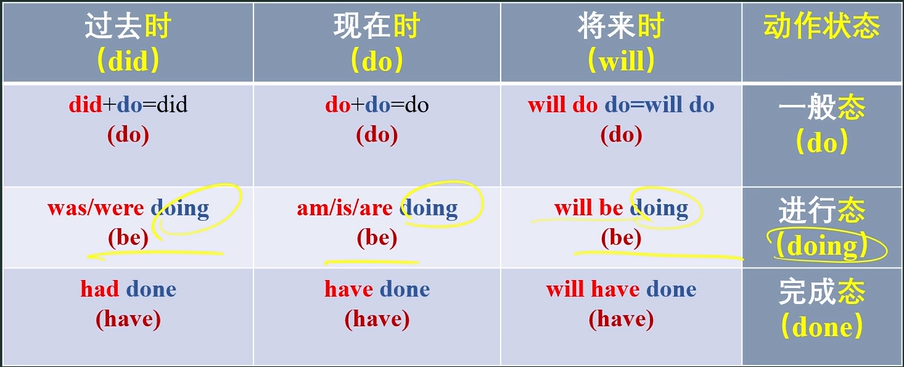
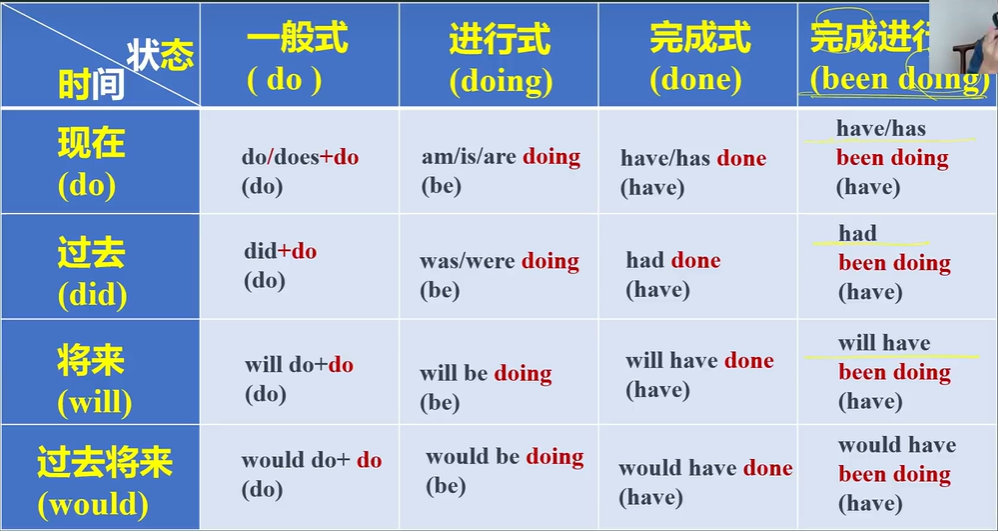
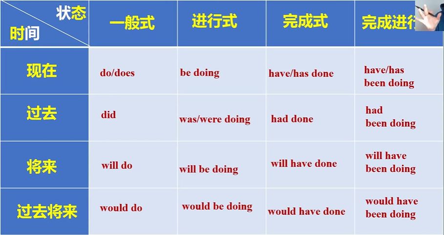
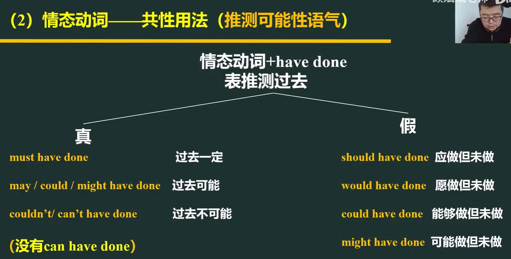

# 英语语法

[toc]

# 10种词性

## 名词

词性缩写：n.

作用：具象地称呼某样东西

## 代词

词性缩写：pron.

作用：代替名词或名词性短语

- it, one, that的区别和用法

**it**：特指之前提到的**同一个事物**（特指同物，可数名词单数)
This pen is mine. You can use it.(同一只笔)
表复数时:用they/them
These pens are mine. You can use them.

**one**：泛指之前提到的**同类中的任一个人/物**（泛指同类不同物，可数名词单数）
I've lost my umbrella. I need to buy one.(不是同一把伞)
表复数时:用ones
I have a new pen and some old ones.

**that**：特指之前提到的**同类中的特定事物**（特指同类不同物，可数名词单数/不可数名词)
The umbrella you bought is cheaper than that I bought.(与前面不同的一把伞)
The weather in Lanzhou is cooler than that in Sanya.(不同的天气，天气不可数)
表复数时:用those
These pictures are more beautiful than those.

## 数词

词性缩写：num.

作用：数字

## 冠词

词性缩写：art.

作用：加在名词或名词词组前后的a,an, the

## 副词

词性缩写：adv.

作用：修饰动词，增加别的一些属性，或者增加一些强度，增加一些修饰成分在内

## 形容词

词性缩写：adj 

作用：修饰名词，把一个物品形容出来

## 介词

词性缩写：prep .

作用：无实际意义，用在名词、代词等其他词之间，形成一些结构，或者形成一些语法内容

## 连词

词性缩写：conj.

作用：把句子、短语、段落连起来，形成一些不同的逻辑关系或语法结构等。

只数连接句子的连词

> I came into the woods. 
> I saw many birds. 
>
> 两句合为一句：
>
> I came into the woods, I saw many birds.（×）
>
> 需要加连：
>
> I came into the woods **and** I saw many birds.（主句+并句）
> **When** I came into the woods, I saw many birds.（主句+从句）

- **并列连词**：and，but，
- **从属化连词**：when，

## 感叹词

词性缩写：int.

作用：发出感叹的词，一般用来表达一下情感，放在句子的前面或者后面，一般和句子本身没有什么实际的直接联系

## 动词

词性缩写：v.

作用：描述某种动作

# 1.句子的成分

- 基本成分
  - 主语：述说的主体（发出**动作**或**被描述**）。
  - 谓语：述说主语的**动作**（承载有时态、语态、情感信息）或**状态。**
  - 宾语：**动作对象**或**介词所联系的对象**。
  - 补语：**补充说明**主语或宾语的意义（身份或特征）。
  - 表语
- 修饰成分
  - 定语：修饰名词。
  - 状语

### 谓语（包含系动词）

实义动词、系动词

### 主语、宾语、同位语

**名词**、代词、非谓语动词、分词、从句

主语缺失时：

1. 用 it 指代
2. there be 句型
3. 主动变被动
4. 加人称代词

### 表语（主语补足语）

**名词**、代词、非谓语动词、分词、从句，形容词、副词，介词短语

### 定语

**形容词**（短语），介词短语，非谓语动词，从句，名词（短语），代词，

### 状语

**副词**（短语），介词短语，非谓语动词，从句

# 2.简单句

- **主语 + 谓语**

- **主语＋谓语 ＋ 宾语**（谓语是有时态的实义动词）

  SVO

- **主语＋谓语 ＋ 间接宾语 ＋ 直接宾语**

  SVOC
  

常见动词有buy pass lend give tell teach show bring send

间接宾语一般是人

直接宾语一般是物

- **主语＋谓语＋宾语＋宾补**

  SVOO

宾补补充说明宾语的特点身份，担任补语的通常是名词、形容词、副词、介词短语、分词、动词不定式

- **主语＋系动词＋表语**

（后面只能跟形容词）

表感官：look sound taste smell feel

表变化：get become turn grow fall

表保持：keep stay remain stand

表表象：seem appear

表终止：prove

表状态：be

# 一、动词词组

## 1.分类

### 1.1分为两大类

1. **谓语动词**：在句子中可以单独作谓语的动词，主要由**实义动词**充当。有 时&态 的变化。
2. **非谓语动词**：
   1. 动名词（doing）：表动作、行为事件
   2. 动词不定式（to do）：表将来、目的，不确定
   3. 分词：
      1. 现在分词（doing）：表主动、进行态，正在……一直……
      2. 过去分词（done）：表被动、完成态，已经……被……

### 1.2细分

#### 1.实义动词

及物动词 Vt

不及物动词Vi(没有被动语态)

#### 2.系动词

表感官：look sound taste smell feel

表变化：get become turn grow fall

表保持：keep stay remain stand

表表象：seem appear

表终止：prove

表状态：be

#### 3.情态动词

1. must 表示必须，非要。责任上（强调客观）
2. have to 表示不得不（强调主观）
3. can could 表示能够（能力），可以（允许） 
4. may might 表示祝愿，许可（允许），可能 （推测）
5. will would 表示将会（意愿）
6. shall should  表示应该（警告、威胁，命令，法律要求）
   - should, ought to 竟然

7. need 表示需要（实义动词时need to do）
8. dare 表示 敢 敢于

【注意】might / would / could 可用在现在，将来的时间上，表示“委婉”。

#### 4.助动词

be：1.帮助构成进行时；2.被动语态

do does did：1.一般现在时、一般过去时的否定和疑问；2.强调谓语；3.倒装句

have has：帮助构成完成时

will：帮助构成将来时

## 2.谓语动词

### 2.1时&态（谓语动词）

各种时态：**时+态**（时间承载词(助动词) + 状态词）

>Tom doing his homework.

这里的doing不是**时态**，因为doing只表明**状态**，缺少**时间承载词（助动词）**，也就是`be`。

应该改为：

>Tom is doing his homework.

**is**表示现在进行，是时间。

当出现：

- doing
- done
- to do

其实都不是谓语，它们只是“态”，因为缺少**助动词**，所以称其为**非谓语动词**。

#### 2.1.1时态拼写

- **时间承载词(助动词)：**

|               | 一般  | 进行（be）doing   | 完成（have）done       | 完成（have）进行（been）doing    |
| ------------- | ----- | ----------------- | ---------------------- | -------------------------------- |
| 现在do        | do    | do be = be        | do have/has = have/has | do have/has been = have/has been |
| 过去did       | did   | did be = was/were | did have = had         | did have been = had been         |
| 将来will      | will  | will be           | will have              | will have been                   |
| 过去将来would | would | would be          | would have             | would have been                  |
|               | +do   | +doing            | +done                  | +doing                           |

现在时：do

过去时：did

将来时：will

过去将来时：did will = would

进行态：be

完成态：have

完成进行态：have be = have been

- **状态词（aspect）:**

一般态：do（动词原形）

进行态：doing（主动/进行）

完成态：done（被动/完成）

完成进行态：be doing

> 拼写例子：
>
> 过去**完成**时：did have + do
>
> had **done**
>
> 过去完成**进行**时：did have be do
>
> had been **doing**
>
> 将来完成**进行**时：will have be do
>
> will have been **doing**
>
> 过去将来完成**进行**时的**被动**语态：did will have be be done
>
> would have been **being** **done**

【特殊情况】在助动词和状态词中间有**状语**。

**have（状语）done**

这个状语只是起修饰成分，但是分割了时态，所以在寻找时不好找。

> eg.
>
> have **largely** done
>
> have **in large part** done
>
> 很大程度上......

谓语动词还是have done（现在完成）

#### 2.1.2被动语态

被动**done**

如果前面的have变成be，那么done就不是表示完成态，而是被动态（be done）。

- **完成态：have done**
- **被动态：be done**
  - 正在被：being done
  - 已经被：been done
  - 已经正在：been doing

三种基本被动：

- 过去被：was/were done
- 现在被：am/is/are done
- 将来被：will be done

同理，也会出现状语在时态之间：
**be（状语）done**

### 2.2语气（情态动词）

| 情态动词                                          |                            | 含义                                       |
| ------------------------------------------------- | -------------------------- | ------------------------------------------ |
| must                                              |                            | 表示必须，非要。责任上（强调客观）         |
| have to                                           |                            | 表示不得不（强调主观）                     |
| can = be able/allowed to                          | could                      | 表示能够（**能力**），可以（允许）         |
| may = wish                                        | might                      | 表示**祝愿**，许可（允许），可能 （推测）  |
| will                                              | would                      | 表示**将会**（意愿）                       |
|                                                   | would = used to 过去常常   |                                            |
| shall                                             | should                     | 表示**应该**（警告、威胁，命令，法律要求） |
| we shell征求意见 you/he shell **威胁，警告** | should = ought to **竟然** |                                            |
| need                                              |                            | 表示需要（实义动词时need to do）           |
| dare                                              |                            | 表示 敢、敢于                              |

【注意】might / would / could 可用在现在，将来的时间上，表示“委婉”。

【词组】

**may well** 很可能

**may as well** = **had better** 最好（还是做某事为好）

**can not ... too ...** = **must** 怎么样都不为过

**simple must** 务必

共性：

#### 2.2.1推测

**情态动词+have done**：表**推测**过去

- 真：

**must** have done 过去一定

**may** / might have done 过去可能

**couldn't/ can't** have done 过去不可能

> He must be at home.

- 假：

**should** have done 应做但未做

**would** have done 愿做但未做

**could** have done 能够做但未做

**might** have done 可能做但未做

> 我们本来可以参观北京大学的，但我们花了太多时间购物。
>
> We **could have visited** Peking University, but we spent too much time shopping.

#### 2.2.2 if条件虚拟语气

过去的事情(历史)是**已经发生过**的，是事实，是不可以被假设的。所以如果非要对过去的事情假设，那就是**虚拟语气**。

现在：**if从句（were/did），主句（would/could/might/should）do.**

过去完成：**if从句（had done），主句（would/could/might/should）have done**.

将来：**if从句（were to do / should do），主句（would/could/might/should）should do**.

- were to do：不可能实现。
- should do：不太可能，但是万一呢，表示希望。

> 事实：I am not a bird.
> I can not fly in the sky.
>
> 虚拟：I **were** a bird.
> I **would fly** in the sky.

【与事实相反】同if条件虚拟语气：

好像：**as if / though** + 主句

希望（暗含明知不可能）：

**wish that** + 主句：真希望

**If only** + 主句：要是……该多好

**would rather that** + 主句：宁愿

> I wish that we were both young again.
>
> I would rather you hadn't told me about the news.
>
> If only I had not lied to my parents.

【与事实相反】代替if条件句的含蓄虚拟语气：

有些句子里，没有if但是有：

- without 没有
- otherwise 否则
- or 否则
- but for 要不是
- but

等，此时可把它们看做**虚拟条件句**，然后根据时间，选择主句的动词形式。

> Without your help, I **wouldn't have passed** the exam.
>= If you didn't help me, I **wouldn't have passed** the exam.
>=But for your help, I **would not have passed** this exam.

【还没实现，**希望成真**】命令建议：

1. 坚持：insist
2. 命令：order，command
3. 建议：advise，consider，suggest，recommend
4. 要求：require，request，demand，desire/ask

### 2.3语态（主被动）

语态表示主语和谓语动词之间的主动或被动关系的动词形式。

1. 主动
2. 被动**done**

如果前面的have变成be，那么done就不是表示完成态，而是被动态（be done）。

- **完成态：have done**
- **被动态：be done**
  - 正在被：being done
  - 已经被：been done
  - 已经正在：been doing

三种基本被动：

- 过去被：was/were done
- 现在被：am/is/are done
- 将来被：will be done

同理，也会出现状语在时态之间：
**be（状语）done**

#### 2.3.1主动被动转换

科学家表示，化合物有可能致癌。

主动：Scientists say the compound **is likely to cause** cancer.

科学家表示，癌症可能由于化合物导致。

被动：Scientists say cancer **is likely to be caused** by the compound.

他们授给他一枚奖章。

主动：They **gave** him a medal for his wonderful work.

He **was given** a medal for his wonderful work.

A medal **was given (to)** him for his wonderful work.

#### 2.3.2被动的妙用

使得主句从句**主语保持一致**，使用一个主语。

1. 连贯性
2. 清楚性
3. 简洁性

两个主语：**Something** can destroy a man, but **nothing** can defeat him.

优化主语为一个：**A man** can be destroyed but not defeated.

## 3.非谓语动词

### 3.1动名词

**动名词**（doing）：表动作、行为事件

作主语、表语、宾语、定语。

- eating a apple：吃苹果这个动作做名词

### 3.2动词不定式

**动词不定式**（to do）：表将来、目的，不确定

动词不定式做后置定语：

a day **to remember**.

The order **to abandon ship** was given.

动词不定式做目的状语：

I came into the woods **to saw many birds**.

不定式（to do） = 情态动词 + 动词原形

must = have to do sth =to do sth

shall / should =ought to do sth= to do sth

may / might = be likely to do sth / be allowed to do sth =to do sth

will / would = be willing to do sth / be going to do sth= to do sth

can / could = be able to do sth/ be allowed to do sth= to do sth

### 3.3分词

作表语、定语、状语、补语。

1. **现在分词（doing）**：表主动、进行态，正在……一直……
   - 主动
   - 短时间：正在
   - 长时间：一直
2. **过去分词（done）**：表被动、完成态，已经……被……
   - 被动
   - 已经完成

后置定语：

The boy **playing football** is my little brother.
The paper **published in England** is under discussion.

伴随状语：

I came into the woods, **seeing many birds**. 我走进树林，看见许多鸟。
The old man walked in the street, **followed by his son**. 老人走在街上，他的儿子跟在后面。

# 二、名词词组

名词词组由三个部分构成：**限定词+修饰词+名词**。

a beautiful girl.

**限定词**类型：

1. 冠词：the；a，an；零冠词；
2. 物主限定词：my, your, his, her, our, your, their, one's, its；
3. 名词所有格：John's, my friend's；
4. 指示限定词：this, that, these, those, such；
5. 不定限定词：no, some, any, each, every, enough, either, neither, all, both, half, several, many, much, (a) few, (a) little, other, another;
6. 基数词：one, two, first, second；
7. 倍数词：double, twice, one-third；
8. 量词：a lot of, lots of, plenty of, a good deal of, a small amount of, a good number of；

**修饰词**一般是形容词。

**名词**：

1. 可数名词
2. 不可数名词
   1. 动名词（事件/动作）：smoking, jogging
   2. 抽象名词（非实物/概念性）：beauty, intelligence
   3. 物质性名词（无法分为个体）：water, air, paper
   4. 专有名词（特定或独一无二）：Beijing, Yale University, Mark Twain

>I found my letter missing.
>
>我发现我的信丢了。（missing是补语，修饰letter）
>
>I found **my missing letter**.
>
>我发现了我丢的信。（missing是形容词）

# 三、修饰语

1. 形容词
2. 副词：副词的位置最好放在要修饰的动词附近，避免出现歧义。
3. 介词短语
4. 从句
5. 不定式
6. 分词

## 1.形容词

### 1.1复合形容词

**限定词+修饰词(形容词性)+名词**

中间不能放短语，要么中间放一个单词，要么放一个复合形容词(A-B-C)

复合形容词就是两个或两个以上的词加**连字符**形成的形容词，通常置于名词前.

1. 数词+名词

   This is a **five-year** program. 五年的

2. 数词+名词+形容词

   A **five-year-old** boy

3. 名词+现在分词

   Mary is a girl who likes to break boy's hearts.
   Mary is a **heart-breaking** girl.

4. 名词+过去分词
   Mary is a **heart-broken** girl.

   【技巧】从右往左看 broken heart

5. **名词/副词 -（连字符） 分词**

### 1.2形容词顺序

一行里面有多个形容词，形容词之间相互比较，

越是相对**不变**（客观、属性、种类特质）的越**靠近**名词。

越是相对易变（主观、态度、情感可有可无）的越远离名词。

### 1.3比较级

1. 写出两个简单句。

2. 找出两个简单句中的比较点。

3. 用 more……than（大于） 把两个简单句连接成一个主从复合句。

   as……as（等于）

   less……than（更小的）

   not so……as

   not as……as

   程度副词……从属化连词

4. 省略比较状语从句中的相同的比较点。

5. 美化：**省略、倒装、换代词**。

形容词变级：

1. 单音节：-er; -est
2. 多音节：more; most

## 2.介词短语

介词短语 = 介词 + 名词词组 = **介词** + **限定词**（冠词） + 修饰词 + **名词**

可以理解成：从一个**介词**到一个**名词**，这之间就组成介词短语。

> four hundreds students（×）不是名词词组
> four hundred students（√）是名词词组

> the flowers shop（×）
> the flower shop（√）

> the sports meeting（√）

**冠词**：a，an，the

### 2.1介词短语做后置定语

**介词**：in，on，of

the bird in **the** tree 树上的那只小鸟
the map on **the** wall 墙上的地图
the development **of China** 中国的发展
the standard **of** living 生活水平
the south side of **the** Changjiang **river** 长江南岸
the way to **the** hotel 去旅馆的路
the life in **the** future 未来的生活

【注意】专有名词前面不加 the，形成**零冠词**。但是有的前面加了 the，并不是形容专有名词的，是修饰后面的普通名词的。

### 2.2介词短语做状语

**介词**：in，on，of，at，by，for，because of，without，

1. 地点状语: We live <u>in</u> **Hangzhou**.我们住在杭州。（Hangzhou专有名词）
2. 时间状语: She got here <u>at</u> four.她在4点到这儿的。
3. 方式状语: They came here <u>by</u> train.他们乘火车来这儿。
4. 原因状语: The game was postponed <u>because of</u> rain.因为下雨运动会被推迟了。
5. 条件状语: There will be no living things <u>without</u> water.没有水就没有生物。
6. 目的状语: He ran <u>for</u> shelter.他跑去避雨。
7. 让步状语: They play football **<u>in spite of</u> the rain**.他们冒雨踢足球。（in spite of尽管）
8. 程度状语: **To what extent** would you trust them?你对他们信任程度如何?

## 3.从句

**从句 = 从属化连词（引导词） + 主干**

1. 名词性从句

2. 定语从句

3. 状语从句

### 3.1 to do不定式

**to do sth.**

动词不定式做后置定语：

a day **to remember**.

The order **to abandon ship** was given.

动词不定式做目的状语：

I came into the woods **to saw many birds**.

### 3.2 分词

- **过去分词**：**done**
  - 被动
  - 已经完成
- **现在分词**：**doing**
  - 主动
  - 短时间：正在
  - 长时间：一直

后置定语：

The boy **playing football** is my little brother.
The paper **published in England** is under discussion.

伴随状语：

I came into the woods, **seeing many birds**. 我走进树林，看见许多鸟。
The old man walked in the street, **followed by his son**. 老人走在街上，他的儿子跟在后面。

# 四、句子组合（并列句、从句）

- 复句：从属，从句；从句在主句中成分。
- 合句：并列

英语句子中逗号隔开的不能是两个句子，要想前后是两个句子，则需要：

1.加入并列连词连接两个**并列句**

- 常见的**并列连词**

  - 1.表平行 and， not only but also，both and，either or，neither nor

  - 2.表转折 but，while，yet，wherea

  - 3.表因果 for，so

  - 4.表选择 or，whether or

  - 5.表递进 then

- 与并列连词同意的**逻辑关系词**

  - 1.表平行 similarly,equally,likewise;at the same time,in the meanwhile

  - 2.表转折 however,nevertheless,nonetheless,conversely,contrarily,unexpectedly,unfortunatedly;on the contrary,in/by contrast

  - 3.表因果 therefore,thus,consequently;as a result,as a consequence

  - 4.表选择 alternatively

  - 5.表递进 then

2.将其中的一个句子变成**从句**

【注意】只有**连词**才可以使句子丧失句子独立性，使用`,`连接；而想用**连接副词**，那么就需要用`;`分号分隔。

| 连词 | 连接副词                                    | 意思           |
| ---- | ------------------------------------------- | -------------- |
| so   | therefore, thus                             | 因此           |
| but  | however, nevertheless                       | 然而           |
| and  | moreover, furthermore, in addition, besides | 况且/再说/此外 |
| or   | otherwise                                   | 否则           |

> I don't like it; **besides**, it's too expensive. 
> 我不喜欢它，而且也太贵了。
>
> We all tried our best; **however**, we lost the game. 
> 我们都已尽了最大的努力，不过我们还是输了。

## 1.并列句

### 1.1复杂并列结构

两种情况：

（1）**N of A** and **B of C**

AN 和 CB

（2）N of **A and B** of C

C的AB的N

CAN和CBN

### 1.2并列句的应用

#### 1.2.1并列句的对称原则

- 词性对称
  - 并列连词前后的词性、单复数、时态和语态等必须一致；连词连接三个或三个以上的词时，前面的词用逗号隔开，只需要在最后一个词前加并列连词.

- 结构对称
  - 连词所连接的句子结构要保持一致。

#### 1.2.2并列句的省略现象

省略的成分：

- 省略主谓：并列连词后的主谓和前面的主谓一致，可以将后面的省略；
- 省略主语：并列连词后面的主语和前面的主语一样时可以省略；
- 省略be动词：并列句前后主语不懂，但是几个句子的谓语东西都是be动词，那么此时可以省略be动词；
- 省略重复的成分：并列句前后两个句子出现重复的部分，那么后一个句子可以省略重复的成分，但是没重复的成分要保留。

## 2.从句

### 2.1名词和名词性从句

名词（短语）能的成分：主语，宾语，表语，同位语

从句的定义：**引导词＋句子**

名词性从句就是能够当**做名词来使用的句子**。

---

按**引导词**分三类：

1. **that**：当从句是**陈述句**时
   - that在句中不充当任何成分（**句子什么都不缺**），没有实意；
   - 在不影响句子意思的情况下，宾语从句的引导词that**可以省略**。
2. **whether(...or)，if**：当从句是一般**疑问句**时
   - whether(...or)，if在句中不充当任何成分，意思为“是否”；
   - whether可以引导所有的名词性从句，if只能引导宾语从句。
3. **特殊疑问词**：当从句是特殊疑问句时
   - 常见的连接**副词**有：**when,where,why,how；**
     - 在句子中作**状语**，在从句中既作定语、又表含义。
   - 常见的连接**代词**有：**who,whom,what,which,whose。**
     - who,whom,what,which 在句子中作**主宾表**；
     - whose 在句子中作**定语**，后接名词连用。
   - 这些特殊疑问词一般都有固定的意思，不能省略。

#### 1）主语从句

引导词出现在句首且和主句的谓语动词之前没有逗号就是主语从句（从引导词到主句谓语动词是主语）

为了避免头重脚轻，主语后置的情况，用it做**形式主语**（**that到从句结束是主语**）。

- it is a common knowledge that...
- it is my belief that ... = i think it 
- it is self-evident that
- it has been found that
- it is beyond dispute that
- it is universally acknowledged that
- it has been widely accepted that
- it is generally agreed that

#### 2）宾语从句

**实义动词**后面为引导词，通常就是宾语从句。

> I don't know where the girl lives.

**介词**之后也可能是宾语从句。

> This is different from what you said.

**双宾语**，**宾语**后面：

> I tell you where the girl lives.

**形容词**后面：

> We are glad that you have come to join us.

**形式宾语**

> l find **it** easy where the girl lives.

#### 3）表语从句

主补语

**系动词（is / are）后面**有引导词就是表语从句。

【注意】并非所有的系动词都能接从句，能接表从的系V.主要是：

- be
- seem
- look
- appear
- sound
- remain等等。

如果这些用“is”进行替换之后，没有很大的区别，那么就是了。

> The question is where the girl lives.

#### 4）同位语从句

the truth/evidence that......manifests/indicates/suggests that....

### 2.2定语和定语从句

定语：修饰名词的成分

定语的成分：形容词，非谓语，名词（短语）（...的等于of ...），介词短语（as...as），从句。

定语从句的两种构成：

1. 按先行词
2. 按引导词

#### 2.2.1按先行词的种类划分

- 1.当先行是**人**时：**that，who，whom，whose**
- 2.当先行词是**物**时：**that，which，whose**
- 3.当先行词是**时间**时：**that，when，which**
- 4.当先行词是**地点**时：**that，which，where**
- 5.当先行词是**原因**时：**that，which，why**

#### 2.2.2按引导词的种类划分（==缺什么==）

- 1.**代词（主语、宾语）**：
  - 人：**that，who，whom**

  - 物：**that，which**（非限制性时候，which前可以有`,`逗号）

- 2.**副词**（在从句中不充当成分）：**where，when，why**
- 3.**形容词**（在从句中充当**定语**成分，修饰名词）：**whose**

定语从句的特殊用法：

- that引导宾语从句时，如果在从句中充当**宾语**，that可以省略

#### 2.2.3限制性、非限制性定语从句

- **限制性**定语从句：定语从句紧跟在先行词后，对先行词进行修饰且不能省略，省略后意思不完整：
  - 定语不能省略。

- **非限制性**定语从句：对前面的先行词或整个句子进行补充说明，既是省略也不影响总体意思，用**逗号（，which）**隔开，非限制性定语从句的特点有两个：
  1. 可以省略；
  2. 起到补充说明作用。

#### 2.2.4**介词＋关系代词** 引导的定语从句

- 1.为什么会有“介词＋关系代词”引导定语从句

  - 1.关系副词在定语从句中做状语成分时，可以使用“介词＋关系代词”代替关系副词

    - 1.when、where＝介词＋关系代词

    - 2.why＝for which

  - 2.定语从句的谓语动词是固定搭配的“动词＋介词”，并且先行词在从句中做宾语

  - 3.用于表达与上文中的先行词或者句子的关系，并避免下文与上文的重复
- 2.“介词＋关系代词”中代词的选择
- 1.修饰人，只能用whom
  
- 2.修饰物，只能用which
  
- 3.whose可以用of which/whom 代替
- 3.如何选择介词

  - 1.根据谓语动词中的动词来选择，并且要判断“动词＋介词”与先行词的逻辑关系

  - 2.根据句中从句动词与先行词的逻辑关系来选择

  - 3.根据“形容词＋介词”与先行词的逻辑关系来解释

  - 4.根据先行词与句子的意思确定
- 4.固定搭配the same as...和the same...that引导的定语从句
- 5.as和which引导的非限制性定语从句

  - 1.相同点：两者都可以引导非限制性定语从句

  - 2.不同点：

    - 1.as引导非限制性定语从句，位置随便放

    - 2.紧跟as后的是be动词；而which后可以用任何类型的动词
- 6.定语从句中引导词which和that的区别

  - 1.用which的情况

    - 1.引导非限制性定语从句

    - 2.放在介词后作宾语时用which

  - 2.用that的情况

    - 1.当先行词是不定代词much，little，none，all，few，every（thing），any（thing），no（thing）

    - 2.当主语以here，there开头时

    - 3.当先行词被the only，the same，the very等先行词修饰时

    - 4.当先行词被any，few。little，no，all，much，some等词修饰时

    - 5.当先行词被序数词或形容词最高级修饰时

    - 6.当先行词是疑问代词who，which，what或主句以这些词为开头时

    - 7.当先行词即有人又有物时
- 7.区分定语从句与同位语从句

  - 1.定语从句的引导词that在从句中充当主语或宾语，而同位语从句中that在从句中不做任何成分
- 2.定语从句是对前面名词的修饰，而同位语从句是对前面名词的解释
  - 3.定语从句的先行词可以是任何名词，同位语从句的先行词只能是可以解释的抽象名词
- 4.定语从句的的引导词很多，同位语从句的引导词多以that为主

### 2.3状语和状语从句

#### 2.3.1形容词、副词、状语

1. 形容词（短语）

   - 系动词后做表语

   - 名词（短语）前作定语

   - 宾语后面做补语

2. 副词（短语）

   - 修饰实义动词

   - 修饰形容词

   - 修饰副词

   - 副词修饰整个句子

3. 状语：在一个句子中修饰实义动词（词组）、形容词（短语）、副词或整个句子的部。

   - 1.副词

   - 2.副词短语

   - 3.介词短语

   - 4.分词、不定式

   - 5.从句

---

状语从句的构成：

- **引导词**＋状语从句＋，＋主句
- 主句＋**引导词**＋状语从句

根据引导词的不同，按充当的成分划分不同的状语从句：

#### 1）时间状语从句

引导词：

- 1.名词短语：the moment（一....就），every time（每当），the day（那一天），the instant（当......的时候）
- 2.副词：immediately，directly，no sooner...than，hardly...when，scarcely...when **都**表示“一...就“
- 3.普通引导词：when，as，while，once，as soon as，before，after，since，not...until，until/till 等

区别：

- when，while，as 的区别

  - 1.when引导的从句的谓语动词可以是延续性动词，也可以是短暂性动词，表示“当...时”

  - 2.while引导的从句的谓语动词可以是延续性动词，多用于进行时态，表示“在...时”，强调时间段的持续性，也可强调主从句的对比

  - 3.as引导的从句的谓语动词是持续性的动词，表示“一边...一边”，一般用于主句与从句动作同时发生的情况；as也可以表示“随着......”

- no sooner ...... than和hardly......when引导的时间状语从句

  - 1.含义：表示“一....就”

  - 2.时态：主句用过去完成时，从句用一般过去时

  - 3.高级用法：引导时间状语从句时可以使用倒装句式

- when引导的时间状语从句的特殊用法
  - 如果从句和主句主语一致，并且从句的谓语中有be动词，那么从句的主句和be动词可以一起省略

- 区分until和not...until
  - not...until主句的谓语动词是短暂性动词；until主句的谓语动词是延续性动词

#### 2）地点状语从句

引导词：

- 1.常用引导词：where

- 2.特殊引导词：wherever，anywhere，everywhere

where引导的定语从句与状语从句的区别与转换：

- 1.区别

  - 1.where引导状语从句时，where是从属连词，修饰主句的谓语动词，where前面没有表示地点的先行词

  - 2.where引导定语从句时，从句修饰先行词，where是关系副词，代表地点的先行词在从句中作地点状语

- 2.转换：一般在状语从句前面加“in/at the 具体地点”，就可以将状语从句改写成定语从句

#### 3）原因状语从句

引导词：

- 1.常用引导词：because,since,as,for

- 2.特殊引导词：seeing that,now that,in that,considering that,given that,as much as,so much as(because of,due to,owing to,thanks to,for the sake of,as a result of后面只能加名词)

#### 4）目的状语从句

引导词：

- 1.常见引导词：so that，in order that

- 2.不定式表目的：to,in order to,so as to后跟动词原形（in order to 前后主语一致反之用in order that）

#### 5）结果状语从句

引导词：

- 1.常见引导词：so that,so...that,such...that

- 2.特殊引导词：to the degree that,to the extent that,to such a degree that

so that,so...that,such...that的区别：

- 1.so that可以引导目的状语从句和结果状语从句，引导目的状语从句时，通常和情态动词连用；引导结果状语从句时，则不和情态动词连用

- 2.so...that的用法

  - 1.so＋形容词/副词＋that

  - 2.so＋many/much/few/little＋名词＋that

  - 3.so＋形容词＋a/an＋可数名词单数＋that

- 3.such...that的用法

  - 1.such＋a/an＋形容词＋可数名词单数＋that

  - 2.such＋形容词＋可数名词复数/不可数名词＋that

#### 6）条件状语从句

引导词：

- 1.常用引导词：if,unless(if not)

- 2.特殊引导词：as/so long as(只要),only if(只要),providing/provided that(假如)，supposing(that)(假如)，in case that(以防)，on condition that（如果）

#### 7）让步状语从句

引导词：

- 1.常用引导词：though，although，even if，even though

- 2.特殊引导词：as，while（虽然，用在句首），no matter（无论），in spite of the fact that（虽然，尽管），whatever，whoever，wherever，whenever，however，whichever

#### 8）方式状语从句

引导词：

- 1.常用引导词：as，as if,as though(似乎好像)

- 2.特殊引导词：the way（方式）

- 3.介词短语：by，through，in...way，in...manner

#### 9）比较状语从句

引导词：

- 1.常用引导词：as，than

- 2.特殊引导词：the more...the more...，more than，more...than...，not so much...as...

  - 1.as...as...和...一样

  - 2.the more...the more...

  - 3.more than的用法：

    - 1.后＋名词，翻译成“不仅仅是”

    - 2.后＋形容词，翻译成“非常”

    - 3.后＋数词，翻译成“多于，超过，比...多”

    - 4.后＋动词，翻译成“不仅仅是”

  - 4.not so much as ＝ not even 甚至不/没有

  - 5.not so much A as B 与其说A，倒不如说B

  - 6.more A than B 与其说B ，不如说A

时态：

- 1.主句表示过去的时候，主句与从句都可以使用相应的过去时态

- 2.主句表示将来的时候，主句使用一般将来时，从句使用一般现在时

- 3.主句表示将来完成的时候，主句使用将来完成时，从句要使用现在完成时

#### 2.3.2分词作状语

- 逗号连接两个句子时，可以将次要的句子转变为分词作状语；
- 如果分词的主语和主句的主语不一致，这种英语语法现象就叫做独立主格；
- 如果分词的主语和主句的主语一致，就叫做非谓语动词做状语。

# 五、句子简化

简化的 **词性** 要保持一致。

```mermaid
graph LR

a(名词性从句 n.)-->1(动名词 n.) & 2(不定式 n. /adj. /adv.)
b(定语从句 adj.)-->2(不定式 n. /adj. /adv.) & 3(分词 adj. /adv.)
c(状语从句 adv.)-->2(不定式 n. /adj. /adv.) & 3(分词 adj. /adv.)

classDef congjv fill:#f90,stroke:#333,stroke-width:2px;
class a,b,c congjv;
classDef jianhua fill:#f9f,stroke:#333,stroke-width:2px;
class 1,2,3 jianhua;
```

- 名词性从句（n.）
- 定语从句（adj.）
- 状语从句（adv.）

- 动名词（n.）
- 不定式（n.，adj.，adv.）
- 分词（adj.，adv.）

## 1.定语从句的省略

步骤：

1. 将关系代词（that）省略；
2. 改变从句的谓语动词
   - be + 其他 → 其他
   - 情态动词 + do → to do**不定式**
   - 非be，也非情态动词 + 其他 → doing现在**分词**

> China is a developing country **which belongs** to the third world. 
>
> China is a developing country **belonging** to the third world.

【所以说】**同位语**其实就是**定语从句**的**名词补语**。

## 2.名词从句的省略

1. **主语从句**（that引导词作主语）→ **动名词**。

   - 直接用**动名词的复合结构（他的doing）**来代替**主语从句**，放在句首作主语。

   - >**That he lost** the game came as a surprise to everybody.
     >
     >**His losing** the game came as a surprise to everybody.

2. 名词+that**同位语**从句 → **动名词**。

   - **名词 + of + 动名词的复合结构（他doing）**

   - >There was no chance **that Davy would come** from the battle alive.
     >
     >There was no chance **of Davy coming** from the battle alive.

3. **宾语从句**（that引导词作宾语）→ **动名词（doing）**、**不定式（to do）**

   - >I hope **that I can** drive to work in my own car.（这里 I 和前面一样，所以可以省略）
     >l hope **to** drive to work in my own car.

     >I would like **that you can** go to the concert with me.（这里是 you 和前面 I 不一样，所以不省略）
     >I would like **you to** go to the concert with me.

     >I dislike **that I am** kept waiting.
     >I dislike **being** kept waiting.

4. **疑问** → 引导词 + **to do不定式**

   - **whether，if**

     - > She can't decide **whether she should** go with him or stay home.
       > She can't decide **whether to** go with him or stay home.

   - **特殊疑问**

     - >I don't know **what I should** do.
       >l don't know **what to** do.

       >Please tell me **how I can** get to the bus station.
       >Please tell me **how to** get to the bus station.

## 3.状语从句的省略

简化条件：主语是否一致。状语从句的**主语** = **主干的主语**

步骤：

1. 自我确定**是否省略**状语从句的**连接词**（留下比较清楚，不留比较简）；
2. 将状语从句的**主语省略**；
3. 改变从句的谓语动词（这部分和定语从句一致）
   - be + 其他 → 其他
   - 情态动词 + do → to do**不定式**
   - 非be，也非情态动词 + 其他 → doing现在**分词**

主语一致：

>When **I returned** home, I found that I had left my key in the office.
>
>When **returning** home, I found that I had left my key in the office.
>或：**Returning** home, I found that I had left my key in the office.

主语不一致：（**主语不能省略**）

>I turned off the TV in order **that** my roommate **could study** in peace and quiet.（in order是目的状语）
>
>I turned off the TV in order **for** my roommate **to study** in peace and quiet.（for引出逻辑主语）

# 六、特殊结构

## 1.强调句

### 1.1陈述句

1. **It is / was + 被强调部分 + that / who / whom**（强调主语且主语指人可用who，强调宾语且宾语指人可用whom）**+ 其他部分**

>It was yesterday that he met Li Ping.
>
>It was Li Ping that he met yesterday.
>
>It is I who / that am right.

2. **It is / was not until + 被强调部分 + that + 其他部分**

> 普通句：He didn't go to bed until/ till ten o'clock.
>
> 强调句：It was not until ten o'clock that he went to bed.
>
> 倒装句：Not until ten o'clock did he go to bed.

### 1.2一般疑问句

**Is / Was it + 被强调部分 + that / who / whom + 其他部分**

>Was it yesterday that he met Li Ping?
>
>Was it Li Ping that he met yesterday?

### 1.3特殊疑问句

**疑问词 + is / was it + that / who / whom + 其他部分**

> When was it that he met Li Ping?
>
> Who was it that he met yesterday?

## 2.倒装句

- 1.否定词在句首的倒装

- 2.so（表肯定），nor/neither(表否定)位于句首，表明承前句子的肯定或否定时用倒装

- 3.含有so...that...结构的句子将so引导的部分置于句首时使用倒装

- 4.“only＋状语”位于句首时用倒装

- 5.as引导让步状语从句，从句的表语可以放在句首构成倒装

- 6.省略if的虚拟语气用倒装		

## 3.虚拟语气

当表示与事实相反的或虚假的、难以实现的情况时用虚拟语气。有时表示主观愿望、建议或某种特殊情感时，也用虚拟语气。

1. 一般用法：if引导的所有条件状语从句都可以改写成虚拟语气，只需要将句子的时态变成过去时

   - 1.对现在和将来的虚拟：主句用“would do”；从句用一般过去时
   
   
      - 2.对过去的虚拟：主句用“could have done”，从句用过去完成时
   

2. 特殊用法：

   - 1.以下情况用“should ＋ 动词原形”表示虚拟，并且should可以省略

     - 1.以防：in case that，for fear that，lest

     - 2.“命”（命令）：order，direct，command

     - 3.“贱”（建议）：suggest，advise，propose

     - 4.要求：ask，request，require，demand

     - 5.用虚拟

     - 6.是必要/紧急的：It is necessary/important/urgent that...

   - 2.以下情况从句用过去时表示虚拟
     - 1.would rather 宁愿...
   
     - 2.It is high time that...是时候...
   
    - 3.以下情况需要区别对待
      - 常见词有：wish，if only（如果...该多好阿），but for（否则），or/otherwise,as if/as though（好像）（把本来的时态变成相应的过去时，情况类似于if条件句变虚拟语气）
   
   
      - 4.虚拟语气的倒装：如果从句中有were/had/should,可以省略if，用倒装句式“were/had/should＋主语”
   

## 4.插入语

- 副词作插入语：

undoubtedly,indeed,surely,obviously,briefly,actually,furthermore,besides,additionally,similarly,exactly

- 介词短语做插入语：

for my part,from my perspective,in short,on the contrary,in others words,in a/some sense,in general,in one's opinion,in conclusion,in reality,as a matter if fact,in addition,in return,as a  consequence/result

- 不定式短语作插入语：

to be frank,to tell you the truth,to be honest,to be sure,to make the matter worse

- 分句作插入语：

I believe，I suppose，I'm afraid，what's more，you know，that is （to say），as far as i know，as far as i'm concerned，believe it or not

- 现在分词短语作插入语：

honestly speaking，generally speaking，strictly speaking

