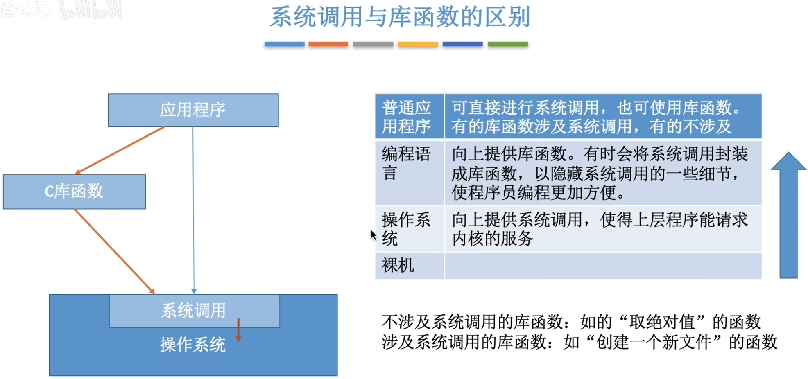
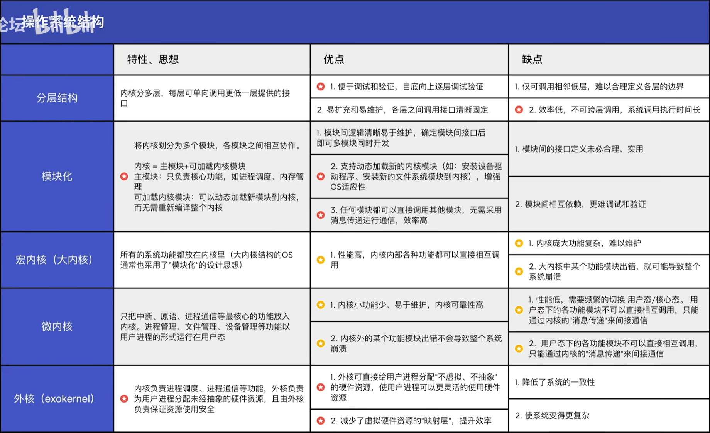
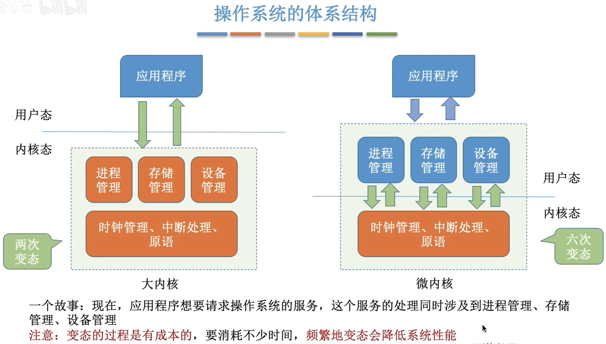
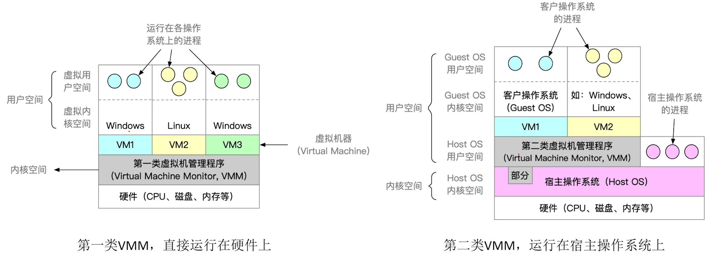
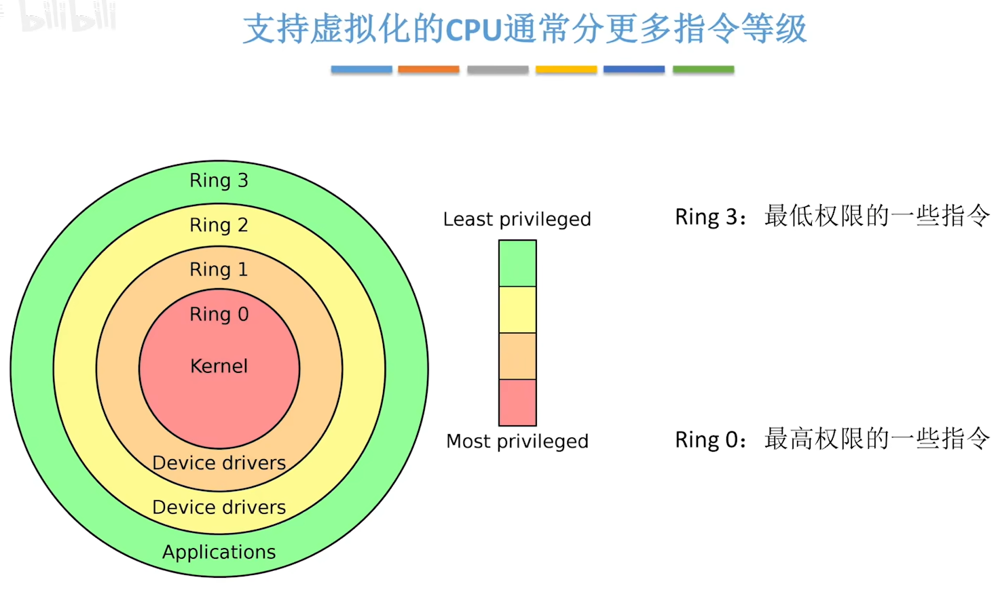

# 操作系统 operating system

# 一、操作系统

[toc]

## 1.概念

**操作系统**（Operating System，OS）是指控制和**管理**整个计算机系统的**硬件和软件资源**，并合理地组织调度计算机的工作和资源的分配；以**提供给用户和其他软件方便的接口和环境**；它是计算机系统中最基本的**系统软件**。

是在软件和硬件之间的一种**系统软件**，不是硬件。


### 1.1操作系统提供的功能

1. 负责管理协调硬件、软件等计算机资源的工作（资源管理者）：

  1. **处理机管理**
  2. **存储器管理**
  3. **文件管理**
  4. **设备管理**

2. 为上层的应用程序、用户：提供方便易用的服务。

   - 直接给用户使用的：
     1. **GUI**：**图形化用户接口**（Graphical User Interface）现代操作系统中的**图形用户界面**。
     2. **命令接口**：联机命令接口实例、脱机命令接口实例。
        - **联机命令接口实例**（Windows系统里面的CMD）
          联机命令接口 = **交互式**命令接口
        - **脱机命令接口实例**（Windows系统种运行的`*.bat`文件）
          脱机命令接口 = **批处理**命令接口

   - 给程序员/软件使用：**程序接口**（即"系统调用"，用户通过程序间接使用）。

3. 为下层的裸机硬件设施进行扩展：使裸机成为**扩充机器**，即**虚拟机**。

   没有任何软件支持的计算机成为裸机。在裸机上安装的操作系统，可以提供资源管理功能和方便用户的服务功能，将裸机改造成功能更强、使用更方便的机器。


### ❗1.2操作系统的运行机制

“指令”就是处理（CPU）能识别、执行的最基本命令。

#### 1.2.1两个指令（特权指令、非特权指令）

- **特权指令**

  所有操作资源的指令。

I/O指令、屏蔽中断指令（关中断）、设置时钟指令、停机指令、内存清零指令、存取寄存器（比如外部中断时候保存通用寄存器的值）、送PSW到程序状态寄存器、磁盘调度、进程调度指令

- **非特权指令**

修改内存单元的值、读时钟、取数、存写内存、寄存器清零、


#### 1.2.2CPU的两种处理机状态（内核态、用户态）

程序状态寄存器（PSW）的标志位（0用户态，1核心态）来决定	CPU的状态。

- **核心态、内核态**（管态）

特权指令、非特权指令都可以执行。

- **用户态**（目态）

CPU只执行非特权指令。


用户态→**核心态**：中断实现，硬件自动完成（**唯一途经**）。

核心态→**用户态**：执行一个特权指令（例如psw）就可以。


#### 1.2.3两种程序

CPU上会运行两种程序，一种是操作系统**内核程序**，一种是**应用程序**。

- **内核程序（OS程序）**

系统的管理者，运行在核心态。

内核(Kernel)是操作系统最重要最核心的部分，由很多内核程序组成操作系统内核。

- **应用程序（用户程序）**

为保证系统安全，普通应用只能运行非特权指令，运行在用户态。

**用户程序只能在用户态运行，不能进入核心态**。


## 2.发展、分类

### 2.1手工操作阶段

人工操作系统

缺点：用户独占全机，人机速度矛盾，导致资源利用率低。

### 2.2批处理阶段

通过引入**脱机I/O（输入/输出）**方式，使用**监督程序（操作系统雏形）**控制输入输出。

1. **单道批处理**系统

优点：缓解一定的人机矛盾。**提高资源利用率**。

缺点：内存仅有一道程序运行，该程序运行之后才进行下一个程序，CPU大量时间在等待I/O完成，资源利用率低。

2. **多道批处理**系统（操作系统诞生）

   采用**多道程序技术**形成**多道批处理**系统。

==**多道性**：提高**系统利用率、吞吐量**。==

优点：多道程序**并发**（宏观并行，微观串行）执行，共享计算机资源，系统吞吐量大。提高资源利用率。

缺点：用户响应时间长，没有人机交互功能。（提交作业之后，需要在整个程序执行完成之后才知道结果和错误，中间过程用户看不到）

### 2.3分时操作系统

以**时间片**为单位，**轮流**为各个用户进行服务。

优点：用户请求可以被及时响应，解决了人机交互的问题，允许多个用户使用同一台计算机。

缺点：不能优先处理一些紧急的任务。

### 2.4实时操作系统

优点：可以优先响应一些紧急的任务，它们不需要时间片排队。

在实时操作系统的控制下，计算机系统接收到外部信号后及时进行处理，并且要在严格的时限内处理完事件。实时操作系统的主要特点是**及时性**和**可靠性**。

- 硬实时系：必须在绝对严格的规定时间内完成处理（火箭导弹）。
- 软实时系：能接受偶尔违反时间规定（12306订票）。


### 分类：

1. 微机系统
2. 嵌入式系统
3. 网络操作系统
4. 分布式操作系统


## ❗3.四个基本特征

并发、共享、虚拟、异步。

**并发**和**共享**是最基本的特征，两个互为存在条件。

不共享，那么就无法并发；而不能并发，那就不能并发的共享也没意义。


### 3.1并发

两个或者多个事件（程序）在同一时间内间隔发生，这些事件宏观上是同时发生的，但是微观上是**交替发生**的。同一时刻还是在进行同一个事件。

与**并行**不同，并行是：两个或多个事件在**同一时刻同时**发生。

操作系统就是伴随着“**多道程序技术**”而出现的。因此，**操作系统**和**程序并发**是一起诞生的。


【考点】:

**单核CPU**同一时刻只能执行**一个程序**，各个程序只能**并发**地执行；

**多核CPU**同一时刻可以同时执行**多个程序**，多个程序可以**并行**地执行。

比如Intel的第八代i3处理器就是**4核**CPU，意味着可以并行地执行**4个程序**。只要有4个程序以上同时进行，那么就只能并发。


### 3.2共享

资源共享。系统的资源可供内存中多个并发执行的进程共同使用。

- **互斥共享**：一段时间**仅仅允许一个**进程访问该资源。
- **同时共享**：一段时间多个进程可以同时（**并发式交替**）对它们进行访问。


### 3.3虚拟

为了提高通信信道的利用率，使用**空分复用**、**时分复用**技术，将一条物理信道分为若干逻辑信道。使原来只能供一对用户通话的物理信道，变成对多对用户通话的逻辑信道。

- 空分复用技术（如虚拟存储器技术)
- 时分复用技术（如虚拟处理器)

显然，如果失去了并发性，则一个时间段内系统中只需运行一道程序，那么就失去了实现虚拟性的意义了。因此，没有并发性，就谈不上虚拟性。


### 3.4异步

由于资源有限，程序执行不是一步到底的，而是停停走走的方式，以不可预知的速度进行。

当程序资源得不到满足的时候，就需要先停下了。只有系统拥有并发性，才有可能导致异步性


## ❗4.中断、异常

CPU上会运行两种程序，一种是操作系统**内核程序**，一种是**应用程序**。

==**中断处理是**OS必须提供的功能。进入中断处理的程序只能是内核程序（操作系统程序）。==

**本质**：只要发生了中断，就意味着需要操作系统介入，开展管理工作。

“中断”会使CPU由用户态变为内核态（用户态→核心态），使操作系统重新夺回对CPU的控制权。

- 用户态→核心态：**中断**实现（**==硬件==中断是唯一途经**）。

  - 用户态内陷内核态三种方式：系统调用，异常，中断。

  - 系统调用：用户态进程主动要求切换到内核态的一种方式

    本质：相当于执行了一个中断响应的过程，因为系统调用实际上最终是中断机制实现的，而异常和中断的处理机制基本上也是一致的。

- 核心态→用户态：执行一个特权指令（例如psw）就可以。


### 4.1内中断

**内中断**（也称**异常**、例外、陷入）

信号来源：CPU**内部**。与当前执行的**指令有关**。

- 自愿中断：指令中断、**陷入trap**（陷入指令、**访管指令**）。
- 强迫中断：**硬件故障fault**（缺页中断）、**软件终止abort**（1/0）。


- **陷入trap**：由**陷入指令**引发，是应用程序故意引发的。

【注意】陷入指令是在**用户态**执行的**非特权指令**，执行陷入指令之后立即引发一个内中断，使CPU**进入核心态**。


- **硬件故障fault**：由错误条件引起的,可能被内核程序修复。内核程序修复故障后会把CPU使用权还给应用程序，让它继续执行下去。
  如：缺页故障。
- **软件终止abort**：由致命错误引起,内核程序无法修复该错误，因此一般不再将CPU使用权还给引发终止的应用程序,而是直接终止该应用程序。
  如：整数除0、非法使用特权指令。


### 4.2外中断

**外中断**（狭义上的**中断**，一般就是称它为中断）

信号来源：CPU**外部**。与当前执行的**指令无关**。

- 时钟中断：由时钟部件发来的中断信号，主要工作是处理和时间有关的信息，以及决定是否执行调度程序。

和时间有关的信息：系统时间、进程时间片、延时、使用CPU的时间、各种定时器。

- 外设请求：I/O中断，例如打印机请求。
- 人工干预。


### 4.3中断机制的原理

> 详见：计算机组成原理 - 7.输入输出系统 - 3.2程序中断方式

不同的中断信号，需要用不同的中断处理程序来处理。

当CPU检测到中断信号后，会根据中断信号的类型去查询“**中断向量表**”，以此来找到相应的中断处理程序在内存中的存放位置。

中断向量表是用**数组**实现的。


显然，中断处理程序一定是内核程序，需要运行在“内核态”。


## 5.接口

### 5.1命令接口

允许用户直接使用

为上层提供的命令接口分为两种：

- **联机命令接口**（**交互式**命令接口）

用户说一句，系统做一句。

CMD

- **脱机命令接口**（**批处理**命令接口）

用户说一堆，系统做一堆。

执行C盘的`*.bat`文件


### 5.2程序接口（系统调用）

系统调用是运行在用户模式的程序请求操作系统内核提供服务的一种方式，比如文件操作、进程控制、网络访问等。通过系统调用，用户程序可以请求操作系统执行某些无法直接访问的内核操作。

**系统调用（system call）**实际上是一个**软件中断**，它将执行的**上下文**从用户模式切换到内核模式（**用户态→核心态**）。操作系统内核作为更高的特权级别，可以访问保护的内存区域和硬件资源。这是一个非常重要的安全机制，因为它阻止了用户程序直接访问硬件和敏感信息。

“**系统调用**”是操作系统**向上层**提供给应用程序（程序员/编程人员）使用的**接口**，可以理解为一种可供应用程序调用的特殊函数，应用程序可以通过系统调用来请求获得操作系统内核的服务。


- 系统调用执行顺序：

1. 进程传递系统参数；
2. 执行陷入（trap）指令，由用户态转变为内核态；
3. 将返回地址压入堆栈备用；
4. CPU执行相应的服务程序；
5. 返回用户态。


系统调用类似于**函数调用**，是应用程序请求操作系统服务的唯一方式。

- 系统调用vs一般调用

系统调用会保存PSW和PC值，一般过程调用只需要保存PC值。


- 系统调用是必须的

由操作系统内核对**共享资源**进行**统一的管理**，并向上提供“系统调用”，用户进程想要使用打印机这种共享资源，只能通过系统调用向操作系统内核发出请求。内核会对各个请求进行协调处理。


发出系统调用请求是在**用户态**，而对系统调用的相应处理在**核心态**下进行。



允许用户通过**程序间接使用**。由一组系统调用组成。

<u>程序接口 = **系统调用** = 系统调用命令 = 广义指令</u>

例子：

```cmd
C:\Windows\System32\user32.dll
```

程序员在程序中调用`user32.dll`。该调用为系统调用，可以创建窗口。


有的教材会把程序接口、命令接口统称为**用户接口**。


### 5.3库函数

库函数其实是封装了系统调用的（也有简单的库函数没有封装系统调用），系统调用更接近内核。


###### ==【题】库函数与系统调用的区别和联系==

> 区别：
>
> - <u>库函数是编程语言或者应用程序的一部分；而系统调用是操作系统的一部分。</u>
> - <u>库函数运行在用户空间；而系统调用是内核为用户提供的接口，运行在内核空间中。系统调用会由用户空间（用户态）陷入到内核空间（内核态）。</u>
>
> 联系：
>
> - <u>所以库函数会使用系统调用来实现功能，没有使用系统调用的库函数，它的执行效率通常要比系统调用的高。因为系统调用时，需要进行上下文的切换及状态的转换（用户态和内核态）。</u>
>   - 深层原因【不写】：库函数调用是调用函数库中的程序，与用户程序相联系，运行时间属于“用户”时间，是过程调用，开销较小；系统调用通常用于底层文件访问，例如在驱动程序中对设备文件的直接访问，运行时间属于系统时间，开销较大。


## 6.操作系统体系结构

> 一定是考简单的选择题，了解各种体系结构的特性，了解各自的优缺。



- **大内核**（宏内核/单内核）
- **微内核**
- 分层结构
- 模块化
- 外核

### 6.1大内核、微内核

内核(Kernel)是操作系统最重要最核心的部分，由很多内核程序组成操作系统内核。


操作系统**内核**需要运行在**内核态**；

操作系统的**非内核**功能运行在**用户态**。



【注意】考试的时候不要写“变态”，这里“CPU状态的转换”。


- **大内核（宏内核）**

将操作系统的主要功能模块都作为系统内核，运行在核心态。**高速但是复杂混乱**。

优点：**高性能**；
缺点：内核代码庞大，结构混乱，难以维护。

- **微内核**

只把最基本的功能保留在内核。**简单但是慢**。

优点：**内核功能少**，结构清晰，方便维护；
缺点：需要频繁地在核心态和用户态之间切换，**性能低**。

微内核基于“**机制与策略分离**”的原理构造OS结构，具有功能：

1. 进程（线程）管理
2. 低级存储器管理
3. 低级I/O
4. 中断和陷入处理

特点：

1. 扩展性、灵活性
2. 可靠性、安全性
3. 可移植性
4. 分布式计算

定义(描述)微内核OS的方面：

1. 内核足够小
2. 基于C/S（客户/服务器）模式
3. 基于“**机制与策略分离**”的原理
4. 面向对象技术


---

典型的大内核（宏内核/单内核）操作系统：Linux、UNIX。

典型的微内核操作系统：Windows NT。

Windows操作系统融合了大内核和微内核。


### 6.2分层结构

内核分多层，每层可单向调用更低一层提供的接口。

- 优点：
  1. 便于调试和验证，自底向上**逐层**调试验证；
  
     单向依赖，依赖固定，**不灵活**。
  
  2. **易扩充和易维护**，各层之间调用**接口清晰固定**。
  
- 缺点：
  1. 仅可调用**相邻低层**，难以合理定义各层的边界；
  2. **效率低**，不可跨层调用，系统调用执行时间长；
  2. **设计困难**。


### 6.3模块化

将内核划分为多个模块，各模块之间相互协作。

内核 = 主模块 + 可加载内核模块

- 主模块：只负责核心功能，如**进程调度、内存管理**。
- 可加载内核模块：可以动态加载新模块到内核,而无需重新编译整个内核。


- 优点：
  1. 模块间逻辑清晰易于维护，确定模块间接口后即可多模块同时开发；
  2. 支持动态加载新的内核模块（如:安装设备驱动程序、安装新的文件系统模块到内核），增强OS适应性；
  3. 任何模块都可以直接调用其他模块，无需采用消息传递进行通信，效率高。

- 缺点：
  1. 模块间的接口定义未必合理、实用；
  2. 模块间相互依赖，更**难调试和验证，寻找bug**。


### 6.4外核

内核负责进程调度、进程通信等功能，**外核（exokernel）**负责为用户进程分配**未经抽象**的硬件资源，且由外核负责**保证资源使用安全**。

用户进程调用“库”请求OS外核服务。

- 优点：
  1. 外核可直接给用户进程分配"不虚拟、不抽象"的硬件资源，使用户进程可以更灵活的使用硬件资源；
  2. 减少了虚拟硬件资源的"映射层"开销，提升效率。

- 缺点：
  1. 降低了系统的一致性；
  2. 使系统变得更复杂。


## 7.操作系统的引导（开机）

操作系统**引导（boot）**：开机启动的时候，怎么让操作系统运行起来?

**引导程序**分为两种：

1. **自举程序**：在BIOS
2. **启动管理器**：在磁盘


安装操作系统之后的磁盘：

- **主引导记录（MBR）**（也称主引导扇区）
  - **磁盘引导程序**
  - **分区表**
- C:盘
  - **引导记录PBR**：负责找到“**（引导程序）启动管理器**”（通常存放在根目录）。
  - **根目录**
- D:盘...

**ROM（BIOS）**包含：ROM引导程序，即自举程序。


==开机过程==：

1. 执行ROM中的引导(boot)程序（**JMP转跳到BIOS**）；
2. BIOS引导CPU将磁盘的**MBR**放入内存RAM（MBR地址入口）；
2. **硬件自检**，构建**中断向量表**，检查硬件故障；
3. MBR中的**磁盘引导程序**会根据**分区表**来寻找C盘的位置，将**PBR**放入内存；
4. 从根目录中找到**启动管理器**，进行操作系统初始化。


## 8.虚拟机

虚拟机：使用虚拟化技术，将一台物理机器虚拟化为多台虚拟机器（Virtual Machine, **VM**），每个虚拟机器都可次独立运行一个操作系统。

同义术语：虚拟机管理程序 / 虚拟机监控程序 / Virtual Machine Monitor（VMM）/ Hypervisor。

但是这不是真正的“并行”，在微观上也是串行的。**多核处理机**才真正实现并行。

VMM功能没有OS复杂，**代码量少于**一个完整的操作系统。



两种虚拟机对比：

|                    | 第一类VMM                                                    | 第二类VMM                                                    |
| ------------------ | ------------------------------------------------------------ | ------------------------------------------------------------ |
| 对物理资源的控制权 | 直接运行在硬件之上，能直接控制和分配物理资。                 | 源运行在Host OS之上，依赖于Host OS为其分配物。               |
| 资源资源分配方式   | 在安装Guest OS时，VMM要在原本的硬盘上自行分配存储空间，类似于"外核"的分配方式，分配未经抽象的物理硬件。 | GuestOS拥有自己的虚拟磁盘，该盘实际上是 Host OS文件系统中的一个大文件。GuestOS分 配到的内存是虚拟内存。 |
| 性能               | 性能更好。                                                   | 性能更差，需要HostOS作为"中介"。                             |
| 可支持的虚拟机数量 | 更多。不需要和Host OS竞争资源，相同的硬件 资源可以支持更多的虚拟机。 | 更少。Host OS本身需要使用物理资源，Host OS上运行的其他进程也需要物理资源。 |
| 虚拟机的可迁移性   | 更差。                                                       | 更好。只需导出虚拟机镜像文件即可迁移到另一 台HostOS上，商业化应用更广泛。 |
| 运行模式           | 第一类VMM运行在最高特权级(Ring 0)，可以 执行最高特权的指令。 | 第二类VMM部分运行在用户态、部分运行在内核 态。GuestOS发出的系统调用会被VMM截获，并转化为 VMM 对 HostOS 的系统调用。 |

特权级别：




# 总参考

[王道计算机考研 操作系统 哔哩哔哩_bilibili](https://www.bilibili.com/video/BV1YE411D7nH)
