# 内存管理

[toc]

# 内存基础知识

> 详见 计算机组成原理 3.存储系统

## 1.分类

### 1.1按在计算机中的作用（层次）

1. **高速缓冲存储器**

   简称**Cache**，位于主存和CPU之间，用来存放正在执行的程序段和数据，以便CPU能高速地使用它们。Cache的存取速度可与CPU的速度相匹配，但存储容量小、价格高。目前的高档计算机通常将它们制作在CPU中。

2. **主存储器**

   简称主存，又称内存储器（**内存**），用来存放计算机运行期间所需的大量程序和数据，CPU可直接随机地对其进行访问，也可以和高速缓冲存储器（Cache）及辅助存储器交换数据。其特点是容量较小、存取速度较快、每位价格较高。

3. **辅助存储器**

   简称辅存，又称外存储器（**外存**），是主存的后援存储器，用来存放当前暂时不用的程序和数据，以及一些需要永久性保存的信息，它不能与CPU直接交换信息。其特点是容量极大、存取速度较慢、单位成本低。

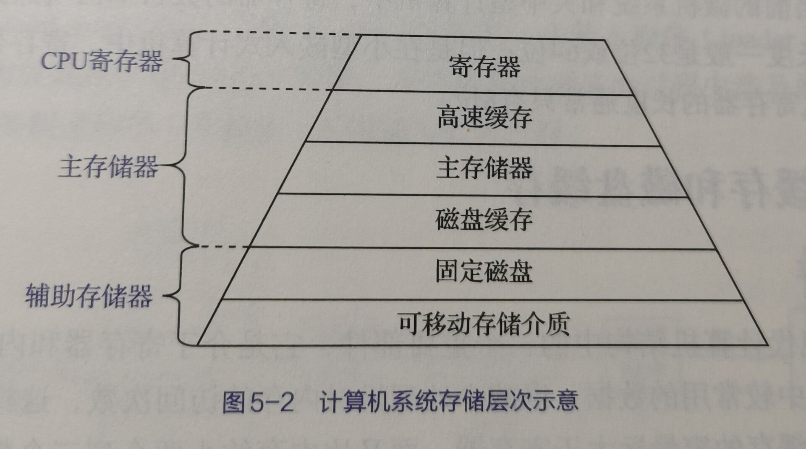

### 1.2按存储介质

1. 磁表面存储器（外存硬盘，磁盘、磁带）、磁心存储器，
2. **半导体存储器**（RAM，ROM，cache、MOS型存储器、双极型存储器），
3. 光存储器（光盘）。

### 1.3按存取方式

1. **随机存储器（RAM，random access memory）**

   存储器的任何一个存储单元的内容都可以随机存取，而且存取时间与存储单元的物理位置无关。

   主要用作主存或高速缓冲存储器。

   RAM又分为：

   1. 静态RAM（SRAM以触发器原理寄存信息）;
   2. 动态RAM（DRAM以电容充电原理寄存信息）。

2. **顺序存取存储器（SAM，sequential access memory）**

   顺序存取存储器的内容只能按某种顺序存取，读写一个存储单元所需时间取决于存储单元所在的物理位置。

   如磁带。

3. **直接存取存储器（DAM，direct access memory）**

   既有随机存取特性，也有顺序存取特性。存取信息时通常先寻找整个存储器中的某个小区域（如磁盘上的磁道），再在小区域内顺序方式查找。

   如机械硬盘。

   **速度：RAM>DAM>SAM**

---

以上的都是**串行访问存储器**。

- **串行访问存储器**

对存储单元进行读写操作时，需按其物理位置的先后顺序寻址，包括顺序存取存储器SAM（如磁带）与直接存取存储器DAM（如磁盘）。

- **相联存储器**（Associative Memory），即可以按内容访问的在储器（**CAM**，ContentAddressed Mamory）可以按照内容检索到存楮位置进行读写，“**快表**”就是一种相联存储器。

### 1.4按信息的可更改性

1. **读写存储器**（Read/Write Memory）

即可读、也可写。

如：磁盘、RAM，Cache。

2. **只读存储器（ROM，Read Only Memory）**

只能读，不能写。信息一旦写入存储器就固定不变，即使断电，内容也不会丢失。

通常用它存放固定不变的程序、常数和汉字字库，甚至用于OS的固化。它与随机存储器可共同作为主存的一部分，统一构成主存的地址域。

如：实体音乐专辑通常采用CD-ROM，实体电影采用蓝光光碟，BIOS通常写在ROM中。

由ROM派生出的存储器也包含可反复重写的类型，广义上的ROM已可通过电擦等方式进行写入，但其写入速度比读取速度慢得多。

### 1.5按信息的可保存性

1. **易失性存储器**

断电后，存储信息即消失的存储器，称为易失性存储器（RAM，即主存、cache）。

2. **非易失性存储器**

断电后信息仍然保持的存储器，称为非易失性存（ROM，磁表面存储器、光存储器）。

- **破坏性读出**

若某个存储单元所存储的信息被读出时，原存储信息被破坏，则称为**破坏性读出**（如DRAM芯片，读出数据之后要重写）。

具有破坏性读出性能的存储器，每次读出操作后，必须紧接一个再生的操作，以便恢复被破坏的信息。

- **非破坏性读出**

若读出时，被读单元原存储信息不被破坏，则称为**非破坏性读出**（如SRAM芯片，ROM，磁盘，光盘）。

## 2.存储器的性能指标

通常把存放一个二进制位的物理器件称为存储元，它是存储器的最基本的构件。地址码相同的多个存储元构成一个存储单元。若干存储单元的集合构成存储体。当对某个基本单元电路进行读/写操作时，必须被行、列地址共同选中。

存储器有3个主要性能指标，即存储容量、单位成本、存储速度。

**位**：**比特**bit（0/1）

**字节**byte, 就是简写为b：1**B**yte = 8Bit

1KB =2^10^B

8KB =2^10^ * 2^3^ = 2^13^B

1MB =2^10^ KB = 2^20^B

- **存储容量**
  $$
  存储容量=存储单元个数×存储字长\\
  如：1M × 8位
  $$
  MDR位数反应 存储字长。

- **单位成本**（每位价格）
  $$
  每位价格=\frac{总成本}{总容量}
  $$

- **存储速度**（数据传输率，主存带宽）
  $$
  数据传输率=\frac{数据的宽度}{存储周期}\\
  存储周期=存取时间+恢复时间
  $$

  - 存取时间（Ta）：存取时间又称存储器的访问时间（Memory Access Time），是指从启动一次存储器操作到完成该操作所经历的时间，分为读出时间和写入时间。（读出时间是指从主存接收到有效地址开始到数据稳定为止的时间，写入时间是指从主存接收到有效地址开始到数据写入被写单元为止的时间）
  - 存取周期（Tm）：存取周期又称读写周期或访问周期。它是指存储器进行一次完整的读写操作所需的全部时间，即连续两次独立访问存储器操作（读或写操作）之间所需的最小时间间隔 （存取周期=存取时间+恢复时间）
  - **主存带宽（Bm）**：**主存带宽**又**称数据传输率**，表示每秒从主存进出信息的最大数量，单位为字/秒、字节/秒（B/s）、位/秒（b/s）。

存取时间不等于存储周期，通常**存储周期大于存取时间**。这是因为对任何一种存储器，在读写操作之后，总要有一段恢复内部状态的复原时间。对于破坏性读出的存储器，存取周期往往比存取时间大得多，因为存储器中的信息读出后需要马上进行再生。

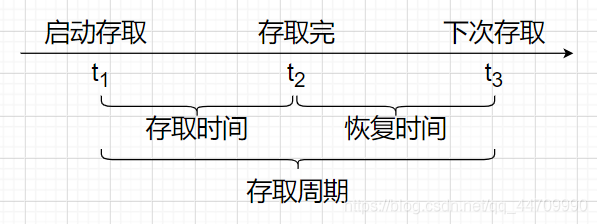

# 六、存储器管理（内存管理基础）

内存管理是指软件运行时对计算机内存资源的分配和使用的技术。其最主要的目的是如何高效，快速的分配，并且在适当的时候释放和回收内存资源。

操作系统的工作（5种）：

1. 内存空间的**分配与回收**（**主要**）
  - **连续分配存储管理方式**
    - 单一连续分配
    - 固定分区分配
    - 动态分区分配
  - **非连续分配存储管理方式**
    - 分页存储管理
    - 分段存储管理
    - 段页式存储管理

2. 提供某种技术从逻辑上对**内存**空间进行**扩充**
  - 覆盖overlay
  - 对换swapping
  - 虚拟存储

3. **地址转换**。逻辑->物理

  为使编程更方便，程序员写程序时应该只需要关注指令、数据的逻辑地址。而逻辑地址到物理地址的转换（这个过程称为**地址重定位**）应该由操作系统负责，这样就保证了程序员写程序时不需要关注物理内存的实际情况。

  - 链接：
    - 静态链接
    - 装入时动态链接
    - 运行时动态链接
  - 装入：
    - 绝对装入
    - 静态重定位装入
    - 动态重定位装入

4. **内存共享**。多个进程访问内存共享区的同一部分。

5. **内存保护**。保证各进程在各自的存储空间运行，互不干扰。

---

## 0.内存保护

内存保护需要由**操作系统**、**硬件机构**合作，保证进程空间不被非法访问（**越界**）。可采取2种方法：

- 方法一：在CPU中设置一对**上、下限寄存器**，存放进程的上、下限地址。进程的指令要访问某个地址时，CPU检查是否越界。
- 方法二：采用**重定位寄存器**（又称**基址寄存器**）**和界地址寄存器**（又称**限长寄存器**）进行越界检查。
  - 重定位寄存器中存放的是进程的**起始物理地址**。
  - 界地址寄存器中存放的是进程的**最大逻辑地址**。

## 1.程序到程序运行（地址转换）

三步：

1. **编译**
2. **链接**
3. **装入**

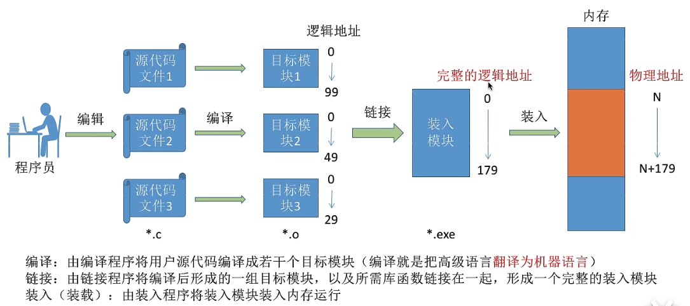

### 1.1编译

把高级语言编译为机器语言。

### 1.2链接

#### 1.2.1静态链接

在程序运行之前把各个目标模块和它们所需要的库函数，链接成一个完成的可执行文件（载入模块），之后不可拆开。

#### 1.2.2装入时动态链接

各目标模块装入内存时，**运行前**，边装入边链接。

#### 1.2.3运行时动态链接

需要运行哪一个目标模块时，才把哪一个放到装入模块。

### 1.3装入

**逻辑地址**（logic address）、相对地址：CPU生成的地址。

**物理地址**（physical address）、绝对地址：内存单元看到的地址，就是装入内存地址寄存器的地址。

逻辑地址的地址参数会转换成物理地址，比如0变成n。

#### 1.3.1绝对装入

absolute loading mode。

在编译的时候，就知道程序将放到内存的哪个位置。那么编译产生的就是物理地址的代码。装入程序按照装入模块中的地址，将程序和数据装入内存。

就是装入模块（*.exe）0\~179，现在就采用n\~n+179。

缺点：灵活性低。只适用于**单道程序环境**。（那时候还没有操作系统）

#### 1.3.2静态重定位装入

可重定位装入，relocation loading mode。又称**静态重定位**。

编译、链接后的装入模块的地址都是从0开始的，指令中使用的地址、数据存放的地址都是相对于起始地址而言的逻辑地址。可根据内存的当前情况，将装入模块装入到内存的适当位置。装入时对地址进行“重定位”，将逻辑地址变换为物理地址（地址变换是在装入时一次完成的）。

【总结】装入程序根据内存的具体情况，对装入模块的地址进行 +n 的操作。

用于早期**多道批处理**操作系统。

特点：

1. **在一个作业装入内存时，必须分配其要求的全部内存空间（一定是连续的）。**如果没有足够的内存，就不能装入该作业；
2. 作业一旦进入内存后，在**运行期间就不能再移动**，也不能再申请内存空间。

#### ❗1.3.3动态重定位装入

**动态运行时装入**，dynamic run-time loading mode。又称**动态重定位**。

编译、链接后的装入模块的地址都是从0开始的。装入程序把装入模块装入内存后，并不会立即把逻辑地址转换为物理地址，而是把地址转换推迟到程序真正要**执行时才进行**。因此装入内存后所有的地址依然是逻辑地址。

这个方式有一个**重定位寄存器**（存放装入模块的起始位置地址）。

【注意】重定位寄存器，使得允许程序在内存中移动，**整个系统中只有一个重定位寄存器**。每次切换进程，都需要保存、恢复该寄存器的值。

**【总结】装入模块存入内存的仍然是逻辑地址，地址转换在程序真正要运行的时候才进行**。

**物理地址 = 逻辑地址 + 重定位寄存器的地址**。

特点：

1. **允许程序在内存中发生移动，因为重定位寄存器的内容可以更改**。
2. 并且可将程序分配到不连续的存储区中；
3. 在程序运行前只需装入它的部分代码即可投入运行，然后在程序运行期间，根据需要动态申请分配内存；
4. 便于程序段的共享，可以向用户提供一个比存储空间大得多的地址空间。
4. 动态重定位需要用到**地址变换机构**。

## 2.内存扩充

### 2.1覆盖

覆盖技术，解决“**程序大小超过物理内存总和**”的问题。用于早期操作系统，现在不常用。

内存中有**固定区**、**覆盖区**。

**把程序分成多个段（多个模块）**，常用的段常驻内存“固定区”，调入后就不再调出（除非运行结束）；不常用的段在需要的时候调入内存“覆盖区”，需要用到时调入内存，用不到时调出内存。

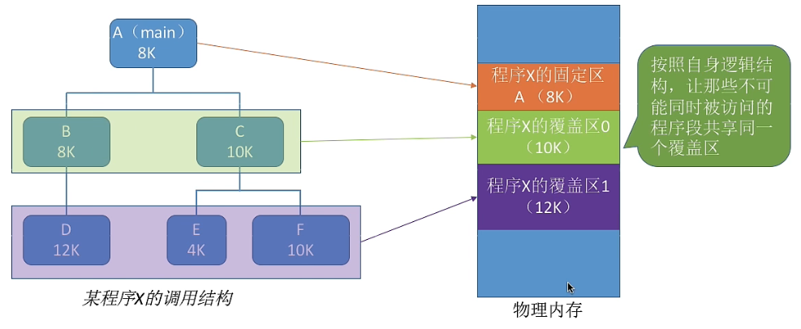

要求：程序员提供一个清楚的覆盖结构。即程序员必须把一个程序划分成不同的程序段，并规定好它们的执行和覆盖顺序。

由程序员声明覆盖结构，操作系统完成自动覆盖。

**缺点：对用户不透明**，增加了用户编程负担。

> [【详解】计算机术语“透明”是什么意思？“对.....是透明的”怎样理解？_透明是可见还是不可见](https://blog.csdn.net/weixin_51350847/article/details/141818403)

覆盖技术只用于早期的操作系统中，现在已成为历史。

### 2.2对换（交换）

用**中级调度（内存调度）**实现。

分为：

- 整体对换
- 页面（或分段）对换

对象是进程，等待状态的进程驻留内存会造成存储空间的浪费。因此，有必要**把处于等待状态的进程换出内存**。

暂时换出外存等待的进程状态为**挂起状态**（挂起态，suspend）。挂起态又可以进一步细分为**就绪挂起**、**阻塞挂起**两种状态。

交换技术是实现此目标的常用方法之一。（进程在内存与磁盘间动态调度）

**【注意】PCB常驻内存，不会被换到外存。**

- **离散**分配方式：提高空间利用率
- **连续**分配方式：对换区的I/O速度比文件区快。

**优点**：与覆盖技术相比，交换技术不要求程序员给出程序段之间的覆盖结构。

---

- 应该在外存（磁盘）的什么位置保存被换出的进程？

具有对换功能的操作系统中，通常把磁盘空间分为**文件区**和**对换区**两部分。

**文件区**主要用于存放文件，主要追求存储空间的利用率，因此对文件区空间的管理采用**离散分配方式**。

**对换区空间只占磁盘空间的小部分**，被换出的进程数据就存放在对换区。由于对换的速度直接影响到系统的整体速度，因此对换区空间的管理主要追求换入换出速度，因此通常**对换区**采用**连续分配方式**（学过文件管理章节后即可理解）。总之，对换区的I/O速度比文件区的更快。

- 什么时候应该交换？

交换通常在许多进程运行且内存吃紧时进行，而系统负荷降低就暂停。

> 例如:在发现许多进程运行时经常发生缺页，就说明内存紧张，此时可以换出一些进程;如果缺页率明显下降，就可以暂停换出。

- 应该换出哪些进程？

可优先换出**阻塞进程**；

可换出**优先级低**的进程，为了防止优先级低的进程在被调入内存后很快又被换出，有的系统还会考虑进程在内存的驻留时间...

### 2.3交换、覆盖的区别

1.交换主要在**不同进程或作业**之间进行。

2.覆盖主要在**同一个进程或作业**内进行，只能对与覆盖程序段无关的程序段进行覆盖。

## ❗3.分配与回收

【注意】操作系统实现“**分区**”存储管理的**代价最小**。（不是分页、分段）

### 3.1==连续==分配存储管理方式

连续分配：系统为用户分配的是一个连续的内存空间。

**内部碎片**：分配给进程的内存区中，有部分没有用上，**分多了**。

**外部碎片**：内存中的某些空间因为**太小而难以利用**。

#### 3.1.1单一连续分配

单道程序环境，内存分为系统区、用户区。

内存中**只能有一道用户程序**。即使用户区有很多空闲，但是只能进行一个进程。

**优点**：实现简单；**无外部碎片**；可以采用覆盖技术扩充内存；不一定需要采取内存保护（eg:早期的PC操作系统MS-DOS） 。

**缺点**：只用于单用户、单任务；**有内部碎片**；存储器利用率低。

#### 3.1.2固定分区分配

**多道程序**环境，内存分为系统区、用户区，用户区划分为若干固定大小（可以相等、也**可以不相等**）的分区，每个分区只装入一道作业。

**优点**：实现简单；**无外部碎片**。

**缺点**：若程序太大，所有的分区都无法满足需求，就不得不使用覆盖技术（但是很适合用于**一台计算机控制多个相同的对象**的场合）；**有内部碎片**；存储器利用率低。

---

操作系统需要建立一个数据结构：**分区说明表**，来实现各个分区的分配与回收。每个表项对应一个分区，通常按分区大小排列。每个表项包括对应分区的大小、起始地址、状态（是否已分配）。

分区说明表：

| 分区号 | 大小 | 起始地址 | 状态   |
| ------ | ---- | -------- | ------ |
| 1      | 12   | 20       | 已分配 |
| 2      | 32   | 32       | 空闲   |
| 3      | 64   | 64       | 空闲   |
| 4      | 128  | 128      | 空闲   |

#### 3.1.3动态分区分配

**可变分区分配**，他不会预先划分内存分区。而是在进程装入内存时，根据进程的大小动态建立分区。并使分区的大小正好适合进程的需要。内此系统分区的大小、数目是可变的。

采用了**动态重定位装入**，所以需要**硬件地址变换机构**。

- 系统要用什么样的数据结构记录内存的使用情况？

数据结构：

1. 空闲分区表：与固定分区分配一样

2. 空闲分区链

- 当有多个空闲分区满足时，如何选择分区？

按照**动态分区分配算法**。

##### ❗==动态分区分配算法==

- **首次适应算法（效果最好）**
  first fit，FF

空闲分区按照**地址递增**顺序排列。每次都是从**低地址**开始查找，找到第一个能满足大小空闲的分区（表或链）。

- **最佳适应算法**
  best fit，BF

空闲分区按照**容量递增**顺序排列。每次都是从**最小分区**开始查找，找到第一个能满足大小空闲的分区。

**缺点**：因为每次都是选用的最小分区，所以每次都会剩下更小，更难利用的分区，产生外部碎片。

【2019年408真题】最佳适应算法最容易产生内部碎片。

- **最坏适应算法**
  worst fit，WF。最大适应算法（Largest Fit)

空闲分区按照**容量递减**顺序排列。每次都是从**最大分区**开始查找，找到第一个能满足大小空闲的分区。

**缺点**：不断分割大分区，之后的大进程来了，可能没有分区来使用。

- **邻近适应算法**
  next fit，NF

空闲分区按照**地址递增**顺序排列（例如形成一个循环链表）。每次从**上次检查结束**的位置开始查找，找到第一个能满足大小空闲的分区。

分区回收：4种情况

---

#### 3.1.4紧凑技术

无内部碎片，**有外部碎片**。

可以通过**紧凑技术**来解决外部碎片的问题。

对进程进行挪位，让进程更紧凑，把小空间变大。

### 3.2==非连续==分配存储管理方式

可以把进程拆分成多段进行存储，所以分区越小，产生的**空闲分区（碎片）就更小**。

#### ❗3.2.1分页存储管理

将**内存空间**分为大小相等的分区，每个分区称为**页框**（frame）（**页框 = 页帧 = 内存块 = 物理块 = 物理页面**）。每个页框有一个编号，称为**页框号**（页框号 = 页帧号 = 内存块号 = 物理块号 = 物理页号），**页框号从 0 开始**，编号小的页框就在低地址位。

将**进程的逻辑地址空间**也分为**与页框大小相等**的一个个部分，每个部分称为一个“**页**”或“**页面**”。每个页面也有一个编号，即“**页号**”，页号也是从0开始。

操作系统以**页框为单位为各个进程分配**内存空间。

【注意】

1. **主存**的分配以**页框**为单位。
2. **主存储器**的访问，以**字节、字**为单位。

进程的每个页面分别放入一个页框中。也就是说，进程的页面与内存的页框有**一一对应**的关系（使用页表实现）。

各个页面不必连续存放，可以放到不相邻的各个页框中。

 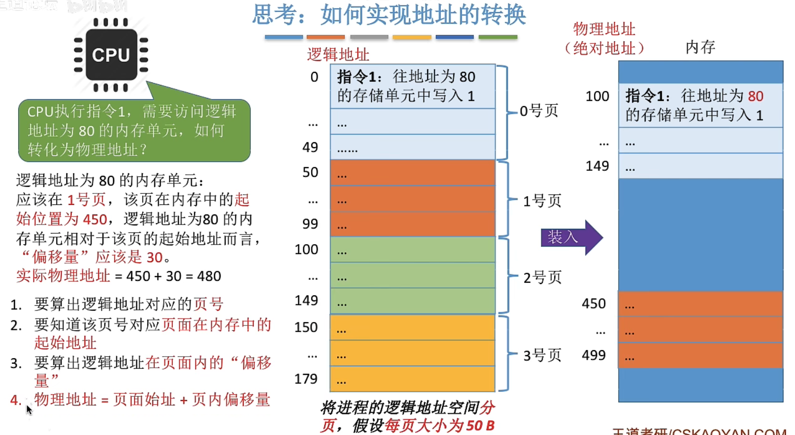

> 80是逻辑地址的位置，在50-99橙色页中。
> 50是已知的起始地址，它的重定位寄存器内是400，可以算出在内存中的物理起始地址是400+50=450
> 偏移量是80-50=30
> 实际物理地址是450+30=480

##### ❗==【考点】逻辑地址结构==

图中**逻辑地址长度**一共32位，

**主存最大容量**为 2^32^ B = 4G。

其中0~11位为**页内地址**（或**页内偏移量**），有12位，即每**页（页框）的大小（==页面大小==）**为2^12^B = 4096B = 4KB。

12~31位为**页号**，即**==空间大小==**，最多允许有 2^20^ = 1024K = 1M页。
$$
P=int[\frac{A}{L}] \ (页号=取整[\frac{逻辑地址}{页面长度}])\\
W=[A] mod\ L \ (页内偏移量=逻辑地址\%页面长度（除法取余）) \\
\\
实际物理地址 = 页面在内存中的起始地址+页内偏移量
$$
`A`：逻辑地址
`L`：页面长度

> 例如上面的例子：
>
> 页号 = 80/50 = 1
> 偏移量 = 80%50 = 30
>
> 而1号页的起始位置450
> 实际物理地址是450+30=480

- 在选择页面大小的时候，通常考虑下面的因素：

1. 页面大：
   - **好处**：用于管理的**页表少**；
   - **坏处**：页内碎片会比较大。
2. 页面小：和页面大好坏处正好相反。

最佳方案是通过计算，获得恰当好处的页面大小。

划分页面大小一般是根据**内存**大小确定的。为了方便计算机计算，页内偏移量、页面大小一般是**2的整数幂**。

---

##### 页表

为了知道进程的每个页面在内存中存放的位置，**操作系统**为**每个进程都建立一张表**。

注：页表通常存在PCB（进程控制块）中。

【注意】查找页表的工作是由**硬件**实现的。

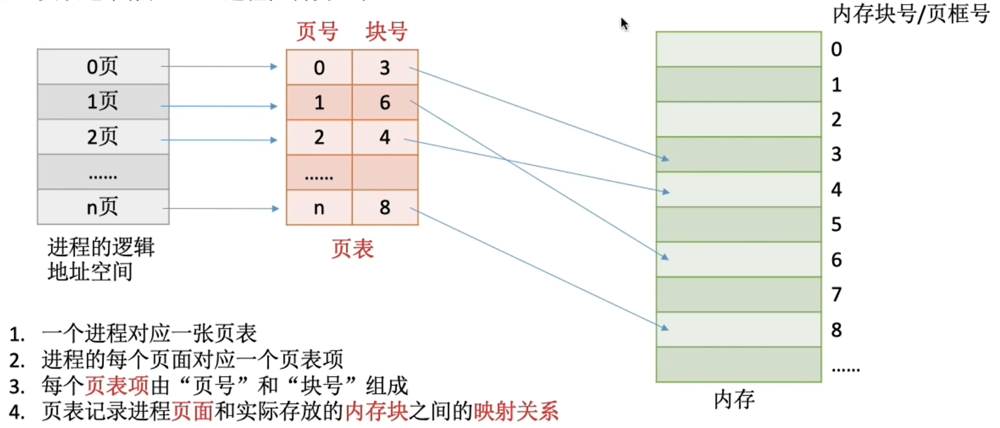

- ==如何通过内存大小和页面大小，推算**页表长度**（内存块数量）？==

Eg：假设某系统物理内存大小为4GB，页面大小为4KB，则每个**页表项（一个格子）**至少应该为多少字节?

1. 内存块大小 = 页面大小 = 4KB = 2^12^B（每个页框存储的大小）
2. 4GB的内存总共会被分为2^32^/2^12^=2^20^个内存块
3. 内存块号的范围应该是0\~2^20^-1
4. 内存块号至少要用20 bit来表示
5. 至少要用**3B**来表示块号（3*8=24bit）

页表项是连续存放的，因此**页号可以是隐含的**，不占存储空间（类比数组的下标，0,1,2……）。

---

##### 基本==地址变换机构==

基本地址变换机构，是用于实现逻辑地址到物理地址转换的一组硬件机构。

在系统中设置一个**页表寄存器**（page-table register，**PTR**），存放页表在内存中的**起始地址 F**、**页表长度 M**。平时不执行进程时，起始地址、页表长度存放在PCB中，当进程运行时，才会把这两者放到PTR中。

【注意】页面大小是2的整数幂。

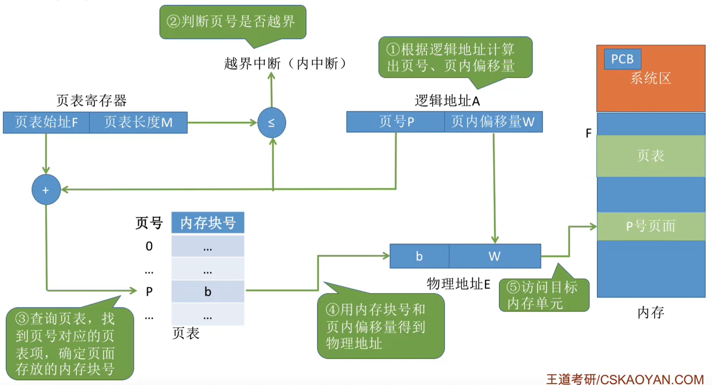

解题步骤：

`A`：逻辑地址
`L`：页面长度

1. 求出**页号 P=A/L**（取整）、**页内偏移量W=A%L**（取余）；

2. 根据**页号**判断是否**越位（越界）**；

   比较页号P和**页表长度M**，若**P ≥ M**，则产生越界中断，否则继续执行。（【注意】页号是从0开的，而页表长度至少是1，因此P=M时也会越界）。

3. 根据**页号**求出**块号**；

   （一般是在页表中，页号与块号对应）

   页表中**页号P**对应的**页表项地址（页表的页号）= 页表起始地址F＋页号P * 页表项长度**，取出该页表项内容b，即为**内存块号**。（注意区分页表项长度、页表长度、页面大小的区别）

   **页表长度**：页表中总共有几个页表项，即总共有几页。
   **页表项长度**：页表项的大小。
   **页面大小**：一个页面占多大的存储空间。**偏移量**占几位就是页面大小。

4. **物理地址E**：
   $$
   E = 块号b * 页面长度(页面大小)L + 页内偏移量W
   $$
   页面长度(页面大小)L的计算：$2^{页内偏移量的位数}$。

【注意】页式管理中地址是**一维的**。因为在实际中寻找物理地址，只需要用户给出逻辑地址，其他都可以计算出。

> 例1：
>
> 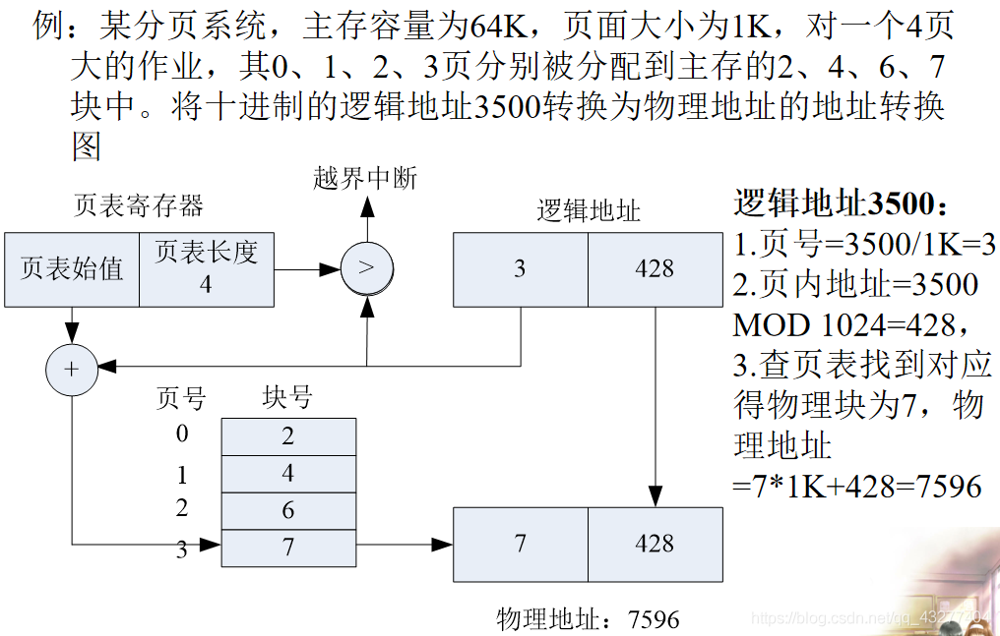

>例2：若**页面大小L为1K字节**，页号2对应的内存块号b=8，将逻辑地址A=2500转换为物理地址E。
>
>等价描述: 某系统**按字节寻址**，逻辑地址结构中，**页内偏移量占10位**，页号2对应的内存块号b=8，将逻辑地址A=2500转换为物理地址E。
>
>这里 页内偏移量占10位 就是说明一个页面的大小为2^10^B = 1KB
>
>1. 计算页号、页内偏移量
>   页号P=A/L = 2500/1024=2；页内偏移量W=A%L= 2500%1024= 452
>2. 根据题中条件可知，页号2没有越界，其存放的内存块号b = 8
>
>3. 物理地址E= b\*L+W = 8 \* 1024 + 425= 8644

---

##### ==快表TLB==地址变换机构

快表的依据是：**局部性原理**。

**时间局部性**：如果执行了程序中的某条指令，那么不久后这条指令很有可能再次执行；如果某个数据被访问过，不久之后该数据很可能再次被访问。（因为程序中存在大量的循环）

**空间局部性**：一旦程序访问了某个存储单元，在不久之后，其附近的存储单元也很有可能被访问。（因为很多数据在内存中都是连续存放的）

因为访问的都是这几个内存块，所以查询到页表项也是相同的，所以创建快表，减少访问页表的次数。

**快表**，又称**联想寄存器**（associative memory），在IBM系统中取名**地址变换高速缓存**（translation look aside buffer，**TLB**），是一种访问速度比内存快很多的高速缓冲存储器，用来**存放最近访问的若干页表项**，以加速地址变换的过程。与此对应，内存中的页表常称为**慢表**。

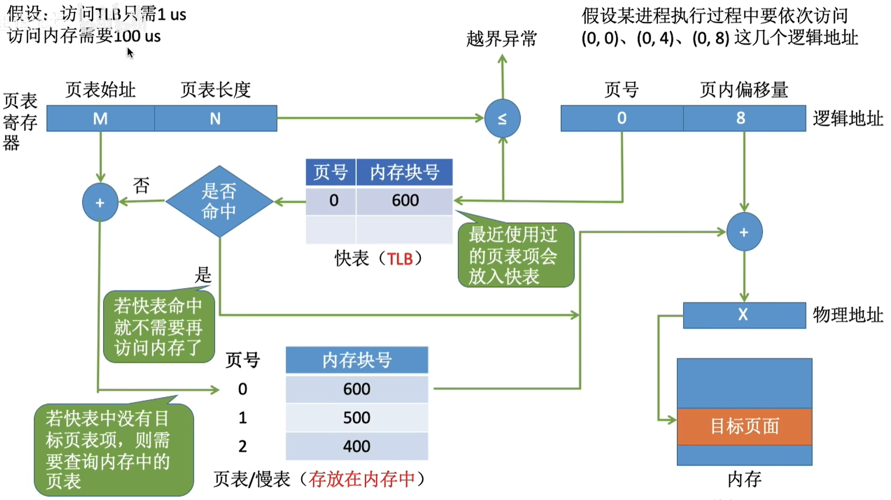

【考点】平均访存时间 = <u>命中率 × 快表访存</u> + <u>不命中率 × （快表访存+页表访存）</u>+ <u>内存访存</u>

---

##### ❗二级页表

单级页表的问题：

1. 页表的存储是连续的，如果特别大，那么它的存在本身就破坏了分页存储的优点。
2. 根据局部性原理，不需要所有页表项一直都在，增加检索耗时，只需要几个特定的。

所以，把页表再分页存储，建立一个**外层页表**（outer page table）（或**一级页表**、**页目录**表、顶层页表）来存储页表（**页表索引**）的页表。套娃，所以后续也就有多级页表。

| 页目录号 | 页表索引（页号） | 页内偏移量 |
| -------- | ---------------- | ---------- |

【2021年408真题】在多级页表中，页表基址寄存器存放的都是顶级页表（**一级页表**）的起始**物理地址**。

【2015年408真题】有几位页目录号，就有几个页面：

| 页目录号（10位） | 页表索引（页号） | 页内偏移量 |
| ---------------- | ---------------- | ---------- |

那么就有2^10^个页目录项 → 有2^10^个页面，这个也就是页表占了多少页。

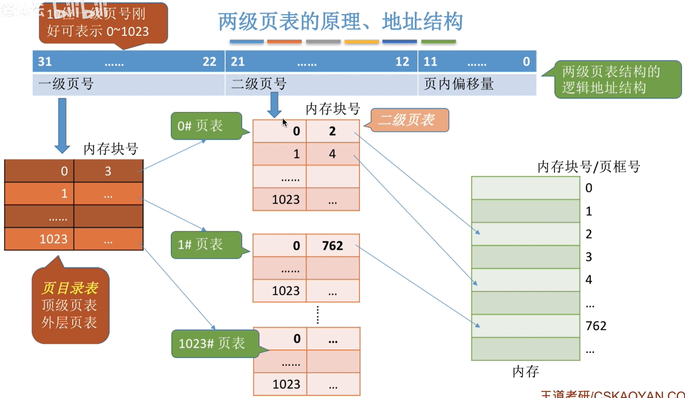

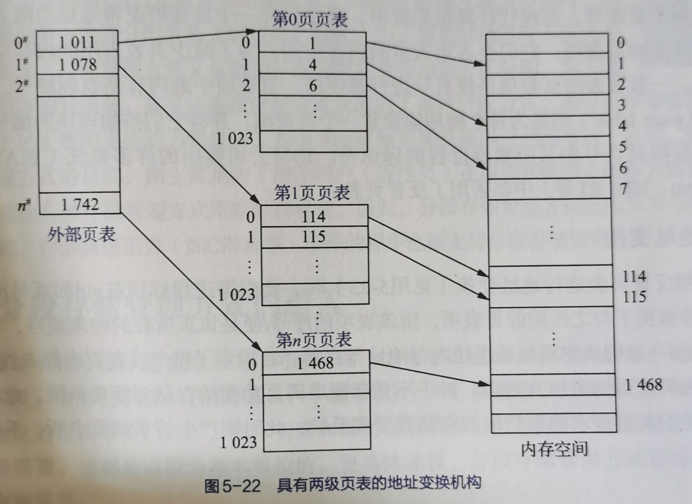

【注意事项】若采用多级页表机制，则**各级页表大小不能超过一个页面**。

---

==【考点：计算多级页表】==

> 例：某系统按字节编址，采用40位逻辑地址，页面大小为4KB，页表项大小为4B，假设采用纯页式存储，则要采用（3）级页表，页内偏移量为（12）位？

**页面大小 = 4KB = 2^12^B，按字节编址，因此页内偏移量为12位。**

**页号 = 40 - 12= 28位。**

**页面大小 = 2^12^B，页表项（页里面的一个格子）大小= 4B，则每个页面可存放2^12^ / 4 = 2^10^个页表项。**

**28 / 10 = 2.8**，两级页表不够，可以分三级。

因此各级页表最多包含2^10^个页表项，需要**10位二进制位**才能映射到2^10^个页表项，因此每一级的页表对应页号应为10位。总共**28位的页号**至少要分为三级。（两级页表不够，可以分更多级）

- 访存**次数**随之增加。

第一次访存:访问内存中的页目录表；

第二次访存:访问内存中的二级页表；

第三次访存:访问目标内存单元。

N级页表访问一个逻辑地址需要N+1次访存。

#### 3.2.2分段存储管理

进程的地址空间：按照程序**自身的逻辑**关系划分为若干个段，每个段都有一个段名（在低级语言中，程序员使用段名来编程），**每段从0开始编址**。

由于是按逻辑功能模块划分，用户编程更方便，程序的可读性更高。

内存分配规则：以段为单位进行分配，**每个段在内存中占据连续空间**，但**各段之间可以不相邻**。

有点像动态分区分配，会产生**外部**碎片，但是**不会产生内部碎片**。

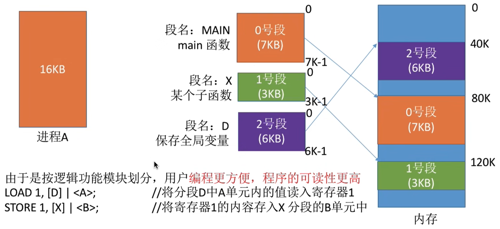

##### 地址结构

**段号**的位数决定了**每个进程最多可以分几个段。**

**段内地址**位数决定了**每个段的最大长度是多少**。

在上述图中，若系统是按字节寻址的，则：

段号占16位，因此在该系统中，每个进程最多有2^16^ = 64K个段

段内地址占16位，因此每个段的最大长度是2^16^ = 64KB。

##### 段表

段号就是逻辑地址的位置，基址是在内存中的位置。

因为每个**段的长度不一定**，所以用段长来表示段的段的长度（类似偏移）。而页表没有，因为页表的每一页都是一样大的。

**段表项的大小是相同的**。由于段表项长度相同，因此段号是可以隐藏的，不占存储空间。

【注意】段表地址、段表长度是存放在PCB中的。

##### 地址变换

1. 由逻辑地址得到段号、段内地址；
2. 段号与段表寄存器中的段长度比较，检查是否越界；
3. 由段表始址、段号找到对应段表项；
4. 根据段表中记录的段长，检查段内地址是否越界；
5. 由段表中的"基址+段内地址"得到最终的物理地址；
6. 访问目标单元。

#### 分段vs分页管理

分段、分页管理的对比

1. 页是信息的**物理单位**。分页的主要目的是为了实现离散分配，提高内存利用率。分页仅仅是系统管理上的需要，完全是系统行为，**对用户不可见的**。

   段是信息的**逻辑单位**。分段的主要目的是更好地满足用户需求。一个段通常包含着一组属于一个逻辑模块的信息。分段**对用户是可见的**，用户编程时需要显示地给出段名。

2. 页的大小固定且由系统决定。

   段的长度却不固定，决定于用户编写的程序。

3. 分页的用户进程地址空间是**一维的**，程序员只需给出一个记忆符即可表示一个地址。

   分段的用户进程地址空间是**二维的**，程序员在标记一个地址时，既要给出段名，也要给出段内地址。

4. **分段**比分页更容易**实现信息的共享和保护**。只需让各进程的段表项指向同一个段即可实现共享。不能被修改的代码称为**纯代码**或**==可重入==代码**（不属于临界资源），这样的代码可以共享的。可修改的代码是不能共享的。

目的不同：

- **分段**：更好的满足用户的需求，实现程序模块化、保护。
- **分页**：离散分配，提高内存利用率。

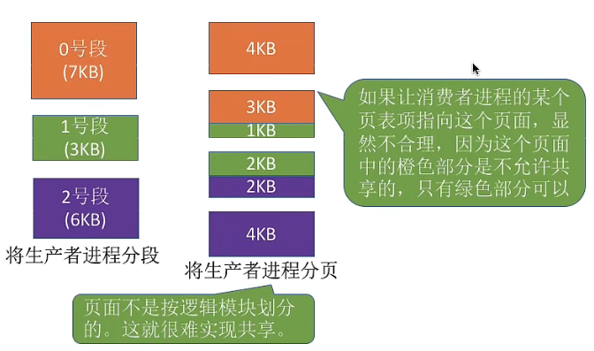

访问一个逻辑地址需要几次访存？

**分页**（单极页表）：第一次访存——查内存中的页表，第二次访存——访问i目标内存单元。总共**两次访存**。

**分段**：第一次访存——查内存中的段表，第二次访存——访问目标内存单元。总共**两次访存**。

与分页系统类似，分段系统中也可引入**分段快表机构**，将近期访问过的段表项放到块表中，这样可以少一次访问，加快地址变换速度。

#### 3.2.3段页式存储管理

先分段，再把大的段分页。

**段号**的位数决定了每个进程最多可以**分几个段**。

**页号**位数决定了**每个段最大有多少页**。

**页内偏移量**决定了**页面大小、内存块大小**是多少。

**段页式需要访存3次**，而分别的段式、页式都是2次。

在上述例子中，若系统是按字节寻址的，则：

段号占16位，因此在该系统中，每个进程最多有2^16^= 64K个段。

页号占4位，因此每个段最多有2^4^ = 16页。

页内偏移量占12位，因此每个页面/每个内存块大小为2^12^ = 4096 = 4KB

---

“分段”对用户是可见的，程序员编程时需要显式地给出段号、段内地址。而将各段“分页”对用户是不可见的。系统会根据段内地址自动划分页号和页内偏移量。因此段页式管理的地址结构是**二维的**。

所以一个**进程**对应**一个段表**，但是可能会对应**多个页表**。

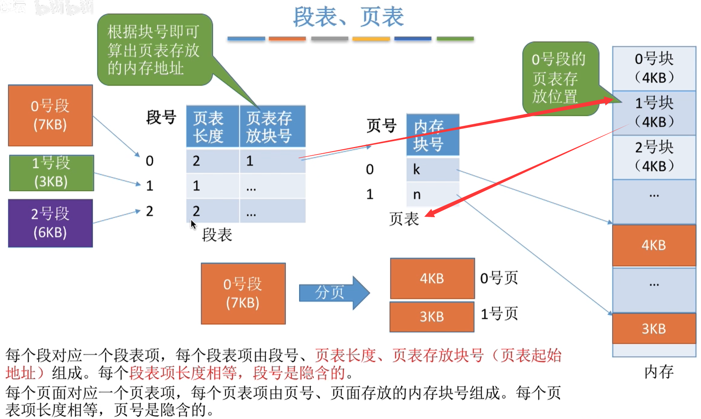

##### 地址转换

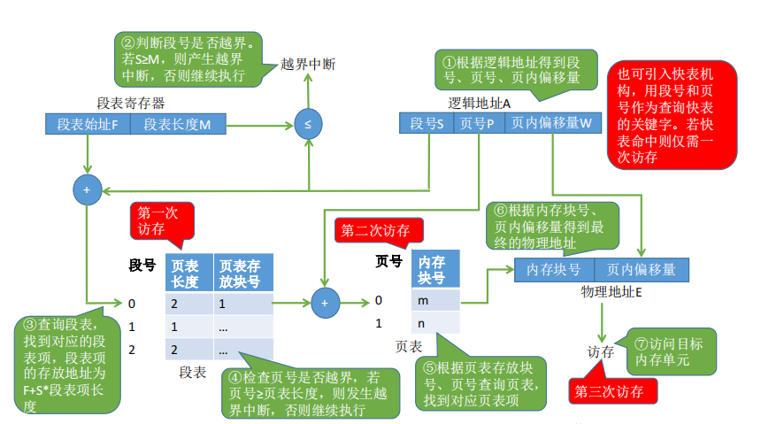

**优点：**
保留了分段和请求分页存储管理的全部优点；
提供了虚存空间，能更有效利用主存。

**缺点：**
增加了硬件成本；
系统复杂度较大。

# 七、虚拟内存管理

虚拟内存是计算机系统内存管理的一种技术。它使得应用程序认为它拥有连续可用的内存（一个连续完整的地址空间），而实际上，它通常是被分隔成多个物理内存碎片，还有部分暂时存储在外部磁盘存储器上，在需要时进行数据交换。

基于**高速缓存技术**来实现的，且必须有相应的硬件来支持。

虚拟内存的**最大容量**：由计算机的地址结构（CPU寻址结构）确定。

虚拟内存的**实际容量** = min{内存、外存容量之和，CPU寻址范围}。

> 例：32位计算机，按字节编址，内存大小为512MB，外存2G.
>
> 最大容量 = 2^32^B = 4GB
>
> 实际容量 = min(2^32^B, 512MB+2GB) = 512MB+2GB

## 1.常规存储器特征

传统存储管理方式的特征、缺点：

### 1.1一次性

作业**必须一次性全部装入内存后才能开始运行**。这会造成两个问题：

1. 作业很大时，不能全部装入内存，导致**大作业无法运行**；

2. 当大量作业要求运行时，由于内存无法容纳所有作业，因此只有少量作业能运行，导致**多道程序并发度下降**。

### 1.2驻留性

一旦作业被装入内存，就**会一直驻留在内存**中，直至作业运行结束。

事实上，在一个时间段内，只需要访问作业的一小部分数据即可正常运行，这就导致了内存中会驻留大量的、暂时用不到的数据，浪费了宝贵的内存资源。

## 2.虚拟内存特征

### 2.1局部性原理

**时间局部性**：如果执行了程序中的某条指令，那么不久后这条指令很有可能再次执行;如果某个数据被访问过，不久之后该数据很可能再次被访问。（因为程序中存在大量的循环）

**空间局部性**：一旦程序访问了某个存储单元，在不久之后，其附近的存储单元也很有可能被访问。（因为很多数据在内存中都是连续存放的)

**高速缓存技术**：使用频繁的数据放到更高速的存储器中。（如：快表）

---

基于局部性原理，在程序装入时，可以将程序中**很快会用到的部分装入内存，暂时用不到的部分留在外存**，就可以让程序开始执行。

在程序执行过程中，当所访问的信息不在内存时，由操作系统负责将所需信息从外存调入内存，然后继续执行程序。若**内存空间不够**，由操作系统负责将内存中暂时用不到的信息**换出到外存**。

在操作系统的管理下，在用户看来似乎有一个比实际内存大得多的内存，这就是**虚拟内存**。

---

- 3种特性：

### 2.2多次性

对应“一次性”。

无需在作业运行时一次性全部装入内存，而是允许被分成多次调入内存。

### 2.3对换性

对应“驻留性”。

在作业运行时无需一直常驻内存，而是允许在作业运行过程中，将作业换入、换出。

### 2.4虚拟性

从逻辑上扩充了内存的容量，使用户看到的内存容量，远大于实际的容量。

### 2.5虚拟存储器的容量

【2023年408真题】**虚拟存储器的最大容量（虚拟地址空间）**：由计算机的**地址结构**决定，与主存、外存容量没有关系。

> eg. 一个计算机系统的地址寄存器有32位，那么虚拟存储器的最大容量是 2^32^。

【2020年408真题】**一个数组**在虚拟空间存放是连续的，但是在物理空间存放可以是不连续的。

## 3.虚拟内存的实现

使用虚拟技术之后，再采用传统的连续分配方式就不是很方便，所以虚拟内存的实现需要建立在**离散分配**的内存管理上。

那么传统的非连续分配存储管理方式：

1. 分页存储管理
2. 分段存储管理
3. 段页式存储管理

就变成了：（**关键就在于“请求”**）

1. **请求**分页存储管理
2. **请求**分段存储管理
3. **请求**段页式存储管理

- **它与传统的非连续分配存储管理区别**：（请求页表的两大功能）

1. 在程序执行过程中，当所访问的信息不在内存时，由操作系统负责将所需的信息从外存中调入内存，然后继续执行程序。就有了**请求调页**（或**请求调段**）功能。
2. 若内存不够，操作系统负责将内存中暂时用不到的信息调出到外存。就有了**页面置换**（或段置换）功能。

### ❗3.1缺页率

$$
缺页率=\frac{缺页次数}{访问页面的总数}
$$

影响因素：

1. 页面大小

2. 工作集的大小：决定进程所分配的物理块数目

   物理块越多，缺页率越低。

3. 页面置换算法

4. 程序固有的特性

5. 进程的数量

   进程越多，进程所分配的物理块数目就越少，缺页率越高。

【2022年408真题】不会影响缺页率的是：**页缓冲队列**的长度。

**页缓冲队列**：是将置换淘汰下的页面进行缓存，暂时不写回磁盘，会影响页面置换速度，但不影响缺页率。

### 3.2请求分页（请求页表）

只有页号、块号的页表叫**基本页表（基本分页）**。

新增4个字段的页表叫**请求页表（请求分页）**。

它们的区别就是：**请求页表**有两大功能：

1. **请求调页**：在程序执行过程中，当所访问的信息不在内存时，由操作系统负责将所需的信息从外存中调入内存，然后继续执行程序。
2. **页面置换**：若内存不够，操作系统负责将内存中暂时用不到的信息调出到外存。

为了实现“请求分页”，新增了4个字段，使用页表机制：

#### 3.2.1页表机制

增加4个字段

**状态位P**：页面是否调入内存。1是在内存，0不在。

**访问字段A**：记录这个页面被访问过几次，或是多久没被访问。

**修改位M**：记录页面是否被修改过，1修改过。

**外存地址**：页面在外存中存放的位置。

#### ❗3.2.2缺页中断机构

**缺页中断**是因为当前执行的指令想要访问的目标页面未调入内存而产生的，因此属于**内中断：故障(fault)**。

在请求分页系统中，每当要访问的**页面不在内存时**，便产生一个**缺页中断**，然后由操作系统的缺页中断处理程序处理中断，当系统处理之后，应该执行**被中断的**那一条指令。

此时缺页的进程阻塞，放入阻塞队列，调页完成之后再将其唤醒，放入就绪队列。

- 如果内存中**有空闲块**，则为进程分配一个空闲块，将所缺页面装入该块，并修改页表中相应的页表项。
- 如果内存中**没有空闲块**，则由**页面置换算法**选择一个页面进行淘汰。该页面在内存期间被修改过，则要将其写回外存；未修改过的页面不用写回外存。

#### 3.2.3地址变换机构

当程序执行的过程中，所访问的信息不在内存之中，操作系统需要把信息从外存中调入内存，然后再执行程序。若内存空间不够，操作系统把内存中暂时用不到的信息调出到外存，腾出空间。

补充细节：

1. 只有“写指令”才需要修改“修改位”。并且，一般来说只需修改快表中的数据，只有要将快表项删除时才需要写回内存中的慢表。这样可以减少访存次数。
2. 和普通的中断处理一样，缺页中断处理依然需要保留CPU现场。
3. 需要用某种“**页面置换算法**”来决定一个换出页面。
4. 换入/换出页面都需要启动速度较慢的I/O操作，如果换入/换出太频繁，会有很大的开销。
5. 页面调入内存后，需要修改慢表，同时也需要将表项复制到快表中。

## ❗4.==页面置换==算法

【注意】

1. 无论使用什么页面置换算法，**第一次访存**都不可能就已经在内存中，**必然会发生缺页**，所以**==缺页次数（失效次数）==不会少于页面（页帧，内存容量的页面）的数量**。计算**缺页率**，应该算上这些。

   但是，注意用词：==页置换==次数 ≠ 缺页次数。页置换应该是新进入的序号不仅没有，而且还需要把已有的换出来。

2. 所有的算法，都会发生**抖动**。

### 4.1最佳置换算法OPT

optimal

每次选择淘汰的页面将是以后永不使用，或者在最长时间内不再被访问的页面，这样可以保证最低的缺页率。

既往前看、也往后看，相当于预见未来。**不可实现**。

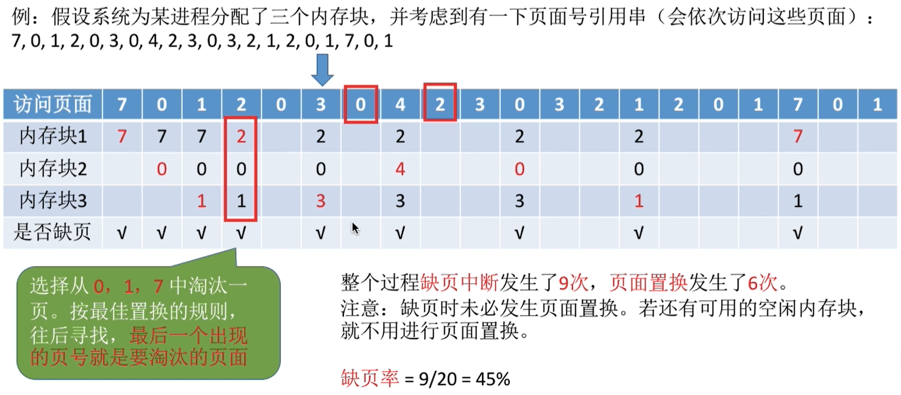

### 4.2先进先出置换算法FIFO

Frist in Frist out

每次选择淘汰的页面是最早进入内存的页面。

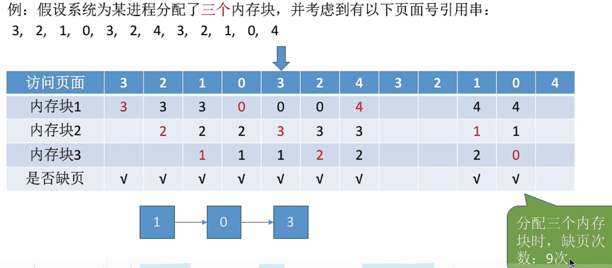

这里的**缺页率**是9/12

这个题，如果变成4个物理块，那么就会有10次缺页。这就是**belady 异常**。

#### Belady 异常

Belady 异常：当为进程分配物理块增大时，缺页次数不减反增的现象。

只有FIFO算法会产生belady异常，因此FIFO算法性能差。

### 4.3最近最久未使用置换算法❗LRU

least recently used

每次淘汰的页面是最近最久未使用的页面。

实现方法：赋予每个页面对应的页表项中，用**访问字段**记录**该页面自上次被访问以来所经历的时间t**。当需要淘汰一个页面时，选择现有页面中t值最大的，即最近最久未使用的页面。

| 页号 | 内存块号 | 状态位 | 访问字段（t） | 修改位 | 外存地址 |
| ---- | -------- | ------ | ------------- | ------ | -------- |

该算法的实现需要专门的硬件支持，虽然算法性能好，但是**实现困难，开销大（因为要进行排序）**。但是同时也是最接近OPT算法的。

【技巧】在手动做题时，若需要淘汰页面，可以逆向检查此时在内存中的几个页面号。在逆向扫描过程中最后一个出现的页号就是要淘汰的页面。

### 4.4时钟置换算法CLOCK

又称**最近未用算法NRU**（not recently used）

> 因为最佳置换算法性能最好，但无法实现；先进先出置换算法实现简单，但算法性能差；最近最久未使用置换算法性能好，是最接近OPT算法性能的，但是实现起来需要专门的硬件支持，算法开销大。
>
> 所以提出时钟置换算法，是一种性能和开销较均衡的算法，又称CLOCK算法，或最近未用算法（NRU，Not
> Recently Used)

简单的CLOCK算法实现方法：为每个页面设置一个**访问位**，再将内存中的页面都通过链接指针链接成一个循环队列。

当某页被访问时，其访问位置为1。当需要淘汰一个页面时，只需检查页的访问位：

- 如果是**0**，表示最近**没访问过**。就**选择该页换出**；
- 如果是**1**，表示最近**访问过**。则将它置为0，暂不换出，继续检查下一个页面。

若第一轮扫描中所有页面都是1，则将这些页面的访问位依次置为0后，再进行第二轮扫描（第二轮扫描中一定会有访问位为0的页面，因此简单的CLOCK算法选择一个淘汰页面**最多会经过两轮扫描**）。

| 页号 | 内存块号 | 状态位 | 访问位（0,1） | 修改位 | 外存地址 |
| ---- | -------- | ------ | ------------- | ------ | -------- |

### ❗4.5改进型clock置换算法

简单的时钟置换算法仅考虑到一个页面最近是否被访问过。事实上，如果被淘汰的页面没有被修改过，就不需要执行I/O操作写回外存。**只有被淘汰的页面被修改过时，才需要写回外存**。

因此，除了考虑一个页面最近有没有被访问过之外，操作系统还应考虑**页面有没有被修改过**。在其他条件都相同时，应**优先淘汰没有修改过的页面，避免I/O操作**。这就是改进型的时钟置换算法的思想。

- 修改位是**0**，表示页面**没有被修改过**；
- 修改位是**1**，表示页面**被修改过**。

为方便讨论，用**（访问位，修改位）**的形式表示各页面状态。如（0，0）表示一个页面近期没有被访问过，且没有被修改过。

==【2016年408真题】优先级：（0，0）→（0，1）→（1，0）→（1，1）==

算法规则：将所有可能被置换的页面排成一个循环队列。

1. 第一轮：找到**近期没有被访问过，且没有被修改过**的页面（0，0）。
   本轮扫描不修改任何标志位。
2. 第二轮：找到**近期没有被访问过，但是被修改过**的页面（0，1）。
   本轮扫描后，**把访问位（前位）置为0**。
3. 第三轮：找到**近期被访问过（第二轮访问修改了访问位），但是没有被修改过**的页面（0，0）。
   本轮扫描不修改任何标志位。
4. 第四轮：找到**近期被访问过，且被修改过**的页面（0，1）。

由于第二轮已将所有帧的访问位设为0，因此经过第三轮、第四轮扫描一定会有一个帧被选中，因此改进型CLOCK置换算法选择一个淘汰页面**最多会进行四轮扫描**。

## 5.页面分配策略（驻留集）

- **驻留集**
- 页面分配、置换策略
  - 固定分配局部置换
  - 可变分配全局置换
  - 可变分配局部置换
- 调入页面的时机
- 从何处调页
- 抖动(颠簸)现象
- 工作集

---

**驻留集**：指请求分页存储管理中**给进程分配的物理块的集合**。

在采用了虚拟存储技术的系统中，驻留集大小一般**小于进程的总大小**。

- 若驻留集**太小，会导致缺页频繁**，系统要花大量的时间来处理缺页，实际用于进程推进的时间很少；
- 若驻留集太大，又会导致多道程序并发度下降，资源利用率降低。

所以应该选择一个合适的驻留集大小。

有4种页面分配、置换策略：

1. **固定分配**：操作系统为每个进程分配一组固定数目的物理块，在进程运行期间不再改变。

  即，**驻留集大小不变**。

2. **可变分配**：先为每个进程分配一定数目的物理块，在进程运行期间，可根据情况做适当的增加或减少。

  即，**驻留集大小可变**。

3. **局部置换**：发生缺页时只能选进程自己的物理块进行置换。

4. **全局置换**：可以将操作系统保留的空闲物理块分配给缺页进程，也可以将别的进程持有的物理块置换到外存，再分配给缺页进程。

它们两两组合，形成3种策略：

|          | 全局置换 | 局部置换 |
| -------- | -------- | -------- |
| 固定分配 | -        | √        |
| 可变分配 | √        | √        |

1. 固定分配局部置换
2. 可变分配全局置换
3. 可变分配局部置换

- 为什么没有固定分配全局置换？

全局置换意味着一个进程拥有的物理块数量必然会改变，因此不可能是固定分配。

### 5.1驻留集的页面分配、置换策略

#### 5.1.1固定分配局部置换

系统为每个进程分配一定数量的物理块，在整个运行期间都不改变。

若进程在运行中发生缺页，则只能从该进程在内存中的页面中选出一页换出，然后再调入需要的页面。

这种策略的**缺点**是：很难在刚开始就确定应为每个进程分配多少个物理块才算合理。（采用这种策略的系统可以根据进程大小、优先级、或是根据程序员给出的参数来确定为一个进程分配的内存块数）

#### 5.1.2可变分配全局置换

刚开始会为每个进程分配一定数量的物理块。操作系统会保持一个空闲物理块队列。

当某进程发生缺页时，从空闲物理块中取出一块分配给该进程；若已无空闲物理块，则可选择一个未锁定的页面换出外存，再将该物理块分配给缺页的进程。

采用这种策略时，**只要某进程发生缺页，都将获得新的物理块**，仅当空闲物理块用完时，系统才选择一个未锁定的页面调出。被选择调出的页可能是系统中任何一个进程中的页，因此这个**被选中的进程拥有的物理块会减少，缺页率会增加**。

#### 5.1.3可变分配局部置换

刚开始会为每个进程分配一定数量的物理块。

当某进程发生缺页时，只允许从该进程自己的物理块中选出一个进行换出外存。

如果进程在运行中频繁地缺页，系统会为该进程多分配几个物理块，直至该进程缺页率趋势适当程度；反之，如果进程在运行中缺页率特别低，则可适当减少分配给该进程的物理块。

总结区别：

- 可变分配**全局**置换：只要**缺页就给分配新物理块**。
- 可变分配**局部**置换：要根据发生**缺页的频率**，来动态地增加或减少进程的物理块。

### 5.2何时调入页面

#### 5.2.1预调页策略

根据**局部性原理**，一次调入若干个相邻的页面可能比一次调入一个页面更高效。但如果提前调入的页面中大多数都没被访问过，则又是低效的。因此可以预测不久之后可能访问到的页面，将它们预先调入内存，但目前预测成功率只有50%左右。

故这种策略主要用于**进程的首次调入**，由程序员指出应该先调入哪些部分，在**运行前调入**。

#### 5.2.2请求调页策略

**进程在运行期间**发现缺页时才将所缺页面调入内存。

由这种策略调入的页面一定会被访问到，但由于每次只能调入一页，而每次调页都要磁盘I/O操作，因此I/O开销较大。

### 5.3从何处调入内存

系统**拥有足够**的对换区空间：页面的调入、调出都是在内存与对换区之间进行，这样可以保证页面的调入、调出速度很快。在进程运行前，需将进程相关的数据从文件区复制到对换区。

系统**缺少足够**的对换区空间：凡是不会被修改的数据都直接从文件区调入，由于这些页面不会被修改，因此换出时不必写回磁盘，下次需要时再从文件区调入即可。对于可能被修改的部分，换出时需写回磁盘对换区，下次需要时再从对换区调入。

**UNIX方式**：运行之前进程有关的数据全部放在文件区，故未使用过的页面，都可从文件区调入。若被使用过的页面需要换出，则写回对换区，下次需要时从对换区调入。

### 5.4抖动(颠簸)现象

**抖动**（**颠簸**）：刚刚换出的页面马上又要换入内存，刚刚换入的页面马上又要换出外存，这种频繁的页面调度行为称为**抖动**或**颠簸**。

现象：CPU利用率低，磁盘利用率极高。

产生抖动的**主要原因**是：进程频繁访问的页面数目高于可用的物理块数（**分配给进程的物理块不够**）。

- 为进程分配的物理块太少，会使进程发生抖动现象。
- 为进程分配的物理块太多，又会降低系统整体的并发度，降低某些资源的利用率。

为了研究为应该为每个进程分配多少个物理块，Denning提出了进程“**工作集**”的概念。

### 5.5进程工作集

**驻留集**：指请求分页存储管理中**给进程分配的内存块的集合**。

**工作集**：指在某段时间间隔里，**进程实际访问页面的集合**。

**工作集大小**可能**小于窗口尺寸**，实际应用中，操作系统可以统计进程的工作集大小，根据工作集大小给进程分配若干内存块。

【2016年年408真题】如果工作集窗口大小确定，但是向前找t时刻的工作集时候发现前面的序列有**重复**，那么就需要**去掉重复的，只保留一个**。

> eg. 虽然工作集窗口大小为6，但是{6，0，3，2，3，2} 应该为：{6，0，3，2}。

【注意】进程运行时，若工作集都在**主存储器**（注意不是虚拟存储器）内，那么进程可以有效运行；否则会中断。

> 如:窗口尺寸为5，经过一段时间的监测，发现进程的工作集最大为3，那么说明该进程有很好的局部性，可以给这个进程分配3个以上的内存块即可满足进程的运行需要。

一般来说，**驻留集大小不能小于工作集大小，否则进程运行过程中将频繁缺页**。
$$
驻留集大小≥工作集大小
$$
【拓展】基于局部性原理可知，进程在一段时间内访问的页面与不久之后会访问的页面是有相关性的。因此，可以根据进程近期访问的页面集合（工作集）来设计一种页面置换算法――选择一个不在工作集中的页面进行淘汰。

## 6.内存映射文件

内存映射文件（Memory-Mapped Files）：操作系统向上层程序员提供的功能（系统调用）。

**优点**：

- 方便程序员访问文件数据。
  - 程序员编程更简单，已建立映射的文件，只需按访问内存的方式读写即可。
  - 文件数据的读入/写出完全由操作系统负责，I/O效率可以由操作系统负责优化。
- 方便多个进程共享同一个文件。

### 6.1方便程序员访问文件数据

【注意】数据在磁盘是随机存放的。

传统的文件访问方式：

1. open系统调用——打开文件。
2. seek系统调用一一将读写指针移到某个位置。
3. read系统调用――从读写指针所指位置读入若干数据（从磁盘读入内存）。
4. write系统调用――将内存中的指定数据，写回磁盘（根据读写指针确定要写回什么位置）。

内存映射文件的访问方式：

1. open系统调用―—打开文件。
2. mmap系统调用一一将文件映射到进程的虚拟地址空间。

mmap之后，文件是数据就被虚拟地放在了内存，**程序员不需要自己去磁盘调用**，当以访问内存的方式访问文件数据时候，数据因为是虚拟的，所以会发生缺页，那么**操作系统就会自动从磁盘读入内存**。

进程关闭文件时，操作系统自动将文件被修改的数据写回磁盘。

### 6.2方便多个进程共享同一个文件

多个进程可以**映射**同一个文件，实现**共享**。

在物理内存中，一个文件对应同一份数据，当一个进程修改文件数据时，另一个进程可以立马“看到”。

