# 输入输出(I/O)管理

[toc]

# 十、I/O 管理

“I/O”就是“输入/输出”（Input/Output）。

**I/O设备**：外部设备。就是可以将数据输入到计算机，或者可以接收计算机输出数据的外部设备，属于计算机中的硬件部件。

系统为每台设备确定一个编号以便区分和识别设备，这个编号叫设备的**绝对号**。

UNIX系统将**外部设备**抽象为一种**特殊文件**，用户可以使用与文件操作相同的方式对外部设备进行操作。

## 1.设备分类

- 1）按使用特性分类：

1. **人机交互类外部设备**

   数据传输速度慢，如：鼠标键盘。用于人机交互。

2. **存储设备**

   数据传输速度块，如：移动硬盘、光盘。用于数据存储。

3. **网络通信设备**

   数据传输速度介于上述二者之间，如猫、路由器。用于网络通信。

- 2）按传输速率分类：

1. 低速设备
2. 中速设备
3. 高速设备

- **3）按信息交换的单位分类**：

1. **块设备**

   数据传输的基本单位是**块**。传输速率较高，可寻址，即对它可随机地读/写任一块。如磁盘。

   - 特征：**可寻址**。
   - I/O控制方式主要采用**DMA**。

2. **字符设备**

   数据传输的基本单位是**字符**。传输速率较慢，不可寻址，在输入/输出时常采用中断驱动方式。如鼠标键盘。

## 2. I/O 控制器

I/O设备分为机械部件、电子部件。

- **机械部件**

  机械部件主要用来执行具体I/O操作。

  如：我们看得见摸得着的鼠标/键盘的按钮；显示器的LED屏；移动硬盘的磁臂、磁盘盘面。

- **电子部件**（**I/O控制器**、设备控制器）

  电子部件通常是一块插入主板扩充槽的印刷电路板。

CPU无法直接控制I/O设备的机械部件，因此I/O设备还要有个电子部件作为CPU和I/O设备机械部件之间的“中介”，用于实现CPU对设备的控制。这个电子部件就是**I/O控制器**，又称**设备控制器**、**I/O逻辑**。

注：在计组中也叫“**I/O接口**”。

> 详见：计算机组成原理 - 7.输入输出系统 - 2. I/O接口

CPU可控制I/O控制器，又由I/O控制器来控制设备的机械部件。

### 2.1功能

I/O控制器的功能：

1. **接受和识别CPU发出的命令；**

   如CPU发来的read/write命令，I/O控制器中会有相应的**控制寄存器**来存放命令和参数。

2. **向CPU报告设备的状态；**

   I/O控制器中会有相应的**状态寄存器**，用于记录l/O设备的当前状态。如:1表示空闲，0表示忙碌。

3. **数据交换；**

   I/O控制器中会设置相应的**数据寄存器**。输出时，数据寄存器用于暂存CPU发来的数据，之后再由控制器传送设备。输入时，数据寄存器用于暂存设备发来的数据，之后CPU从数据寄存器中取走数据。

4. **地址识别**。

   类似于内存的地址，为了区分设备控制器中的各个寄存器，也需要给各个寄存器设置一个特定的“地址”。I/O控制器通过CPU提供的“地址”来判断CPU要读/写的是哪个寄存器。

### 2.2组成

I/O控制器的组成：

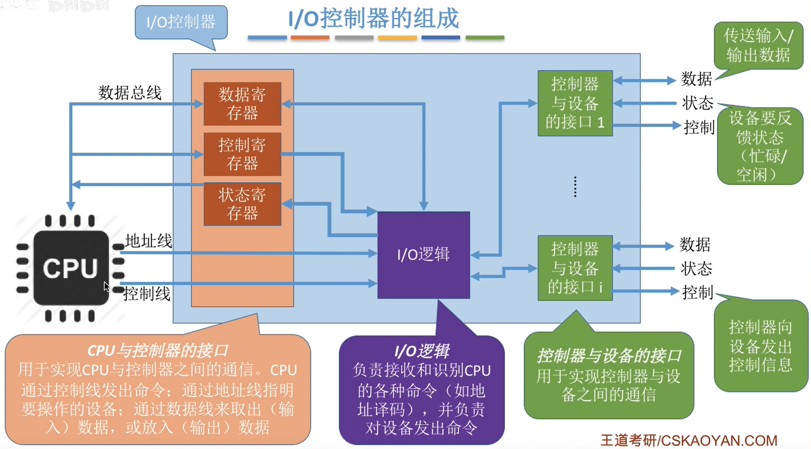

**【注意】**：

1. 一个I/O控制器可能会对应**多个设备**；
2. **数据寄存器**、**控制寄存器**、**状态寄存器**可能有**多个**。（如：每个控制/状态寄存器对应一个具体的设备），且这些寄存器都要有相应的地址，才能方便CPU操作。
   - 有的计算机会让这些寄存器占用内存地址的一部分，与内存地址编址连续，称为**内存映像I/O**。
     - 内存映像I/O优点:简化了指令。可以采用对内存进行操作的指令来对控制器进行
       操作
   - 另一些计算机则采用I/O专用地址，就是内存是内存的编码，控制器寄存器从0开始有新编址，即**寄存器独立编址**。
     - 寄存器独立编址缺点：需要设置专门的指令来实现对控制器的操作，不仅要指明寄存器的地址，还要指明控制器的编号。

## ❗3. I/O 控制方式

> 详见：计算机组成原理 - 7.输入输出系统 - 3. I/O控制方式

### 3.1 程序直接控制方式

CPU会==**轮询**==检查控制器状态。

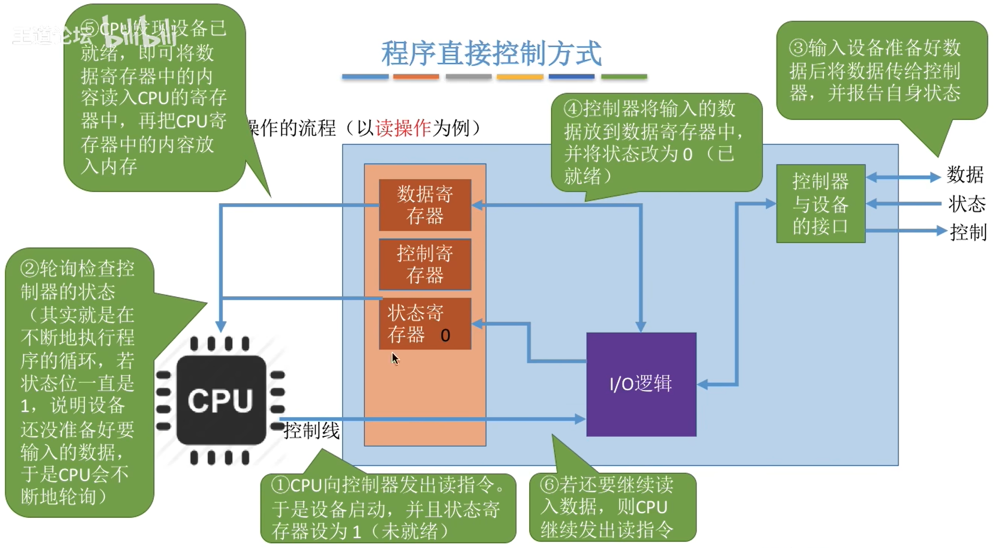

- CPU干预的频率

很频繁，I/O操作开始之前、完成之后需要CPU介入，并且在等待l/O完成的过程中CPU需要不断地轮询检查。

- 数据传送的单位

每次读/写一个**字**。

- 数据的流向

读操作（数据输入）：I/O设备→CPU（指CPU寄存器）→内存。

写操作（数据输出）：内存→CPU→I/O设备。

每个字的读/写都需要CPU的帮助。

- 主要缺点和主要优点

**优点**：实现简单。在读/写指令之后，加上实现循环检查的一系列指令即可（因此才称为“程序直接控制方式”）。

**缺点**：CPU和I/O设备只能**串行**工作，CPU需要一直**轮询**检查，长期处于“**忙等**”状态，CPU利用率低。

【注意】它不会进入阻塞态。

### 3.2 中断驱动方式

引入**==中断==机制**。流程描述：

1. 由于I/O设备速度很慢，因此在CPU发出读/写命令后，可将等待I/O的进程**阻塞**，先切换到别的进程执行。
2. 当I/O完成后，控制器会向**CPU发出中断信号**，CPU检测到中断信号后，会保存当前进程的运行环境信息，转去执行中断处理程序处理该中断。
3. 处理中断的过程中，CPU从I/O控制器读一个字的数据传送到CPU寄存器，再写入主存。
4. 接着，CPU恢复等待l/O的进程（或其他进程）的运行环境，然后继续执行。

**【注意】**：

1. CPU会在每个指令周期的末尾检查中断；
2. 中断处理过程中需要保存、恢复进程的运行环境，这个过程是需要一定时间开销的。可见，如果中断发生的频率太高，也会降低系统性能。

- CPU干预的频率

每次I/O操作开始之前、完成之后需要CPU介入。等待I/O完成的过程中CPU可以切换到别的进程执行。

- 数据传送的单位

每次读/写一个字

- 数据的流向

读操作（数据输入）：I/O设备→CPU→内存。

写操作（数据输出）：内存→CPU→I/O设备。

- 主要缺点和主要优点

**优点**：与“程序直接控制方式”相比，在“中断驱动方式”中，I/O控制器会通过中断信号主动报告I/O已完成，**CPU不再需要不停地轮询**。CPU和I/O设备可并行工作，CPU利用率得到明显提升。

**缺点**：每个字在I/O设备与内存之间的传输，都需要经过CPU。而**频繁的中断处理会消耗较多的CPU时间**。

### ❗3.3 ==DMA==方式

与“中断驱动方式”相比，**DMA方式**（Direct Memory Access，**直接存储器存取**。主要用于块设备的I/O控制）有这样几个改进：

1. 数据的**传送单位**是“**块**”。不再是一个字、一个字的传送；
2. 数据的流向是从设备直接放入内存，或者从内存直接到设备。
3. 仅在传送一个或多个数据块的开始和结束时，才需要CPU干预。

- CPU干预的频率

仅在传送一个或多个数据块的开始和结束时，才需要CPU干预。

- 数据传送的单位

每次读/写一个或多个**块**（注意：每次读写的只能是**连续的多个块**，且这些块读入内存后在内存中也必须是连续的）

- 数据的流向（**不再需要经过CPU**）

读操作（数据输入）：I/O设备→内存。

写操作（数据输出）：内存→I/O设备。

- 主要缺点和主要优点

**优点**：数据传输以“块”为单位，**CPU介入频率进一步降低**。数据的传输不再需要先经过CPU再写入内存，数据传输效率进一步增加。CPU和I/O设备的**并行性得到提升**。

多用于**块设备**（eg.磁盘）。

**缺点**：CPU每发出一条I/O指令，只能读/写一个或多个连续的数据块。

如果要读/写多个**离散**存储的数据块，或者要将数据分别写到不同的内存区域时，CPU要分别**发出多条I/O指令**，进行多次中断处理才能完成。

#### 3.3.1 DMA控制器

DMA控制器也是一种特殊的**I/O控制器**。

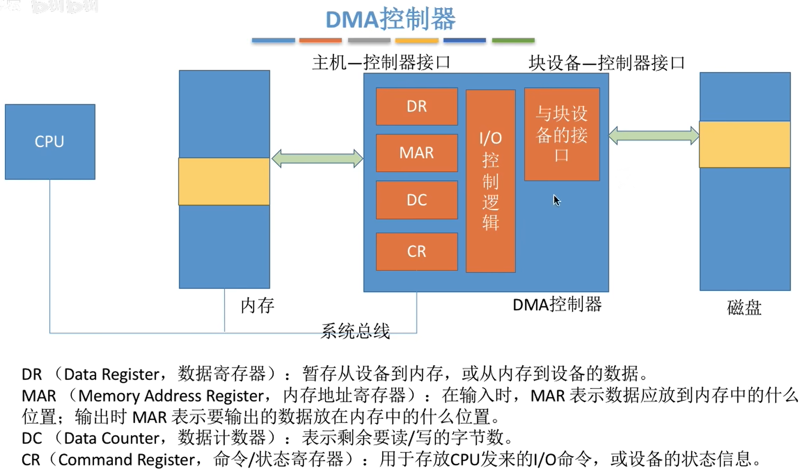

### 3.4 通道控制方式

**通道**：一种硬件，可以理解为是“弱鸡版的CPU”。通道可以识别并执行一系列通道指令。

与CPU相比，通道可以执行的指令很单一，并且通道程序是放在主机内存中的，也就是说**通道与CPU共享内存**。

- CPU干预的频率

极低，通道会根据CPU的指示执行相应的通道程序，只有完成一组数据块的读/写后才需要发出中断信号，请求CPU干预。

- 数据传送的单位

每次读/写一组数据块。

- 数据的流向（在通道的控制下进行）

读操作（数据输入）：I/O设备→内存。
写操作（数据输出）：内存→I/O设备。

- 主要缺点和主要优点

**缺点**：**实现复杂**，需要专门的通道**硬件支持**。

**优点**：CPU、通道、I/O设备可并行工作，资源利用率很高。

## ❗4. I/O 软件层次结构

- **用户层软件**
- **设备独立性软件**（设备无关性软件）
- **设备驱动程序**
- **中断处理程序**

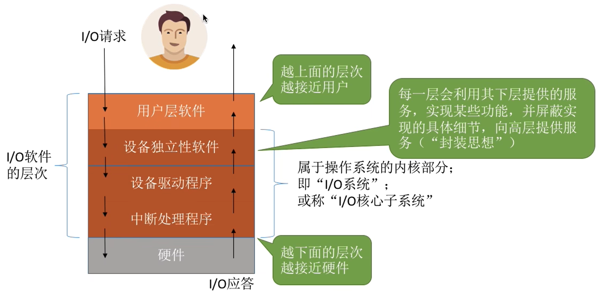

### 4.1用户层软件

用户层软件实现的功能：

1. 向上，实现了与**用户交互的接口**，用户可直接使用该层提供的、与l/O操作相关的**库函数**对设备进行操作。
2. 向下，将用户请求翻译成格式化的I/O请求，并通过“**系统调用**”请求操作系统内核的服务。

> eg：`printf("hello, world!");`会被翻译成等价的write系统调用，当然，用户层软件也会在系统调用时填入相应参数。

拓展：Windows操作系统向外提供的一系列系统调用，但是由于系统调用的格式严格，使用麻烦，因此在用户层上封装了一系列更方便的库函数接口供用户使用（(Windows API）。

### ❗4.2==设备独立性软件==

设备独立性软件，又称**设备无关性软件**。与设备的硬件特性无关的功能几乎都在这一层实现。I/O系统的最高层软件（在往上就是用户）。

- 什么是设备独立性？

**设备独立性**：是指操作系统把所有**外部设备**统一当作成**特殊文件**来看待，只要安装它们的**驱动程序**，任何用户都可以象使用文件一样，操纵、使用这些设备，而不必知道它们的具体存在形式。

- 为什么要引入设备独立性？（优点）

引入设备独立性后可以：

1. 可以方便用户操作，易于实现IO重定向；
2. 使程序运行不受具体机器的影响；
3. 调高设备的利用率和分配时的灵活性；
4. 提高系统的可适应性和可扩展性；

---

- 设备独立性软件主要实现的功能（如何实现设备独立性）：

1. 向上层提供统一的**调用接口**（如read/write系统调用）。

   提供：

   - 控制寄存器
   - 状态寄存器
   - 控制命令

2. **设备的保护**。

   原理类似与文件保护。设备被看做是一种特殊的文件，不同用户对各个文件的访问权限是不一样的，同理，对设备的访问权限也不一样。

3. **差错处理**。

   设备独立性软件需要对一些设备的错误进行处理。

4. **设备的分配与回收**。

5. **数据缓冲区管理**。

   可以通过缓冲技术屏蔽设备之间数据交换单位大小和传输速度的差异。

6. 建立**逻辑设备**名到**物理设备**名的**映射关系**；根据设备类型选择调用相应的**驱动程序**。

   用户或用户层软件发出l/O操作相关系统调用的系统调用时，需要指明此次要操作的I/O设备的逻辑设备名。

   > eg:去学校打印店打印时，需要选择打印机1/打印机2/打印机3，其实这些都是**逻辑设备名**。

   设备独立性软件需要通过“**逻辑设备表**（**LUT**，Logical UnitTable）”来确定逻辑设备对应的物理设备，并找到该设备对应的设备驱动程序。

   注：这个也是对设备进行分配的改进方法（见本章6.2.4设备分配的步骤）。

### 4.3设备驱动程序

设备驱动程序：主要负责对硬件设备的具体控制（**写命令**），将上层发出的一系列命令（如read/write）转化成特定设备“能听得懂”的一系列操作。包括设置设备寄存器；检查设备状态等。

【注意】**驱动程序**一般会以一个独立进程的方式存在。

不同的I/O设备有不同的硬件特性，具体细节只有设备的厂家才知道。因此厂家需要根据设备的硬件特性设计并提供相应的驱动程序。

### 4.4中断处理程序

> 详见：计算机组成原理 - 7.输入输出系统 - 3.2程序中断方式
>
> 操作系统 - 1.操作系统 - 4.中断、异常

当I/O任务完成时，I/O控制器会发送一个中断信号，系统会根据中断信号类型找到相应的中断处理程序并执行。

==【考点】==理解并记住I/O软件各个层次之间的顺序，要能够推理判断某个处理应该是在哪个层次完成的。

最常考的是：**设备独立性软件**、**设备驱动程序**这两层。

只需理解一个特点即可：

- 直接涉及到硬件具体细节、且与中断无关的操作肯定是在**设备驱动程序**层完成的；
- 没有涉及硬件的、对各种设备都需要进行的管理工作都是在**设备独立性软件**层完成的。

## 5. 输入输出管理

- 用户层软件&设备独立软件之间有：**输入输出 应用程序接口**。
- 设备独立软件&设备驱动程序之间有：**设备 驱动程序接口**。

### 5.1输入输出 应用程序接口

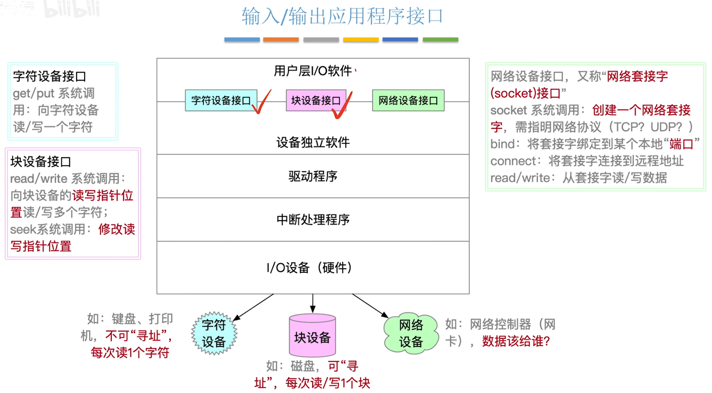

- **字符设备接口**

get/put系统调用：向字符设备读/写**一个字符**。

- **块设备接口**

read/write系统调用：向块设备的读写指针位置读/写**多个字符**；

seek系统调用：修改读写指针位置。

- **网络设备接口**

网络设备接口，又称"**网络套接字(socket)接口**”。

socket系统调用：创建一个网络套接字，需指明网络协议（TCP? UDP? ）。

bind：将套接字绑定到某个本地“端口”。

connect：将套接字连接到远程地址。

read/write：从套接字读/写数据。

#### 5.1.1阻塞、非阻塞I/O

阻塞I/O：应用程序发出**I/O系统调用**，进程需转为**阻塞态**等待。

> eg:字符设备接口――从键盘读一个字符get、scanf。

非阻塞I/O：应用程序发出I/O系统调用，系统调用可**迅速返回**，进程**无需阻塞等待**。

> eg:块设备接口――往磁盘写数据write。

### 5.2设备 驱动程序接口

类似**虚拟文件系统（VFS）**。

## 6. I/O 核心子系统

根据上面划分的 I/O软件层次结构，讨论不同层次上有什么不同的功能。

- **I/O调度**

I/O调度：用某种算法确定一个好的顺序来处理各个I/O请求。

> 详见：
>
> 操作系统 - 2.进程与线程 - 三、处理机调度 - 8.调度算法
>
> 操作系统 - 3.内存管理 - 六、存储器管理 - 3.1.3动态分区分配 - 动态分区分配算法
>
> 操作系统 - 3.内存管理 - 七、虚拟内存管理 - 4.页面置换算法
>
> 操作系统 - 3.内存管理 - 六、存储器管理（内存管理基础） - 3.1.3动态分区分配 - 动态分区分配算法
>
> 操作系统 - 4.文件管理 - 九、磁盘组织与管理 - 7.磁盘调度算法

> 如：磁盘调度（先来先服务算法、最短寻道优先算法、SCAN算法、C-SCAN算法、LOOK算法、C-LOOK算法）。

当多个磁盘I/O请求到来时，用某种调度算法确定满足l/O请求的顺序。

同理，打印机等设备也可以用先来先服务算法、优先级算法、短作业优先等算法来确定I/O调度顺序。

- **设备保护**

**设备**被看作是一种特殊的**文件**，所以“**设备保护**”就是“**文件保护**”。

> 详见：操作系统 - 4.文件管理 - 八、文件系统基础 - 9.文件保护

### ❗6.1假脱机技术（==SPOOLing==）

手工操作阶段：主机直接从I/O设备获得数据，由于设备速度慢，主机速度很快。人机速度矛盾明显，主机要浪费很多时间来等待设备。

批处理阶段：引入了**脱机输入/输出技术**（用磁带完成）。

---

**脱机**：脱离主机的控制进行的输入/输出操作。

而**假脱机技术**，又称“**SPOOLing 技术**”是用**软件**的方式**模拟脱机**技术。需要**多道程序设计技术**的支持。

SPOOLing技术是用空间换时间。

SPOOLing系统的组成如下：

- **输入井**和**输出井**（在磁盘）——模拟脱机输入/输出时的磁带；
- **输入进程**和输出进程——模拟脱机输入/输出时的外围控制机；
- 输入**缓冲区**和输出缓冲区（在内存）——内存中的缓冲区，输入、输出时的“中转站"。

上面这3部分，由**预输入程序**、**井管理程序**、**缓输出程序** 3部分管理。

由此可见，SPOOLing技术需要磁盘空间和内存空间，但是，**不需要外围计算机支持**，也就是外围计算机可以是0台。

#### 6.1.1共享打印机的原理分析

**独占式设备**：只允许各个进程**串行**使用的设备。一段时间内只能满足一个进程的请求。

**共享设备**：允许多个进程“**同时**”使用的设备（宏观上同时使用，微观上可能是**交替使用**）。可以同时满足多个进程的使用请求。共享设备就可以**避免死锁**。

【注意】共享设备是**可寻址**、**可随机访问**的设备。

打印机是种“独占式设备”，但是可以用SPOOLing技术改造成“共享设备”。

当多个用户进程提出输出打印的请求时，系统会答应它们的请求，但是并不是真正把打印机分配给他们，而是由假脱机管理进程为每个进程做两件事：

1. 在磁盘输出井中为进程申请一个空闲缓冲区（也就是说，这个缓冲区是在**磁盘**上的)，并将要打印的数据送入其中；
2. 为用户进程申请一张空白的打印请求表（打印任务的说明书），并将用户的打印请求填入表中（其实就是用来说明用户的打印数据存放位置等信息的），再将该表挂到假脱机文件队列上。

**【总结】也就是说：数据先存放在磁盘中，之后打印这些数据时就不用再使用CPU了**。

虽然系统中只有一个台打印机，但每个进程提出打印请求时，系统都会为在**输出井**中为其分配一个存储区（相当于分配了一个逻辑设备)，使得进程都觉得自己独占了一台打印机，从而实现对打印机的共享。

### 6.2设备分配与回收

#### 6.2.1设备分配时应考虑的因素

设备的固有属性、设备分配算法、设备分配中的安全性：

- **1）设备的固有属性**

设备的固有属性可分为三种：独占设备、共享设备、虚拟设备。

1. **独占设备**：一个时段只能分配给一个进程（如打印机）。
2. **共享设备**：可同时分配给多个进程使用（如磁盘），各进程往往是宏观上同时共享使用设备，而微观上交替使用。
3. **虚拟设备**：采用SPOOLing 技术将独占设备改造成虚拟的共享设备，可同时分配给多个进程使用（如采用SPOOLing技术实现的共享打印机）。

- **2）设备分配算法**

先来先服务、优先级高者优先、短任务优先......

- **3）设备分配中的安全性**

从进程运行的安全性上考虑，设备分配有两种方式：安全分配方式、不安全分配方式。

1. **安全分配方式**：为进程分配一个设备后就将**进程阻塞**，进程会一直等待，直到本次I/O完成后才将进程唤醒。（eg:考虑进程请求打印机打印输出的例子）

   一个时段内每个进程只能使用一个设备。

   优点：破坏了“请求和保持”条件，不会死锁。
   缺点：对于一个进程来说，CPU和I/O设备只能串行工作。

2. **不安全分配方式**：进程发出I/O请求后，系统为其分配I/O设备，进程可继续执行，之后还可以发出新的I/O请求。只有某个l/O请求得不到满足时才将进程阻塞。

   一个进程可以同时使用多个设备。

   优点：进程的计算任务和I/o任务可以并行处理，使进程迅速推进。
   缺点：有可能发生死锁（死锁避免、死锁的检测和解除）。

#### 6.2.2静态分配、动态分配

> 可参考 操作系统 - 2.进程与线程 -  五、死锁 - 2.1预防死锁

**静态分配**：进程运行前为其分配全部所需资源，运行结束后归还资源。

破坏了“请求和保持”条件，不会发生死锁。

**动态分配**：进程运行过程中动态申请设备资源。

#### 6.2.3设备分配管理中的数据结构

“设备、控制器、通道”之间的关系：

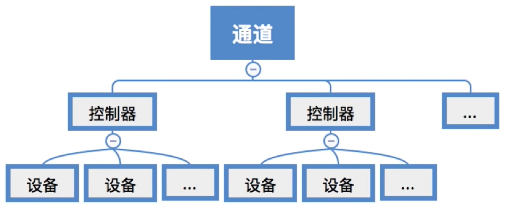

一个通道可控制多个设备控制器，每个设备控制器可控制多个设备。

有四种数据结构：

1. 设备控制表(DCT)
2. 控制器控制表(COCT)
3. 通道控制表(CHCT)
4. 系统设备表(SDT)

---

- 第一种数据结构：**设备控制表(DCT)**：系统为每个设备配置一张DCT，用于记录设备情况。

| 设备控制表（DCT）  | 说明                                                         |
| ------------------ | ------------------------------------------------------------ |
| 设备类型           | 如:打印机/扫描仪/键盘                                        |
| 设备标识符         | 即物理设备名，系统中的每个设备的物理设备名唯一               |
| 设备状态           | 忙碌/空闲/故障...                                            |
| 指向控制器表的指针 | 每个设备由一个控制器控制，该指针可找到相应控制器的信息当重复 |
| 重复执行次数或时间 | 执行多次I/O操作后仍不成功，才认为此次I/O失败                 |
| 设备队列的队首指针 | 指向正在等待该设备的进程队列（由进程PCB组成队列）            |

- 第二种数据结构：**控制器控制表(COCT)**：每个设备控制器都会对应一张COCT。操作系统根据COCT的信息对控制器进行操作和管理。

| 控制器控制表（COCT） | 说明                                                 |
| -------------------- | ---------------------------------------------------- |
| 控制器标识符         | 各个控制器的唯一ID                                   |
| 控制器状态           | 忙碌/空闲/故障...                                    |
| 指向通道表的指针     | 每个控制器由一个通道控制，该指针可找到相应通道的信息 |
| 控制器队列的队首指针 | 指向正在等待该控制器的进程队列（由进程PCB组成队列）  |
| 控制器队列的队尾指针 |                                                      |

- 第三种数据结构：**通道控制表(CHCT)**：每个通道都会对应一张CHCT。操作系统根据CHCT的信息对通道进行操作和管理。

| 通道控制表（CHCT）       | 说明                                                   |
| ------------------------ | ------------------------------------------------------ |
| 通道标识符               | 各个通道的唯一ID                                       |
| 通道状态                 | 忙碌/空闲/故障...                                      |
| 与通道连接的控制器表首址 | 可通过该指针找到该通道管理的所有控制器相关信息（COCT） |
| 通道队列的队首指针       | 指向正在等待该通道的进程队列（由进程PCB组成队列）      |
| 通道队列的队尾指针       |                                                        |

- 第四种数据结构：**系统设备表（SDT）**：记录了系统中**全部设备**的情况，每个设备对应一个表目。

#### ❗6.2.4设备分配的步骤

1. 根据进程请求的**物理设备名**查找SDT（注:物理设备名是进程请求分配设备时提供的参数）；
2. 根据SDT找到DCT，若**设备**忙碌则将进程PCB挂到攻备寺付队外中，ENL@不村将控制器分配；
3. 根据DCT找到COCT，若**控制器**忙碌则将进程PCB挂到控制希寺付队列中，个IL欧则付工的l力给进程；
4. 根据COCT找到CHCT，若**通道**忙碌则将进程PCB挂到通道等待队列中，不忙碌则将通道分配给进程。

注︰只有设备、控制器、通道三者都分配成功时，这次设备分配才算成功，之后便可启动I/O设备进行数据传送。

**缺点**：

1. 用户编程时必须使用“**物理设备名**”，底层细节对用户不透明，不方便编程。
2. 若换了一个物理设备，则程序无法运行。
3. 若进程请求的物理设备正在忙碌，则即使系统中还有**同类型的设备**，进程也必须阻塞等待。

**改进方法**：建立**逻辑设备名**与**物理设备名**的**映射机制**，用户编程时只需提供逻辑设备名。

**逻辑设备表（LUT）**建立了逻辑设备名与物理设备名之间的映射关系。如果之后用户进程再次通过相同的逻辑设备名请求使用设备，则操作系统通过LUT表即可知道用户进程实际要使用的是哪个物理设备了，并且也能知道该设备的驱动程序入口地址。

逻辑设备表的设置问题：

整个系统只有一张LUT：各用户所用的**逻辑设备名不允许重复**，适用于单用户操作系统。

每个用户一张LUT：不同用户的**逻辑设备名可重复**，适用于多用户操作系统。

【补充】**设备映射表（DMT）**建立了逻辑设备与物理设备之间的对应关系。

### ❗6.3缓冲区管理

缓冲区（Buffer）是一个存储区域，可以由专门的硬件寄存器组成，也可利用内存作为缓冲区。

使用**硬件作为缓冲区**的成本较高，容量也较小，一般仅用在对速度要求非常高的场合（如存储器管理中所用的联想寄存器，由于对页表的访问频率极高，因此使用速度很快的联想寄存器来存放页表项的副本）。

一般情况下，更多的是利用**内存**作为**缓冲区**，“**设备独立性软件**”的**缓冲区管理**就是要组织管理好这些缓冲区。所以这一节主要讨论内存作为缓冲区。

缓冲区的**作用**：

1. 缓和CPU与I/O设备之间速度不匹配的矛盾。
2. 减少对CPU的中断频率，放宽对CPU中断相应时间的限制。
3. 解决数据粒度不匹配的问题。
4. 提高CPU与I/O设备之间的并行性。

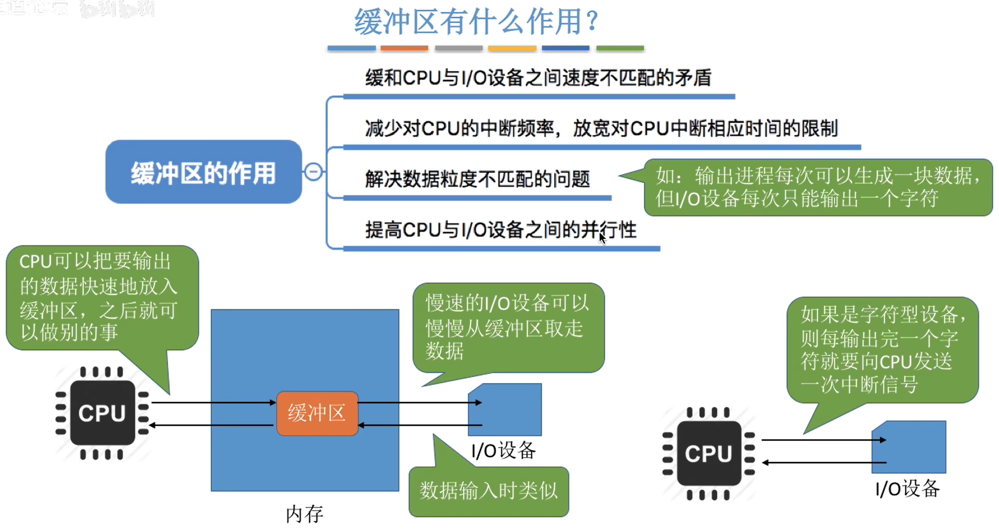

#### 6.3.1==单缓冲==

假设某用户进程请求某种块设备读入若干块的数据。若采用**单缓冲**的策略，操作系统会在主存中为其分配一个缓冲区（若题目中没有特别说明，一个缓冲区的大小就是一个块）。

**【注意】当缓冲区数据非空时，不能往缓冲区冲入数据，只能从缓冲区把数据传出；当缓冲区为空时，可以往缓冲区冲入数据，但必须把缓冲区充满以后，才能从缓冲区把数据传出。**

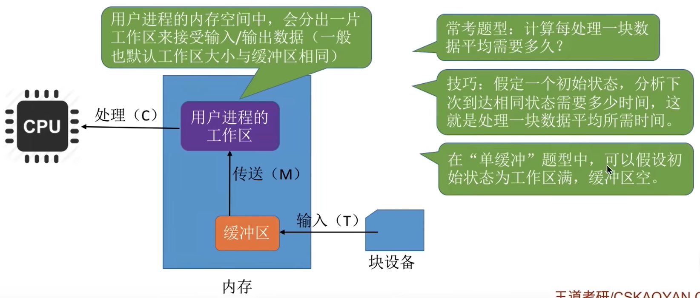

==【考点】计算每处理一块数据平均需要多久？==

【技巧】假定一个初始状态，分析下次到达相同状态需要多少时间，这就是处理一块数据平均所需时间。在“单缓冲”题型中，可以假设初始状态为**工作区满，缓冲区空（CPU一上来就可以运行）**。

**【注意】**在做这种题时，有多个磁盘块所以使用多次缓冲区时要注意，不要漏掉最后传输完成之后，CPU还要分析处理的时间。

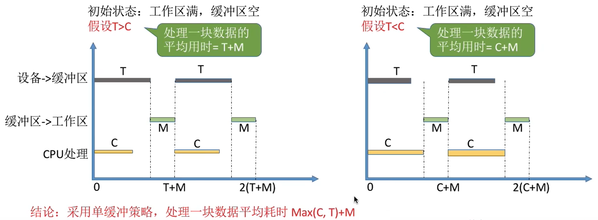

**结论**：采用单缓冲策略，处理一块数据平均耗时 **Max(C, T) + M**。

 

#### 6.3.2==双缓冲==

假设某用户进程请求某种块设备读入若干块的数据。若采用**双缓冲**的策略，操作系统会在主存中为其分配两个缓冲区（若题目中没有特别说明，一个缓冲区的大小就是一个块）。

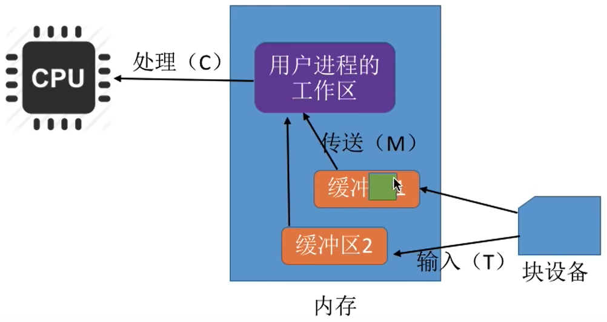

双缓冲题目中，假设初始状态为：**工作区空，其中一个缓冲区满，另一个缓冲区空**。

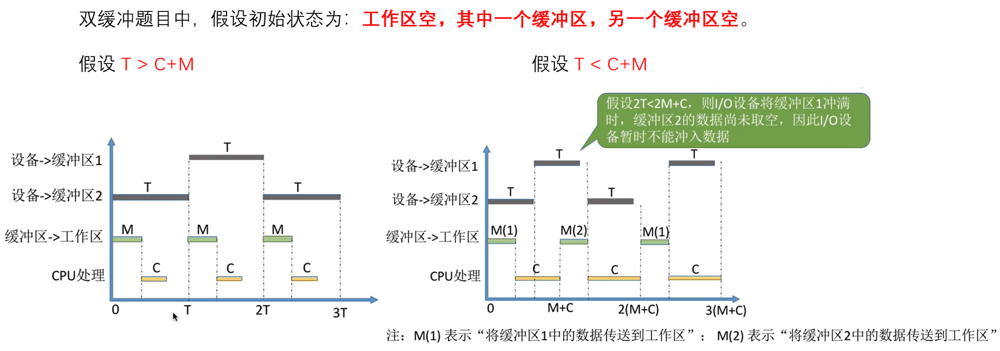

**结论**：采用双缓冲策略，处理一块数据平均耗时 **Max(C+M, T)**。

#### 6.3.3循环缓冲区

将多个**大小相等**的缓冲区链接成一个**循环队列**。

注：以下图示中，橙色表示已充满数据的缓冲区，绿色表示空缓冲区。

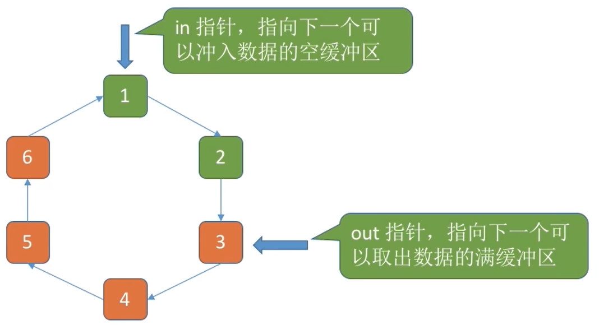

#### 6.3.4缓冲池

缓冲池由系统中共用的缓冲区组成。**这些缓冲区按使用状况可以分为**：空缓冲队列、装满输入数据的缓冲队列（输入队列）、装满输出数据的缓冲队列（输出队列）。

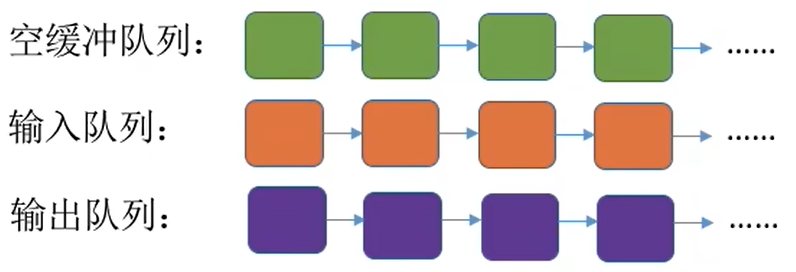

另外，根据一个缓冲区在实际运算中扮演的**功能不同**，又设置了四种工作缓冲区：用于收容输入数据的工作缓冲区（hin）、用于提取输入数据的工作缓冲区（sin）、用于收容输出数据的工作缓冲区（hout） 、用于提取输出数据的工作缓冲区（sout）。

当**输入**时，会先从**空缓冲队列的队头**取一个空缓冲区在`hin`进行填充，充满之后就放入**输入队列的队尾**；输入缓冲区的内容在`sin`被全部提取之后，变成空缓冲区，再放回**空缓冲队列的队尾**。

这个缓冲区的位置变化：空缓冲队列的队头→输入队列的队尾→空缓冲队列的队尾。

同理，**输出**时，也是这个逻辑，只是输入队列变为输出队列。

#### 6.3.5区别

##### 1）使用单/双缓冲 在通信时的区别

两台机器之间通信时，可以配置缓冲区用于数据的发送和接受。

因为缓冲区的特性：当缓冲区数据非空时，不能往缓冲区冲入数据，只能从缓冲区把数据传出；当缓冲区为空时，可以往缓冲区冲入数据，但必须把缓冲区充满以后，才能从缓冲区把数据传出。（**全空才进，全满才出**）

显然：

1. 若两个相互通信的机器只设置**单缓冲区**，在**同一时刻**只能实现数据的**单向传输**。（单工）

   【注意】单缓冲区在同一时刻不能双向传输，但是在**一段时间内**，可以先发送数据、再接收数据，实现双向传输。

2. 若两个相互通信的机器设置**双缓冲区**（接收缓冲区、发送缓冲区），则同一时刻可以实现数据的**双向传输**。（全双工）

---

【拓展】三种数据通信方式：单工、半双工、全双工。

- 单工通信（simplex）

单工通信只支持信号在**一个方向上传输**（正向或反向），**任何时候不能改变信号的传输方向**。

为保证正确传送数据信号，接收端要对接收的数据进行校验，若校验出错，则通过监控信道发送请求重发的信号。

此种方式适用于数据收集系统，如气象数据的收集、电话费的集中计算等。

> 例如：计算机和打印机之间的通信是单工模式，因为只有计算机向打印机传输数据，而没有相反方向的数据传输。还有在某些通信信道中，如单工无线发送等。

- 半双工通信（half-duplex）

半双工通信允许信号在**两个方向上传输**，但**某一时刻只允许信号在一个信道上单向传输**。

因此，半双工通信实际上是一种可切换方向的单工通信。

此种方式适用于问讯、检索、科学计算等数据通信系统。

> 例如：传统的对讲机使用的就是半双工通信方式。由于对讲机传送及接收使用相同的频率，不允许同时进行。因此一方讲完后，需设法告知另一方讲话结束（例如讲完后加上’OVER’），另一方才知道可以开始讲话。

- 全双工（full-duplex）

全双工通信允许数据**同时在两个方向上传输**，即有**两个信道**，因此允许同时进行双向传输。

全双工通信是两个单工通信方式的结合，要求收发双方都有独立的接收和发送能力。

全双工通信效率高，控制简单，但造价高。

> 计算机之间的通信是全双工方式。一般的电话、手机也是全双工的系统,因为在讲话时可以听到对方的声音。

总结：通常四线线路实现全双工数据传输，二线线路实现单工或半双工数据传输。在采用频分法、时间压缩法、回波抵消技术时，二线线路也可实现全双工数据传输。

---

##### 2）缓冲池&其他3种缓存结构的区别

**缓冲池**：缓冲池是**公共资源**，可以用于多个并发进程进行输入输出。

单/双/循环缓冲：都是**专用缓冲**。

