# 一、排序Sort

【注意】在这一章，<u>记录</u>就是<u>数据</u>的意思。

排序可视化网站：[Data Structure Visualization (usfca.edu)](https://www.cs.usfca.edu/~galles/visualization/Algorithms.html)


[toc]

## 1.排序概述

就是重新排列表中的元素，使表中的元素满足按关键字有序的过程。为了查找方便，通常希望计算机中的表是按关键字有序的。

- **排序的稳定性**。假设$k_i=k_j(1≤i≤n,1≤j≤n,i!=j)$，且在排序前的序列中 Ri 领先于 Rj（即 i < j）。

  如果排序后 Ri 仍领先于 Rj，则称所用的排序方法是稳定的；反之，若可能使得排序后的序列中 Rj 领先于Ri，则称所用的排序方法是不稳定的。

【注意】算法是否具有**稳定性**并**不能衡量一个算法的优劣**，它主要是对算法的性质进行描述。如果待排序表中的关键字不允许重复，则排序结果是唯一的，那么选择排序算法时的稳定与否就无关紧要。

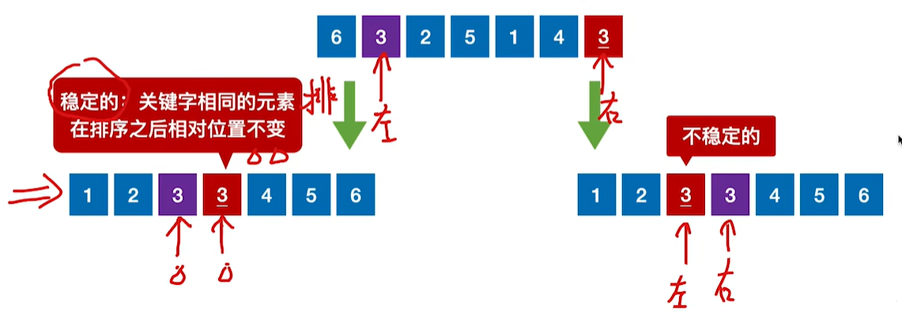


## 2.分类

- **内排序**

  内排序是在排序整个过程中，待排序的所有**数据全部被放置在内存中**。

- **外排序**

  外排序是由于排序的**数据个数太多，不能同时放置在内存**，整个排序过程需要在内外存之间多次交换数据才能进行。

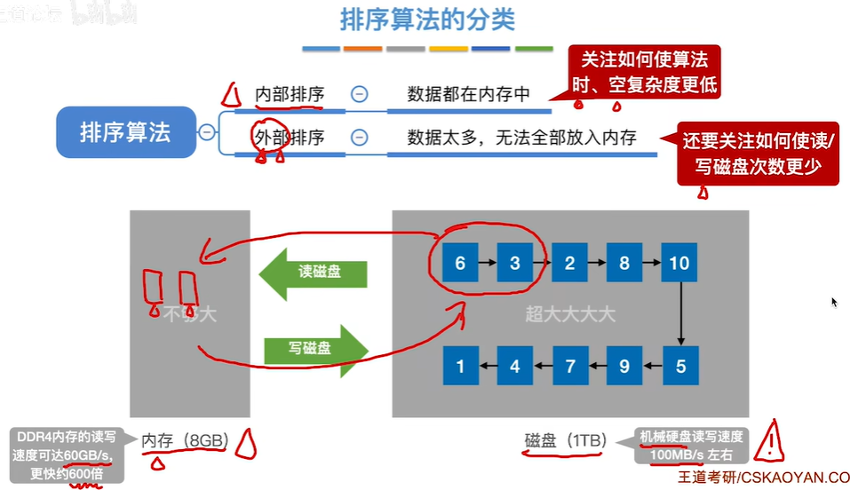

通常可以将排序算法分为**插入排序**、**交换排序**、**选择排序**、**归并排序**和**基数排序** 5 大类。每种排序算法都有各自的优缺点，适合在不同的环境下使用，就其全面性能而言，很难提出一种被认为是最好的算法。内部排序算法的性能取决于算法的时间复杂度和空间复杂度，而时间复杂度一般是由比较和移动的次数决定的。

【注意】下面的 5 大类都是内部排序。

1. 插入排序：

   - **直接插入排序**
   - **折半插入排序**
   - **希尔排序**

2. 交换排序：基于“交换”的排序：根据序列中两个元素关键字的比较结果来对换这两个记录在序列中的位置。

   - **冒泡排序**
   - **快速排序**

3. 选择排序：每一趟在待排序元素中选取关键字最小(或最大)的元素加入有序字序列。

   - **简单选择排序**

   - **堆排序**

4. **归并排序**

5. **基数排序**


# 二、排序算法

【2011年408真题】对于绝大部分**内部排序**而言，只适用于**顺序存储**结构。

#### ==【考点】比较次数==

- 在最好情况下，表中元素**基本有序**，此时每插入一个元素，都只需比较一次而不用移动元素。

  也就是进行 $n-1$ 次比较。

【注意】在待排元素**基本有序**的前提下，**效率最高**的排序算法是 **直接插入排序**。

- **在最坏情况下**，就是从头到尾都进行比较：

  有 n 个关键字，第一个需要比较除了他自身的其他所有关键字，即 $n-1$ 次；

  后面以此类推，直到最后一个不用比较。

  可以得到这 n 个关键字的比较次数序列：$n-1,n-2,...,0$。是一个等差序列。

所有可以求和，也就是**需要比较==$\cfrac{n(n-1)}2$ 次==**。

【注意】这个最坏情况比较次数规律适用于：

1. **插入排序**
   - 最好：O(n)
   - 最坏：O(n^2^)

2. **冒泡排序**
   - 最好：O(n)
   - 最坏：O(n^2^)

3. **选择排序**，比较次数始终是 $\cfrac{n(n-1)}2$（选择排序的比较次数与初始状态无关）
   - 最好，最坏：O(n^2^)


## 1.直接==插入排序==Insertion Sort

**直接插入排序（Straight Insertion Sort）**的基本操作是将一个数据插入到已经排好序的有序表中，从而得到一个新的、数据数增1的有序表。

**就是用一个for正向遍历所有的数据，每当遍历到一个数据的时候，就把它和前面所有已经遍历过的排好序的数据用for反向遍历进行对比，然后放到正确的位置。**


### 1.1算法

```c
// 直接插入排序，n是数组的长度
void InsertSort(int A[], int n){
	int i,j,temp;
    
    // i=1开始遍历
	for(i=1; i<n; i++){
        
		//若当前关键码A[i]小于其前驱A[i-1]，将A[i]插入有序表
		if(A[i] < A[i-1]){
			temp = A[i];	//temp暂存A[i]
            
			//从后往前查找前面已经排好序的待插入位置（后移）
			for(j=i-1; j>=0 && temp<A[j]; --j){
				A[j+1] = A[j];	//向后挪位
			}
			A[j+1] = temp;	//A[i]复制到插入位置
		}
	}
}
```

### 1.2性能分析

- **空间复杂度**：O(1)

仅使用了常数个辅助单元。

- **时间复杂度**：O(n^2^)

  - 在最好情况下，表中元素**基本有序**，此时每插入一个元素，都只需比较一次而不用移动元素。

    也就是进行 $n-1$ 次比较。
    
    【注意】在待排元素**基本有序**的前提下，**效率最高**的排序算法是 **直接插入排序**。

  - **在最坏情况下**，就是从头到尾都进行比较：

    有 n 个关键字，第一个需要比较除了他自身的其他所有关键字，即 $n-1$ 次；后面以此类推，直到最后一个不用比较。可以得到这 n 个关键字的比较次数序列：$n-1,n-2,...,0$。是一个等差序列。

    所有可以求和，也就是**需要比较==$\cfrac{n(n-1)}2$ 次==**。

最好：O(n)

最坏：O(n^2^)


- **稳定性**：稳定

由于每次插入元素时总是从后向前先比较再移动，所以不会出现相同元素相对位置发生变化的情况，即直接插入排序是一个稳定的排序方法。

- **适用性**：线性表（顺序存储和链式存储）

直接插入排序算法适用于顺序存储和链式存储的线性表。为链式存储时，可以从前往后查找指定元素的位置。


## 2.折半插入排序

因为使用上面直接插入排序之后，前面的序列已经是有序的了，那么此时就可以使用折半查找的方式去把数据移动到对应的位置。

下图使用了**带哨兵A[0]**的直接插入排序，此处的哨兵作用等价于temp：


### 2.1算法

```c
//折半插入排序
void InsertSort(int A[] ,int n){
	int i, j, low, high, mid;
    
    //依次将A[2]~A[n]插入前面的已排序序列
	for(i=2; i<=n; i++){
	
		A[0]=A[i];//将A[i]暂存到A[0]
		low=1; high=i-1;
        
		//设置折半查找的范围
		while(low<=high){
			//折半查找(默认递增有序)
			mid=(low+high)/2;			//取中间点
			if(A[mid]>A[0]) high=mid-1;	//查找左半子表
            else low=mid+1;				//查找右半子表
        }
        
        //元素后移
        for(j=i-1; j>=high+1; --j)
            A[j+1]=A[j];	//统一后移元素，空出插入位置
        //插入
        A[high+1]=A[0];
	}
}
```

### 2.2性能分析

- **空间复杂度**：O(1)

仅使用了常数个辅助单元。

- **时间复杂度**：O(n^2^)

比起“直接插入排序”，比较关键字的次数减少，但是移动元素的次数没变，整体来看时间复杂度依然是O(n^2^)。

最好：O(n)

最坏：O(n^2^)

- **稳定性**：稳定

由于每次插入元素时总是从后向前先比较再移动，所以不会出现相同元素相对位置发生变化的情况，即直接插入排序是一个稳定的排序方法。

- **适用性**：线性表（顺序存储和链式存储）

直接插入排序算法适用于顺序存储和链式存储的线性表。为链式存储时，可以从前往后查找指定元素的位置。


## 3.希尔排序Shell Sort

**希尔排序（shell sort）**是对直接插入排序进行改进而得来的，又称**缩小增量排序**。

1959年Shell发明，第一个突破O(n^2^)的排序算法，是简单插入排序的改进版。它与插入排序的不同之处在于，它会优先比较距离较远的元素。

### 3.1算法思想

算法思想（严谨）：先将待排序表分割成若干形如 L [ i, i + d, i + 2d, . . . , i + kd ] 的“特殊”子表（即把相隔某个“**增量d**”的记录组成一个子表），对各个**子表内**分别进行**直接插入排序**，当整个表中的元素已呈“基本有序”时，再对全体记录进行一次**直接插入排序**。

**算法思想（个人）：先追求表中元素部分有序，再逐渐逼近全局有序**。

#### ==【考点】希尔排序增量的计算==

> 例如有8个元素，那么我们先用元素个数的一半 8/2=4 作为增量d1=4。

那么第一个元素的相距d1的元素就是1+d1=5。

**【技巧】在同一个子表里面的两个元素，隔着多远D：**

1. **距离D一定可以整除增量d**；
2. **D≥d**。


 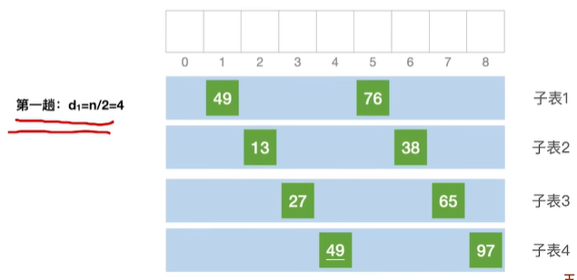

第二趟的d2 = d1 / 2 = 4/2=2。

也就是1，(1+2），(1+4）
1，3，5，7构成一个子表。


第三趟d3 = 2/2 = **1**那么就是最后一次处理。

完成所有排序。

---

动图：


或者：

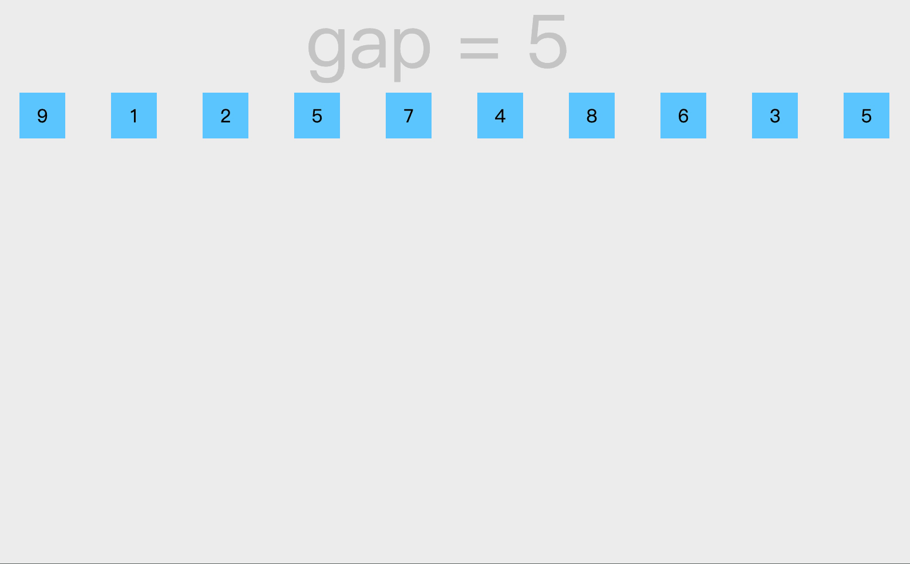

### 3.2算法

```c
//希尔排序
void ShellSort(int A[] ,int n){
    int d, i，j;	//d是增量
	//A[0]只是暂存单元，不是哨兵，当j<=8时，插入位置已到
    // 一开始是元素个数的一半
    for(d=n/2; d>=1; d=d/2){	//步长变化
        
        //一开始从第一个子表的第二个元素d+1开始
		for(i=d+1; i<=n; ++i){
			if(A[i] < A[i-d]){	//需将A[i]插入有序增量子表
				A[0]=A[i];		//暂存在A[0]
				for(j= i-d; j>0 && A[0]<A[j]; j-=d)
					A[j+d] = A[j];	//记录后移，查找插入的位置
				A[j+d] = A[0];	//插入
			}//if
        }
    }
}
```

### 3.3性能分析

- **空间复杂度**：O(1)

仅使用了常数个辅助单元。

- **时间复杂度**：O(n^3/2^)

由于希尔排序的时间复杂度依赖于增量序列的函数，这涉及数学上尚未解决的难题，所以其时间复杂度分析比较困难。当n在某个特定范围时，希尔排序的时间复杂度约为O(n^{3/2}^)。要好于直接排序的O(n^2^)。

- **稳定性**：不稳定

当相同关键字的记录被划分到不同的子表时，可能会改变它们之间的相对次序，因此希尔排序是一种不稳定的排序方法。

- **适用性**：顺序存储

希尔排序算法仅适用于线性表为顺序存储的情况。


## 4.==冒泡排序==Bubble Sort

一种交换排序

基于“交换”的排序：根据序列中两个元素关键字的比较结果来对换这两个记录在序列中的位置。

### 4.1算法思想

算法思想（严谨）：从后往前（或从前往后）两两比较相邻元素的值，若为逆序，则交换它们，直到序列比较完。第一趟冒泡，结果是将最小的元素交换到待排序列的第一个位置（或将最大的元素交换到待排序列的最后一个位置），关键字最小的元素如气泡一般逐渐往上“漂浮”直至“水面”（或关键字最大的元素如石头一般下沉至水底）。下一趟冒泡时，前一趟确定的最小元素不再参与比较，每趟冒泡的结果是把序列中的最小元素（或最大元素）放到了序列的最终位置…这样最多做 n − 1 趟冒泡就能把所有元素排好序。

**算法思想（个人）：两两比较两个数大小，正向先找大的，逆向先找小的**。共进行n趟排序。


### 4.2算法

```c
//冒泡排序
void BubbleSort(int A[], int n){ 
    for(int i=0; i<n-1; i++){
        bool flag=false;		//表示本趟冒泡是否发生交换的标志
        
        for(int j=n-1; j>i; j--){	//一趟冒泡过程
            if(A[j-1] > A[j]){		//若为逆序
                swap(A[j-1],A[j]); 	//交换
        		flag=true;
            }
        }
        
        if(flag==false) return;	//本趟遍历后没有发生交换，说明表已经有序
    }
}
//交换
void swap(int &a, int &b){
    int temp = a;
    a = b;
    b = temp;
}
```

【注意】每次交换都需要移动3次元素。

### 4.3性能分析

- **空间复杂度**：O(1)

仅使用了常数个辅助单元。

- **时间复杂度**：O(n^2^)

最好：O(n)。原本基本有序，只需要比较n-1次，交换次数为0。

最坏：O(n^2^)。**原本的顺序刚好和目标顺序相反**，例如原本是从大到小，目标是从小到大。

- **稳定性**：稳定

- **适用性**：顺序存储和链表


## ❗5.==【考点】快速排序==Quick Sort

[8.3_2_快速排序_哔哩哔哩_bilibili](https://www.bilibili.com/video/BV1b7411N798/?p=90&spm_id_from=pageDriver&vd_source=9d3c5a863c7c6dbd5152dd7c4e9dc492)

基于“交换”的排序：根据序列中两个元素关键字的比较结果来对换这两个记录在序列中的位置。

快速排序算法，被列为20世纪十大算法之一。快速排序是所有内部排序算法中平均性能最优的排序算法。

前面介绍及几种算法中，希尔排序相当于直接插入排序的升级，它们同属于插入排序类，堆排序相当于简单选择排序的升级，它们同属于选择排序类。

而快速排序是冒泡排序的升级，它们都属于交换排序类。即它也是通过不断比较和移动交换来实现排序的，只不过它的实现，增大了记录的比较和移动的距离，将关键字较大的记录从前面直接移动到后面，关键字较小的记录从后面直接移动到前面，从而减少了总的比较次数和移动交换次数。

### 5.1算法思想

算法思想（严谨）：在待排序表L[1...n]中任取一个元素pivot作为**枢轴**（或**基准**，**通常取首元素**），通过一趟排序将待排序表划分为独立的两部分L[1k-1]和L[k+1n]，使得L[1k-1]中的所有元素小于pivot，L[k+1n]中的所有元素大于等于pivot，则**pivot放在了其最终位置L(k)上**，这个过程称为一次“**划分**”。

然后分别递归地对两个子表重复上述过程，直至每部分内只有一个元素或空为止，即所有元素放在了其最终位置上。

**算法思想（简记）：通过一趟排序将待排记录分割成独立的两部分，其中一部分记录的关键字均比另一部分记录的关键字小， 则可分别依次对这两部分记录继续进行排序，以达到整个序列有序的目的。**

#### ==【考点】判断是快速排序第几趟==

因为每一趟都会确定一个元素在最终位置上，所以**第几趟就有几个元素在最终位置上，且，一般要有一个在首段、尾端**。所以有两种情况：（**两趟**为例子【2014年2019年408真题】）

1. **有 2 个已在最终位置，且至少有一个在首段、尾端**。
2. 首段、尾端没有，但是**有 3 个已在最终位置**。


通过一个可视化例子来加深理解：[Comparison Sorting Visualization (usfca.edu)](https://www.cs.usfca.edu/~galles/visualization/ComparisonSort.html)

==【算法思想细节】==

1. 一开始`i`和`j`指针分别从两端开始，向内遍历。

2. `i`从左侧开始，把首元素作为**基准**，直到遍历到比`i`大的元素就停止，等待`j`；

3. `j`从右侧开始，每次与**基准**进行对比，如果小于基准（假设是从小到大排序）就与左侧的第一个大于基准的元素进行调换，然后`i`就向右一步；

4. 直到`j`来到`i`的左边的第一个元素，就是最边上的小于**基准**的元素，它与基准进行替换。

   【此时】**完成了左右的划分，并且基准在了最终的位置**。

5. 然后令两个指针到左边的部分继续进行上面的对比过程。


### 5.2算法

```c
//用第一个元素将待排序序列划分成左右两个部分
int Partition(int A[],int low,int high){ 
    int pivot=A[low];	//第一个元素作为枢轴
    while(low < high){ 	//用low、high搜索枢轴的最终位置		
        while(low < high && A[high] >= pivot)
            --high;
        A[low] = A[high];	//比枢轴大的元素移动到右端
        while(low<high&&A[low]<=pivot)
            ++low;
        A[high] = A[low];	//比枢轴小的元素移动到左端
    }
        A[low] = pivot;		//枢轴元素存放到最终位置
    return low;				//返回存放枢轴的最终位置
}

//快速排序
void QuickSort(int A[], int low,int high){
    if(low < high){	//递归跳出的条件
    	int pivotpos = Partition(A,low,high); //划分
        QuickSort(A,low,pivotpos-1); //划分左子表
        QuickSort(A,pivotpos+1,high); //划分右子表
    }
}
```

### 5.3性能分析

- **空间复杂度**：$O(log_2n)$

由于快速排序是**递归**的，需要借助一个递归工作栈来保存每层递归调用的必要信息，其容量应与递归调用的最大深度一致。所以空间复杂度：O(递归层数)。

1. **最好情况**下（**最小递归深度**）：$O(log_2n)$。
2. **最坏情况**下（**最大递归深度**），因为要进行 n-1 次递归调用，所以栈的深度为 $O(n)$；

平均情况下，栈的深度为$O(log_2n)$。

- **时间复杂度**： $O(nlog_2n)$

快速排序的运行时间与划分是否对称有关，

最坏情况发生在两个区域分别包含 n-1 个元素和0个元素时，这种最大程度的不对称性若发生在每层递归上，即对应于初始排序表基本有序或基本逆序时，就得到最坏情况下的时间复杂度为 O(n^2^)。

【优化】提高算法的效率：

一种方法是尽量选取一个可以**将数据中分**的枢轴元素，如从序列的头尾及中间选取三个元素，再取这三个元素的中间值作为最终的枢轴元素；或者随机地从当前表中选取枢轴元素，这样做可使得最坏情况在实际排序中几乎不会发生。

在最理想的状态下，即`Partition()`可能做到最平衡的划分，得到的两个子问题的大小都不可能大于 n/2，在这种情况下，快速排序的运行速度将大大提升，此时，时间复杂度为 $O(nlog_2n)$。 

好在快速排序平均情况下的运行时间与其最佳情况下的运行时间很接近，而不是接近其最坏情况下的运行时间。

**【注意】快速排序是所有内部排序算法中平均性能最优的排序算法。**

- **稳定性**：不稳定

在划分算法中，若右端区间有两个关键字相同，且均小于基准值的记录，则在交换到左端区间后，它们的相对位置会发生变化，即快速排序是一种不稳定的排序方法。

- **适用性**：顺序存储和链表


## 5.简单==选择排序==Selection Sort

选择排序：**每一趟在待排序元素中选取关键字最小（或最大）的元素加入有序字序列**。

简单选择排序法（Simple Selection Sort）：就是通过 n-i 次关键字间的比较，从 n-i+1 个记录中选出关键字最小的记录，并和第 i (1<i<n)个记录交换。


### 5.1算法

```c
//简单选择排序
void SelectSort(int A[],int n){
    for(int(i=0; i<n-1; i++){	//一共进行n-1趟
        int min=i;			//记录最小元素位置
        for(int j=i+1; j<n; j++){	//在A[i...n-1]中选择最小的元素
            if(A[j] < A[min]) min=j;//更新最小元素位置   
        }
        if(min!=i) swap(A[i],A[min]);//封装的swap()函数共移动元素3次
	}
}

//交换
void swap(int &a，int &b){
	int temp = a;
	a = b;
	b = temp;
}
```

### 5.2性能分析

- **空间复杂度**：O(1)

仅使用了常数个辅助单元。

- **时间复杂度**：O(n^2^)

从上述代码中不难看出，在简单选择排序过程中，元素移动的操作次数很少，不会超过 3(n-1)次，最好的情况是移动 0 次，此时对应的表已经有序。

但元素间比较的次数与序列的初始状态无关，无论有序、逆序、还是乱序，一定需要 n-1 趟处理，所以需要对比的关键字始终是 (n-1)+(n-2)+...+1= n(n -1)/2 次，因此时间复杂度始终是O(n^2^)。

比较次数：O(n^2^)

移动次数：O(n)

- **稳定性**：不稳定

在第 i 趟找到最小元素后，和第 i 个元素交换，可能会导致第 i 个元素与其含有相同关键字元素的相对位置发生改变。例如，表L={2,2,1}，经过一趟排序后L={1,2,2}，最终排序序列也是L={1,2,2}，显然，2与2的相对次序已发生变化。因此，简单选择排序是一种不稳定的排序方法。

- **适用性**：顺序存储和链表


## 6.堆排序Heap Sort

[8.4_2_堆排序_哔哩哔哩_bilibili](https://www.bilibili.com/video/BV1b7411N798/?p=92&spm_id_from=pageDriver&vd_source=9d3c5a863c7c6dbd5152dd7c4e9dc492)

堆排序（Heap sort）是指利用堆这种数据结构所设计的一种排序算法，是对简单选择排序进行的一种改进。

【注意】堆的**根节点到任意叶节点都是有序的**。

### 6.1堆的定义

堆积是一个近似**完全二叉树**的结构，并同时满足堆积的性质：即子结点的键值或索引总是小于（或者大于）它的父节点。

常常使用**顺序存储**。

**大根堆**：每个结点的值都**大于或等于**其左右孩子结点的值。

或者理解为在完全二叉树中，根的值大于或等于左右子树的所有结点的值。

**小根堆**：每个结点的值都**小于或等于**其左右孩子结点的值。

大根堆：

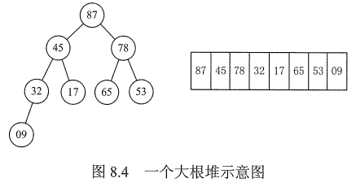

### 6.2==【考点】创建堆==

【考点注意】有时候提问**比较次数**，可以比较失败了不换，所有比较次数不一定等于**交换次数**。


算法思想（严谨）：堆排序的关键是**构造初始堆**。n个结点的完全二叉树，最后一个结点是第 ⌊n/2⌋ 个结点的孩子。对第 ⌊n/2⌋ 个结点为根的子树筛选（<u>对于大根堆，若根结点的关键字小于左右孩子中关键字较大者，则交换</u>），使该子树成为堆。之后向前依次对各结点（⌊n/2⌋-1~1）为根的子树进行筛选，看该结点值是否大于其左右子结点的值，若不大于，则将左右子结点中的较大值与之交换，交换后可能会破坏下一级的堆，于是继续采用上述方法构造下一级的堆，直到以该结点为根的子树构成堆为止。反复利用上述调整堆的方法建堆，直到根结点

**算法思想（个人）：把序列层序的方式挨个写上。从==最后面一个非叶子结点（分支结点）==开始，判断是否满足堆（大根堆or小根堆）的要求，不满足则进行调整，满足后再往前寻找不满足的结点进行调整，直到根节点完全调整完毕。**

**在大元素（假设是大根堆）上浮的过程中，每当大元素到达了一个子树的根节点后，如果原本根节点的小元素“下坠”之后，破坏了原先子树的根堆，那么再对进行交换的子树进行调整**。

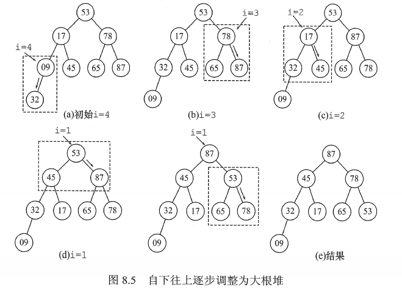

### 6.3堆排序

创建大根堆之后，根节点就是所有元素的最大值，这时候，把这个最大值加入有序序列，剩下的再进行大根堆创建（小元素下坠），得到新的大根堆，再拿走最大元素根节点。

多次重复上面的过程，直到所有元素都放入有序序列。

**【注意】大根堆 = 增序，树顶上最大，那么有序序列中最后一个元素最大。**


### 6.4算法

```c
//建立大根堆
void BuildMaxHeap(int A[], int len){
	for(int i=len/2; i>0; i--)	//从后往前调整所有非终端（叶子）结点
	HeadAdjust(A,i,len);
}

//将以 k 为根的子树调整为大根堆（len是长度）
void HeadAdjust(int A[], int k, int len){
	A[0] = A[k];					//A[0]暂存子树的根结点
	for(int i=2*k; i<=len; i*=2){	//沿key较大的子结点向下筛选(2*k就是左孩子)
		if(i<len && A[i]<A[i+1])	//判断左右孩子谁key更大
			i++;					//取key较大的子结点的下标
		if(A[0]>=A[i]) break;		//左右孩子都不如根节点key大,筛选结束,不需要交换
		else{
			A[k]=A[i];				//将A[i]调整到双亲结点上
			k=i;					//修改k值,以便继续向下筛选
		}
	}
	A[k]=A[0] ;						//被筛选结点的值放入最终位置
}


//堆排序的完整逻辑
void HeapSort(int A[], int len){
	BuildMaxHeap(A,len) ;		//初始建堆
	for(int i=len; i>1, i--){	//n-1趟的交换和建堆过程
        swap(A[i], A[1]);		//堆顶元素和堆底元素交换
        HeadAdjust(A,1,i-1);	//把剩余的待排序元素整理成堆
	}
}
```

### 6.5性能分析

- **空间复杂度**：O(1)

仅使用了常数个辅助单元。

- **时间复杂度**
  - 构建：$O(n)$
  - 排序：$O(nlog_2n)$


一个结点，每“下坠”一层，最多只需对比关键字2次。

若树高为h，某结点在第i层，则将这个结点向下调整最多只需要“下坠”h-i层，关键字对比次数不超过2(h-i)。

n个结点的完全二叉树树高 h = ⌊log2n⌋+1。

第i层最多有2^i-1^个结点，而只有第1~(h-1)层的结点才有可能需要“下坠”调整。


**建堆时间为O(n)**，之后有 n-1 次向下调整操作，每次调整的时间复杂度为O(h)=O(log2n)。故在最好、最坏和平均情况下，堆排序的时间复杂度为 $O(nlog_2n)$。

- **稳定性**：不稳定

进行筛选时，有可能把后面相同关键字的元素调整到前面，所以堆排序算法是一种不稳定的排序方法。

- **适用性**：顺序存储和链表


### 6.6在堆中插入删除元素

**插入删除的时间复杂度**都是：$O(log_2n)$。

#### 6.6.1插入

1. 将新元素放入**表尾**，也就是树的最后一个叶子节点。
2. 对于**小根堆**，与父节点对比，若新元素比父节点更小，则将二者互换。
3. 新元素就这样一路“上升”，直到无法继续上升为止。

【注意】每次上升，只需要进行1次关键字的对比。

#### 6.6.2==【考点】删除==

被删除的元素用==**堆底元素**（层序遍历最后一个）==替代，然后让该元素不断“下坠”，直到无法下坠为止。

【注意】每次下坠，如果有2个孩子，那么就进行2次关键字对比，1个孩子就进行1次关键字对比。


## 7.归并排序Merge Sort

[8.5_1_归并排序_哔哩哔哩_bilibili](https://www.bilibili.com/video/BV1b7411N798/?p=94&spm_id_from=pageDriver&vd_source=9d3c5a863c7c6dbd5152dd7c4e9dc492)

归并排序与上述基于交换、选择等排序的思想不一样。

【2016年408真题】可以用于大文件（TB）的排序。

“归并"的含义是：**将两个或两个以上的有序表组合成一个新的有序表**。

归并排序是建立在归并操作上的一种有效的排序算法。该算法是采用**分治法（Divide and Conquer）**的一个非常典型的应用。将已有序的子序列合并，得到完全有序的序列。即先使每个子序列有序，再使子序列段间有序。若将两个有序表合并成一个有序表，称为**2-路归并**。 

**2路归并排序**：假定待排序表含有n个记录，则可将其视为n个有序的子表，每个子表的长度为1，然后两两归并，得到 ⌈ n/2 ⌉ 个长度为2或1的有序表；继续两两归并...如此重复，直到合并成一个长度为n的有序表为止，这种排序方法称为**2路归并排序**。

**【总结】m路归并，每选出一个元素需要对比关键字m-1次**。

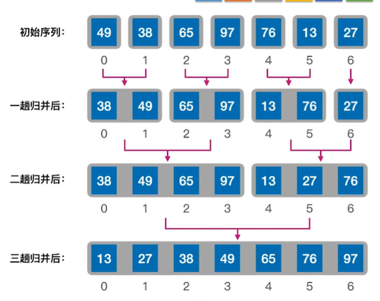

动图：


### 7.1算法


```c
int *B=(int *)malloc(nksizeof(int));//辅助数组B
//A[low..mid]和A[mid+1...high]各自有序，将两个部分归并
void Merge(int A[],int low,int mid,int high){
	int i,j,k;
	for(k=low; k<=high ; k++)
		B[k]=A[k];		//将A中所有元素复制到B中
	for(i=low,j=mid+1,k=i; i<=mid && j<=high; k++){
		if(B[i]<=B[j])
			A[k]=B[i++];	//将较小值复制到A中
		else
			A[k]=B[j++];
    }//for
	while(i<=mid) A[k++]=B[i++];
    while(j<=high) A[k++]=B[j++];
}

//对整个数组进行拆分，然后归并排序
void MergeSort(int A[],int low,int high){
	if(low<high){
		int mid=(low + high)/2;		//从中间划分
    	MergeSort(A,low,mid);		//对左半部分归并排
        MergeSort(A,mid+1,high);	//对右半部分归并排
    	Merge(A,low,mid,high);		//归并
    }//if
}
```

### 7.2性能分析

- **空间复杂度**：O(n)

Merge()操作中，辅助空间刚好为n个单元，所以算法的空间复杂度为O(n)。

- **时间复杂度**：$O(nlog_2n)$

#### ==【考点】归并趟数==

2路归并的“归并树”―一形态上就是一棵倒立的二叉树。

根据二叉树的性质：**二叉树的第h层最多有2^h-1^个结点**。

若树高为h，则应满足n个结点 < 2^h-1^，即 h-1 =  ⌈log~2~n⌉ 。

所以：n个元素进行2路归并排序，**归并趟数 =  ⌈log~2~n⌉** 。

**【结论】n个元素进行k路归并排序m趟：==k^m^ = n==**。

每趟归并的时间复杂度为 O(n)，共需进行 ⌈log~2~n⌉ 趟归并，所以算法的时间复杂度为 O(nlog~2~n)。

- **稳定性**：稳定

由于Merge()操作不会改变相同关键字记录的相对次序，所以2路归并排序算法是一种稳定的排序方法。


## 8.基数排序Counting Sort

[8.5_2_基数排序_哔哩哔哩_bilibili](https://www.bilibili.com/video/BV1b7411N798/?p=95&spm_id_from=pageDriver&vd_source=9d3c5a863c7c6dbd5152dd7c4e9dc492)

**基数排序不是基于“比较"的排序算法**。

基数排序得到**递增**序列的过程如下：

初始化：设置 r 个空队列Q0, Q1, ... Q~r-1~（这里是Q9, ..., Q1, Q0十位）

按照各个**关键字位权重递增**的次序 (个、十、百)，对 d 个关键字位分别做“分配”和“收集”：

分配：顺序扫描各个元素，若当前处理的关键字位=x，则将元素插入 Q~x~ 队尾

收集：把Q0, Q1, ... Q~r-1~ 各个队列中的结点依次出队并链接

【注意】如果是递增，那么每次个十百千位...排序时候，就是大数在前面；如果是递减，那么就是小数在前面。

==【考点】==

- **几进制，就建立几个空队列。**
- **几位，就进行几趟。**


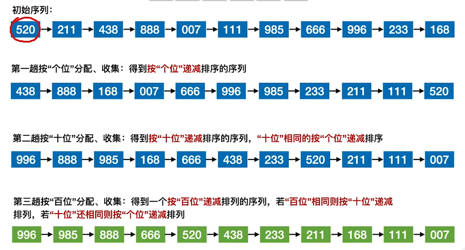

---

【真题】设线性表中每个元素有两个数据项k1和k2，现对线性表按一下规则进行排序：先看数据项k1，k1值小的元素在前，大的在后；在k1值相同的情况下，再看k2，k2值小的在前，大的在后。满足这种要求的排序方法是（）。

**先按k2进行简单选择排序，再按k1进行直接插入排序**。

原因分析：“在k1值相同的情况下，再看k2，k2值小的在前，大的在后。”，这明显就是基数排序的原理。也就是后面对k1再进行排序的时候，不能打乱之前对k2的排序，所以对k1排序必须是**稳定**的。

在 3 大类内部排序中，只有**直接插入排序**、**冒泡排序**是稳定的。

---


### 8.1性能分析

- **空间复杂度**：O(r)

需要r个辅助队列，空间复杂度=O(r)

- **时间复杂度**：O( d(n+r) )

一趟分配O(n)，一趟收集O(r)，总共 d 趟分配、收集，总的时间复杂度=O(d(n+r))。

- **稳定性**：稳定

> 基你太稳~

### 8.2应用

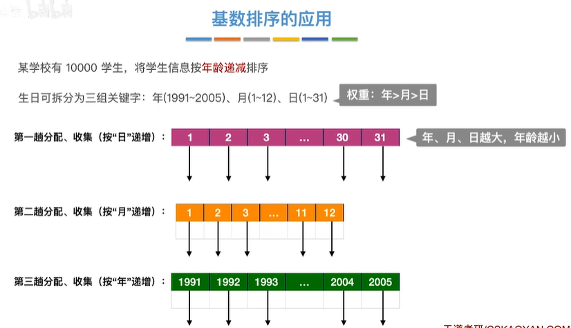

基数排序擅长解决的问题：

1. 数据元素的关键字可以后便地拆分为 d 组，即 **d 较小**。

   反例：给5个人的身份证排序，身份证18位，d=18有点多

2. 每组关键字的取值范围不大，即 **r 较小**。

   反例：给中文人名排序，人名汉字太多了，取值范围极广

3. 数据元素**个数n较大**。


## 9.外部排序

### 9.1外存与内存之间的数据交换

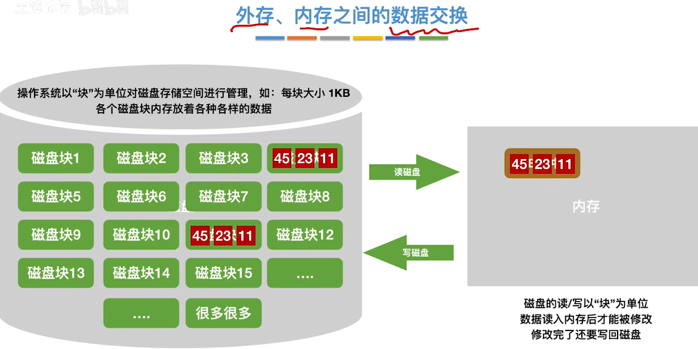

### 9.2外部排序的原理

使用明并排席的方法，最少只需在内存中分配**3块**大小的缓冲区即可对任意一个大文件进行排序。

这里就是在外存中包含16块磁盘块，每一块中包含3个记录。


### 9.3影响外部排序效率的因素

进行归并过程中：

1. 先生成初始化归并段（对每一段进行内部排序）
2. 2路归并进行多次

外部排序时间开销 = 读写外存的时间+内部排序所需时间+内部归并所需时间

读写磁盘的次数 = 2\*块数 + 2\*块数 \* 归并的趟数

因为块数是确定的，所有可以通过减少归并的趟数进行优化。

### 9.4优化思路

- **方法一：增加归并路数 k，进行多路平衡归并**。

那么就把 之前的2路归并转换为**多路归并**。

也就需要多个内存缓冲区。

- 优点

采用多路归并可以减少归并趟数，从而减少磁盘IO(读写)次数。

> 归并路越多，效率越高。

- **负面影响**

1. k路归并时，需要开k个输入缓冲区，内存开销增加。
2. 每挑选一个关键字需要对比关键字(k-1)次，内部归并所需时间增加。（可用“**败者树**"减少关键字对比次数）

---

- **方法二：减少初始归并段数量 r**。

对r个**初始归并段**，做**k路归并**，则归并树可用k叉树表示。

若树高为h，则归并趟数 = h-1 = ⌈ log ~k~ r ⌉ 

可以看出：**k越大**，**r越小**，归并趟数越少，读写磁盘次数越少。

【结论】若能增加初始归并段的长度，则可减少初始归并段数量r。

按照本节介绍的方法生成的初始归并段，若共 N 个记录，内存工作区可以容纳 L 个记录，则初始归并段数量r= ⌈ N/L ⌉ 。（可用“**置换-选择排序**”进—步减少初始归开段数量）


## 10.败者树（决策树，Decision Tree）

败者树：可视为一棵**完全二叉树**（多了一个头头），为**多路归并排序**设计的高效数据结构。

k个叶结点分别是当前参加比较的元素，非叶子结点用来记忆左右子树中的“失败者”，而让胜者往上继续进行比较，一直到根结点。

> 败者树在多个有序数据流进行合并时，能够迅速确定多个当前元素中的最小（或最大）元素，并在该最值元素被更新时进行高效调整。该结构维护一个完全二叉树，在非叶子节点（内部节点）中存储一轮比较中的 **败者**，将 **胜者** 推进到下一轮比较（即父节点），显著减少了调整过程中出现的元素比较次数，优化了合并过程的效率。

数据结构：

- **叶子节点**：代表对应输入序列的当前元素，直接关联到数据流的输出。
- **内部节点**：记录其两个子节点（所推进上来的胜者）比较后的败者，即较小（或较大）的元素。
- **根节点**：在完全二叉树的根节点之上额外添加的父节点，表示所有叶子节点比较后的最终胜者，即当前所有输入序列中的最小（或最大）元素。


### 败者树在==多路平衡归并==中的应用

[8.7_2_败者树_哔哩哔哩_bilibili](https://www.bilibili.com/video/BV1b7411N798/?p=97&spm_id_from=pageDriver&vd_source=9d3c5a863c7c6dbd5152dd7c4e9dc492)

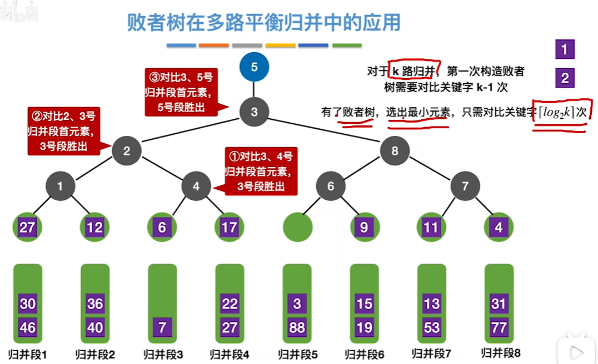

对比次数：

k 路平衡归并，第一次构造败者树需要对比关键字**k-1次**。

当有了败者树，选出**最小元素**，只需对比关键字 **⌈ log ~2~ k ⌉ 次**。

> 8路归并，第一次需要对比7次，以后每次对比新元素，只需要  ⌈ log ~2~ 8 ⌉ = 3次（2^3^=8）。

---

【例题】对任意 **7 个关键字**进行**基于比较**的排序，要进行两两关键字之间比较次数至少为（13）。

上面的 对比关键字 **⌈ log ~2~ k ⌉ 次** 只是选出最大最小的，这里要进行排序是所有的关键字，所有是：
$$
\lceil \log_2(n!) \rceil
$$
在这里就是 ⌈ log ~2~ 7! ⌉ = ⌈ log ~2~ 5040 ⌉ = 13

【但是注意】如果**不是基于比较**的排序：将7个不同的数据进行排序，至少需要比较（6）次。


## 11.置换-选择排序

老办法：按照本节介绍的方法生成的初始归并段，若共 N 个记录，内存**工作区**可以容纳 L 个记录，则**初始归并段数量r= ⌈ N/L ⌉** 。（可用“**置换-选择排序**”进—步减少初始归开段数量）

> 有24个记录，用于内部排序的工作区可以容纳3个记录，那么归并段有 24/3 = 8个归并段。

[8.7_3_置换-选择排序_哔哩哔哩_bilibili](https://www.bilibili.com/video/BV1b7411N798/?p=98)

[「四分钟速通」置换-选择排序生成初始归并段流程（外部排序）_哔哩哔哩_bilibili](https://www.bilibili.com/video/BV1Lw41127zJ/)

默认从小到大。

1. 放入工作区之后，依次拿出最小的元素，并且记录这个元素大小
2. 之后依次继续拿出小元素
3. 但是这个小元素不能比记录的值还要小
4. 因为是放在后面的，所以比记录还要小的元素会被冻结，大的拿出来放到最后
5. 最后如果工作区全部被冻结，那么就重启一行归并段

【2023年408真题】对于含有n（n>0）个元素的记录文件，工作区可以容纳 m 个元素，对于任意m（n>>m>0），生成的第一个初始归并段长度：

1. 最大值：n
2. 最小值：m.


## 12.最佳归并树

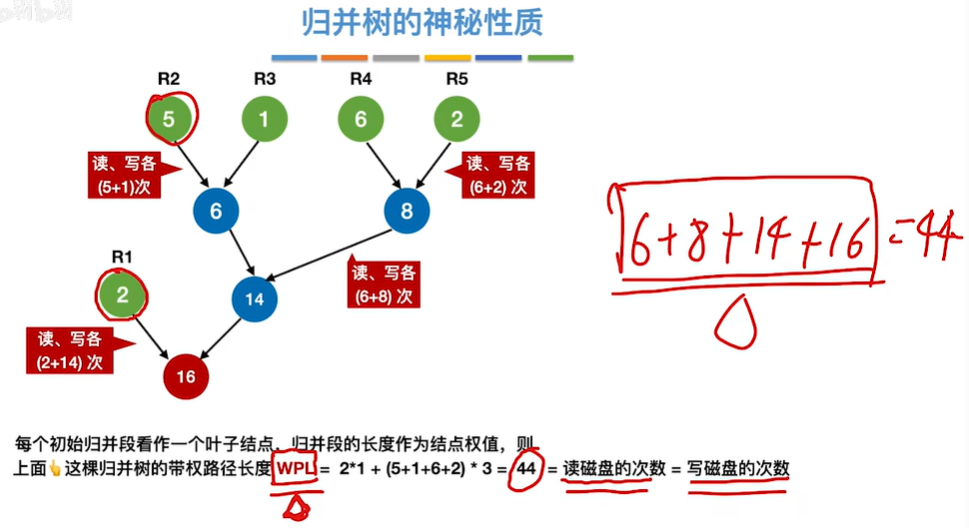

归并过程中 **==磁盘I/O的次数== = 读磁盘次数 + 写磁盘次数** = **==归并树WPL \*2==**

所以要I/O次数最少，那么就是WPL最小，那么就是**哈夫曼树**。

---

#### ==【考点】归并树的虚段==

对于 **k 叉归并**，若初始归并段的数量无法构成**严格的 k 叉归并树**则需要补充几个**长度为0的“虚段”**再进行k叉哈夫曼树的构造。

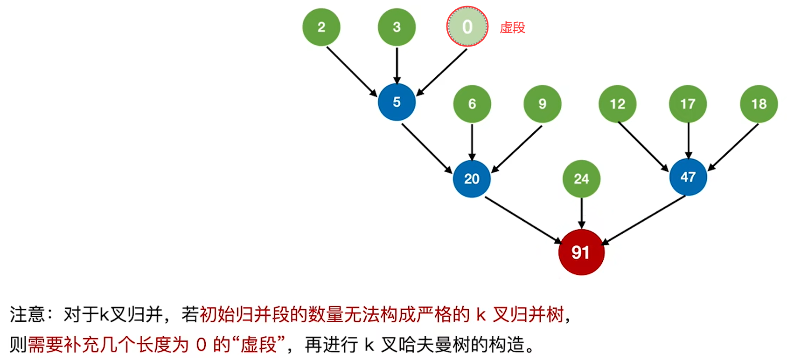

因为哈夫曼树只有度为k的结点和度为0的结点，所以：
$$
n_0 = 初始归并段数 + 虚段数 \\[1em]
因为n = n_0+n_k = kn_k+1 \\
所以n_0 = (k-1)n_k+1 \\
n_k = \frac{n_0-1}{k-1}
$$
如果 $n_k = \cfrac{n_0-1}{k-1}$ 刚好能除得尽，说明刚刚好，也不需要补充虚段。

但是如果有**余数 u**，也就是说明 $\cfrac{初始归并段数 + 虚段数-1}{k-1}$ 在添加虚段之后得到除尽，得：
$$
\color{red} 虚段数 = k-1-余数u
$$

- **严格的 k 叉归并树**：比如3路归并，如果3路归并到最后剩下两个结点，那么就不合理，必须最后归并的时候也是3个结点。

【2019年408真题】设外存上有 120 个初始归并段，进行 12 路归并时，为实现最佳归并，需要补充的虚段个数是（2）。

此题就是推导之后：(12-1) - (120-1) % (12-1) = 2


# 三、==【考点】各种排序算法的比较==

大多数算法的时间复杂度，平均就是最坏，但是下面的平均时间复杂度除外：

1. 希尔排序：O(n^3/2^)
2. 快速排序：O(nlog~2~n)
3. 桶排序：O(n+k)

| 排序方法     | 时间复杂度(最坏)           | 时间复杂度(最好) | 空间复杂度               | 稳定性   | 备注                                                         |
| ------------ | -------------------------- | ---------------- | ------------------------ | -------- | ------------------------------------------------------------ |
| **插入排序** | O(n^2^)                    | O(n)             | O(1)                     | **稳定** | **最佳情况**：**基本有序**。<br />1.一趟之后不一定能选出元素在最终位置上。<br />2.排序趟数**与初始状态无关**。 |
| 希尔排序     | O(n^2^)（平均O(n^3/2^)）   | O(n)             | O(1)                     | 不稳定   |                                                              |
| >            | >                          | >                | >                        | >        | 交换排序：基本有序情况下效果**最差**                         |
| 冒泡排序     | O(n^2^)                    | O(n)             | O(1)                     | **稳定** |                                                              |
| **快速排序** | O(n^2^)（平均O(nlog~2~n)） | O(nlog~2~n)      | O(log~2~n)（最坏O(n^2^） | 不稳定   | **最佳情况**：数据分别随机<br />1.可以并行。                 |
| >            | >                          | >                | >                        | >        | 选择排序                                                     |
| 选择排序     | O(n^2^)                    | O(n^2^)          | O(1)                     | 不稳定   | 选择排序所有的（比较次数，排序趟数）**与初始状态无关**。     |
| 堆排序       | O(nlog~2~n)                | O(nlog~2~n)      | O(1)                     | 不稳定   | 1.堆用于排序，查找效率极低。<br />2.可以并行。               |
|              |                            |                  |                          |          |                                                              |
| 归并排序     | O(nlog~2~n)                | O(nlog~2~n)      | O(n)                     | **稳定** | 1.一趟之后不一定能选出元素在最终位置上。<br />2.比较次数的数量级**与初始状态无关**。 |
| 基数排序     | O(n*k)                     | O(n*k)           | O(n+k)                   | **稳定** | 1.不需要进行关键字比较；<br />2.元素移动次数**与初始状态无关**。 |
| 计数排序     | O(n+k)                     | O(n+k)           | O(n+k)                   | **稳定** |                                                              |
| 桶排序       | O(n^2^)（平均O(n+k)）      | O(n)             | O(n+k)                   | **稳定** |                                                              |


# 参考

[数据结构：排序(Sort)【详解】_sort结构体排序-CSDN博客](https://blog.csdn.net/Real_Fool_/article/details/114692744)

[十大经典排序算法（动图演示） - 一像素 - 博客园 (cnblogs.com)](https://www.cnblogs.com/onepixel/p/7674659.html)   

[败者树 - OI Wiki (oi-wiki.org)](https://oi-wiki.org/ds/loser-tree/)
