# 七、输入/输出系统

[toc]

## 1.基本概念

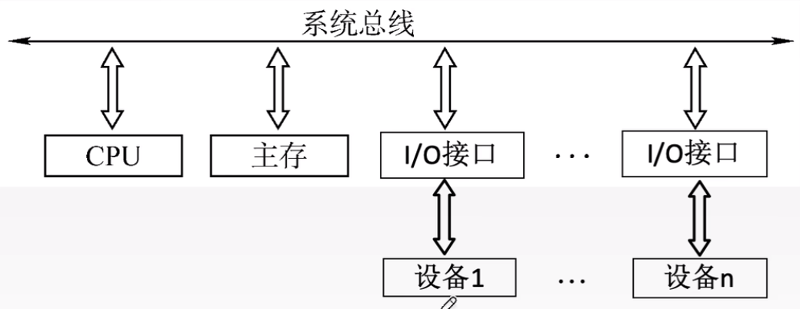

“I/O”就是“输入/输出”( Input/Output)。

I/O系统由I/O软件和I/O硬件两部分构成。

- **I/O硬件**
  - **I/O设备**：外部设备。
  - **I/O接口**：又称**I/O控制器**（I/O Controller）、**设备控制器**，负责协调主机与外部设备之间的数据传输。
    现在的I/O接口（芯片）也会被集成在**南桥芯片**内部。
  - **I/O总线**
- **I/O软件**：**驱动程序**（指示I/O指令）、用户程序、管理程序、升级补丁。

I/O软件通常采用**I/O指令**和**通道指令**实现主机和I/O设备的信息交换：

> 看完I/O控制方式来看。

1. **I/O指令**：CPU指令的一部分。

| 操作码 | 命令码 | 设备码 |
| ------ | ------ | ------ |

操作码：识别I/O指令；

命令码：做什么操作；

设备码：对哪个设备进行操作。

2. **通道指令**：通道能识别的指令。

通道程序提前编制好**放在主存**中，在含有通道的计算机中，CPU执行I/O指令对通道发出命令，由通道执行一系列通道指令，代替CPU对I/O设备进行管理。

---

主机和外设之间的路线：

1. CPU、主存
2. I/O总线
3. I/O接口
4. 通信总线（电缆）
5. 外设

## 2. I/O接口

> 详见：操作系统 - 5.输入输出(I/O)管理 - 2. I/O 控制器

**I/O接口**：又称**I/O控制器**（I/O Controller）、**设备控制器**，负责协调主机与外部设备之间的数据传输。
现在的I/O接口（芯片）也会被集成在**南桥芯片**内部。

I/O接口如：打印机适配器、网络控制器、可编程中断控制器。

### 2.1 I/O接口的作用

**数据缓冲**：通过数据缓冲寄存器（DBR）达到主机和外设工作速度的匹配；

**错误或状态监测**：通过状态寄存器反馈设备的各种错误、状态信息，供CPU查用；

**控制和定时**：接收从控制总线发来的控制信号、时钟信号；

**数据格式转换**：串-并、并-串等格式转换；

**与主机和设备通信**：实现主机一I/O接口一I/O设备之间的通信。

### 2.2 I/O接口的结构

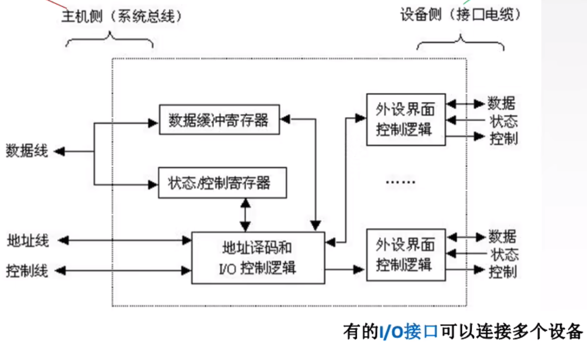

主机测：**内部接口**：内部接口与系统总线相连，实质上是与内存、CPU相连。

设备测：**外部接口**：外部接口通过接口电缆与外设相连，外部接口的数据传输可能是串行方式，因此I/O接口需具有串/并转换功能。

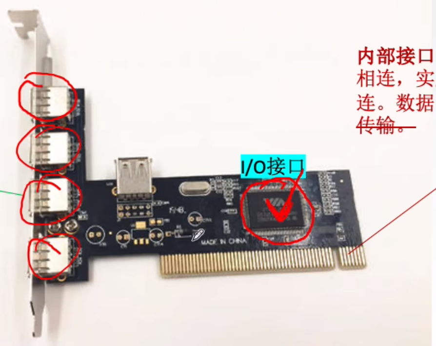

### 2.3==【考点】I/O端口（寄存器）==

**I/O端口**是指接口电路中可以被CPU直接访问的**寄存器**。

【2017年408真题】I/O指令实现的数据传输通常发生在：**通用寄存器、I/O端口**之间。

- I/O接口interface
  - I/O端口port
    - 数据端口、**数据寄存器**：读写
    - 控制端口、**控制寄存器**：只能写
    - 状态端口、**状态寄存器**：只能读
  - I/O控制逻辑

#### 2.3.1如何访问I/O端？

2种方式：统一编制、独立编址。

1. **==统一编制==**：

把l/O端口当做存储器的单元进行地址分配，用**统一的访存指令**就可以访问I/O端口，又称存储器映射方式。靠不同的**地址码区分内存和l/O设备**，I/O地址要求相对固定在地址的某部分。

**优点**：

1. 不需要专门的输入/输出指令，所有访存指令都可直接访问端口，程序设计灵活性高；
2. 端口有较大的编址空间；
3. 读写控制逻辑电路简单。

**缺点**：端口占用了主存地址空间，使主存地址空间变小外设寻址时间长（地址位数多，地址译码速度慢）。

2. **==独立编址==**：

I/O端口地址与存储器地址无关，独立编址CPU需要设置**专门的输入/输出指令**访问端口，又称**I/O映射**方式。靠不同的**指令**区分内存和I/O设备。

**优点**：使用专用I/O指令，程序编制清晰I/O端口地址位数少，地址译码速度快I/O端口的地址不占用主存地址空间。

**缺点**:

1. I/O指令类型少，一般只能对端口进行传送操作，程序设计灵活性差；
2. 需要CPU提供存储器读/写、I/O设备读/写两组控制信号，增加了控制逻辑电路的复杂性。

> 有个图找不到了

### 2.4==【考点】工作原理==

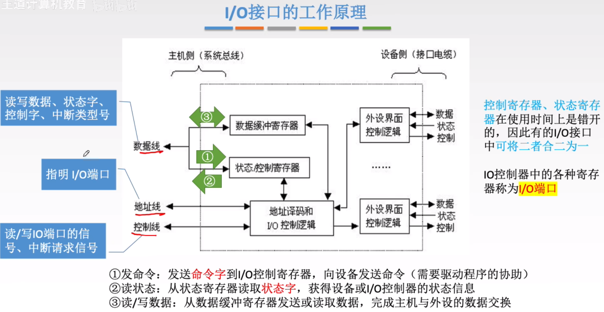

- 如何确定要操作的设备？

每个设备对应一组寄存器，操作不同的寄存器就是在操作不同的设备。

### 2.5 分类

按数据传送方式可分为：

1. **并行接口**：一个字节或一个字所有位同时传送
2. **串行接口**：一位一位地传送。
   - 磁盘驱动器向盘片磁道记录数据时采用**串行**。

注：这里所说的数据传送方式指的是外设和接口一侧的传送方式，而在主机和接口一侧，接口要完成数据格式转换。

按主机访问I/O设备的控制方式可分为：

1. **程序查询接口**
2. **中断接口**
3. **DMA接口**

按功能选择的灵活性可分为：

1. **可编程接口**
2. **不可编程接口**

## 3.==【大题❗考点】I/O控制方式==

> 详见：操作系统 - 5.输入输出(I/O)管理 - 3. I/O 控制方式
>
> 此部分通常配合其他章节内容，如CPU性能，综合考大题。

CPU如何控制键盘I/O的完成？

### 3.1程序查询方式

**程序查询方式**：CPU不断轮询检查l/O控制器中的“**状态寄存器**”，检测到状态为“已完成”之后，再从“**数据寄存器**”取出输入数据。

这个阶段CPU需要一直检查，进行**忙等**，CPU与I/O串行工作，而无法去做其他的事情，效率很低。

- 优点：接口设计简单、设备量少。
- 缺点：CPU在信息传送过程中要花费很多时间用于查询和等待，而且如果采用独占查询，则在一段时间内只能和一台外设交换信息，效率大大降低。

分类：

1. 独占查询：CPU 100%的时间都在查询l/O状态，完全串行。
2. 定时查询：在保证数据不丢失的情况下，每隔一段时间CPU就查询一次I/O状态。查询的间隔内CPU可以执行其他程序。

程序查询流程图：

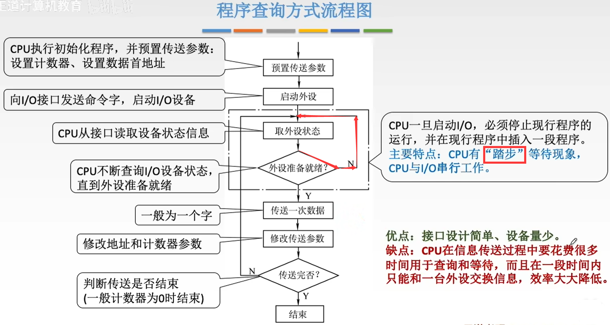

> 列题
>
> 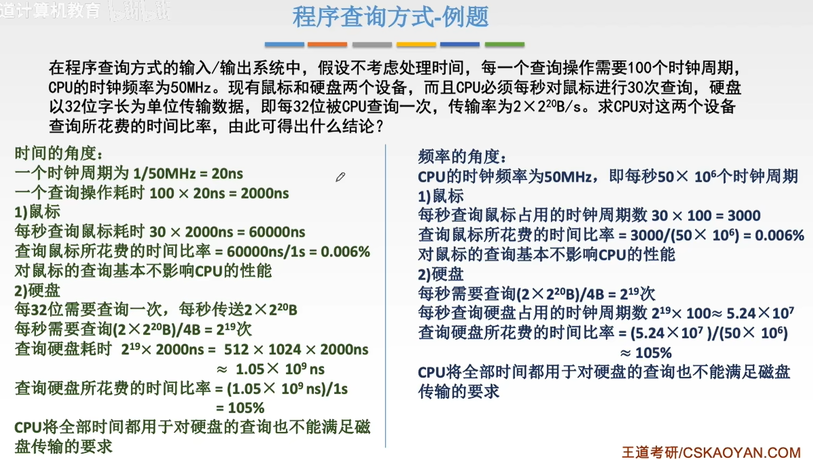

### 3.2程序==中断==方式

> [【计算机组成原理】汇总七、输入/输出系统](https://blog.csdn.net/weixin_51350847/article/details/141818173)
>
> [【操作系统】一、操作系统概述](https://blog.csdn.net/weixin_51350847/article/details/141245017) - 4.中断、异常
>
> [【操作系统】汇总二、进程管理](https://blog.csdn.net/weixin_51350847/article/details/142148698) - 4.2中断上下文
>
> [【操作系统】汇总三、内存管理](https://blog.csdn.net/weixin_51350847/article/details/142719318) - 3.2.2缺页中断机构
>
> [【操作系统】汇总五、输入输出(I/O)管理_输入输出系统,控制器](https://blog.csdn.net/weixin_51350847/article/details/142954661) - 3.2 中断驱动方式、4.4中断处理程序

#### 3.2.1中断系统

程序中断是指在计算机执行现行程序的过程中，出现某些急需处理的异常情况或特殊请求，CPU暂时中止现行程序，而转去对这些异常情况或特殊请求进行处理，在处理完毕后CPU又自动返回到现行程序的断点处，继续执行原程序。

中断分类：

**【2022年408真题】外设准备数据的时间最好 ≥ 中断处理时间**。小于可能会导致数据丢失。

#### 3.2.2==【考点】中断工作流程==

【2018年408真题】CPU只有在中断允许状态时，才能响应外部设备的中断请求。

工作流程：

1. **中断请求**

   - 中断源向CPU发送中断请求信号（通过**数据线**）。

   - **中断请求标记触发器INTR**。

     对于**外中断**：CPU是在统一的时刻即每条指令执行阶段**结束前**向接口**发出中断查询信号**，以获取I/O的中断请求，也就是说，CPU响应中断的时间是在每条指令执行阶段的**结束时刻（结束了才检查）**。
     
     所以因为CPU无法及时的对中断请求进行处理，就需要**中断触发器**暂存外设发出的中断请求。

2. **中断响应**
   
   - 响应中断的条件：
     1. 中断源有中断请求；
     2. CPU允许中断即**开中断**。（“**关中断**”则不响应中断）；
     3. 一条指令执行完毕，且没有更紧迫的任务。
   - **中断判优**：多个中断源同时提出请求时通过中断判优逻辑响应一个中断源。
     - 中断判优既可以用硬件实现，也可用软件实现：
       - **硬件**实现是通过**硬件排队器**实现的，它既可以设置在CPU中，也可以分散在各个中断源中；
       - **软件**实现是通过**查询程序**实现的。
     - 中断判优-优先级：
       1. 硬件故障中断属于最高级，其次是软件中断；
       2. 非屏蔽中断优于可屏蔽中断；
       3. DMA请求优于I/O设备传送的中断请求；
       4. 高速设备优于低速设备；
       5. 输入设备优于输出设备；
       6. 实时设备优于普通设备。
   
3. **中断处理**
   - **中断隐指令**：
     1. **关中断**：原子操作，需要关中断；
     2. **保存断点**：保存原程序的**PC值、PSW**；
        - 这个对PC的保存和更新是**硬件自动**完成的。
     3. 引出**中断服务程序**：PC指向中断服务程序的第一条指令。
   - **中断服务程序**：
     1. 保护现场：保存**通用寄存器**和**状态寄存器**的内容，以便返回原程序后可以恢复CPU环境；
     2. 中断服务(设备服务、中断要做的主体)；
     3. 恢复现场：通过出栈指令或取数指令把之前保存的信息送回寄存器。

中断处理流程图：

在关中断、开中断这中间的一段原子操作不能再进入新的中断。所以只允许一个中断服务程序的就是**单重中断**。

---

##### ==【考点】中断服务程序（向量中断）==

> 详见：计算机组成原理 - 7.输入输出系统 - 3.2程序中断方式

- **向量中断**：一种识别中断源的方式和技术。

- **中断服务程序**：不同的中断信号，需要用不同的**中断处理程序（中断服务程序）**来处理。中断服务程序一般是OS模块。

- **中断向量**：由向量地址形成部件，是硬件产生的。是**中断服务程序**的入口地址。
- **中断向量表**：所有中断的**中断向量**构成的表。是用**数组**实现的。
- **中断向量地址**：中断向量表中每个表项所在的内存地址。也就是在内存中，存放**中断向量**的地址。也就是**中断服务程序**的入口地址的地址。

当CPU检测到中断信号后，会根据中断信号的类型去查询“**中断向量表**”，以此来找到相应的中断处理程序在内存中的存放位置。

#### 3.2.3多重中断与==【考点】中断屏蔽技术==

单重中断：执行中断服务程序时不响应新的中断请求。

多重中断：又称中断嵌套，执行中断服务程序时可响应新的中断请求。

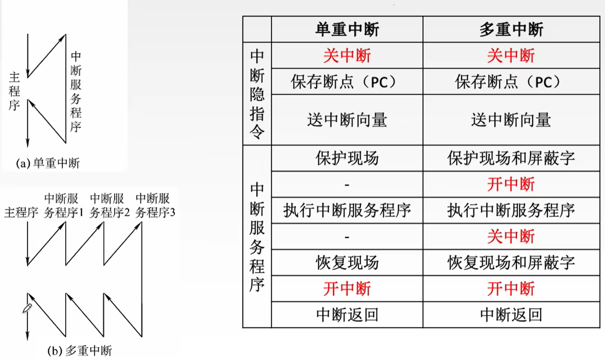

**中断屏蔽技术**主要用于多重中断，CPU要具备多重中断的功能，须满足下列条件：

1. 在中断服务程序中提前设置开中断指令；
2. 优先级别高的中断源有权中断优先级别低的中断源。

每个中断源都有一个屏蔽触发器，1表示屏蔽该中断源的请求，0表示可以正常申请，所有屏蔽触发器组合在一起，便构成一个屏蔽字寄存器，屏蔽字寄存器的内容称为**屏蔽字**。

**中断屏蔽字**设置的规律：

1. 一般用**'1'表示屏蔽（高优先级）**，'0'表示正常申请；
2. 每个中断源对应一个屏蔽字(在处理该中断源的中断服务程序时，屏蔽寄存器中的内容为该中断源对应的屏蔽字)；
3. 屏蔽字中'1'越多，优先级越高。每个屏蔽字中至少有一个'1'(至少要能屏蔽自身的中断)。

【特点】

1. 对角线一定是 1；
2. 高优先级的 1 写完之后，它本身的那一列都是 0。

---

例子：（优先次序由高到低）

例1：中断处理==次序==是：A→D→C→B

屏蔽字：

| 中断源 | A     | B     | C     | D     |
| ------ | ----- | ----- | ----- | ----- |
| A      | **1** | 1     | 1     | 1     |
| B      | 0     | **1** | 0     | 0     |
| C      | 0     | 1     | **1** | 0     |
| D      | 0     | 1     | 1     | **1** |

例2：中断处理次序是：B→E→C→A→D

屏蔽字：

| 中断源 | A     | B     | C     | D     | E     |
| ------ | ----- | ----- | ----- | ----- | ----- |
| A      | **1** | 0     | 0     | 1     | 0     |
| B      | 1     | **1** | 1     | 1     | 1     |
| C      | 1     | 0     | **1** | 1     | 0     |
| D      | 0     | 0     | 0     | **1** | 0     |
| E      | 1     | 0     | 1     | 1     | **1** |

【2015年408真题】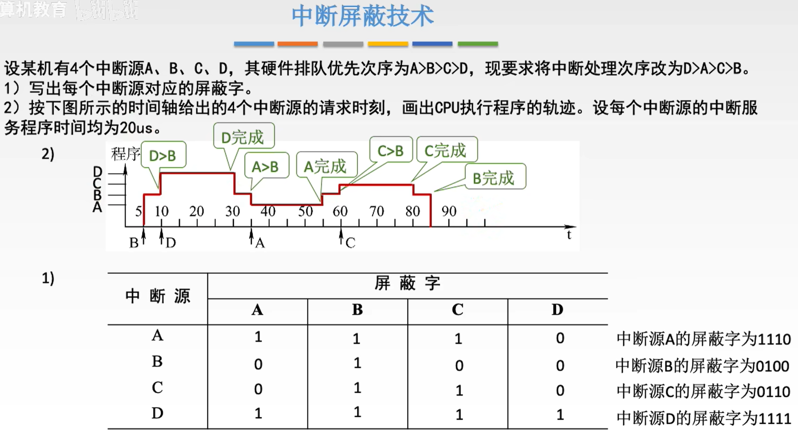

#### 3.2.4程序中断方式

**程序中断方式**：等待键盘I/O时CPU可以先去执行其他程序，键盘I/O完成后I/O控制器向CPU发出**中断请求**，CPU响应中断请求，并取走输入数据。

详细：

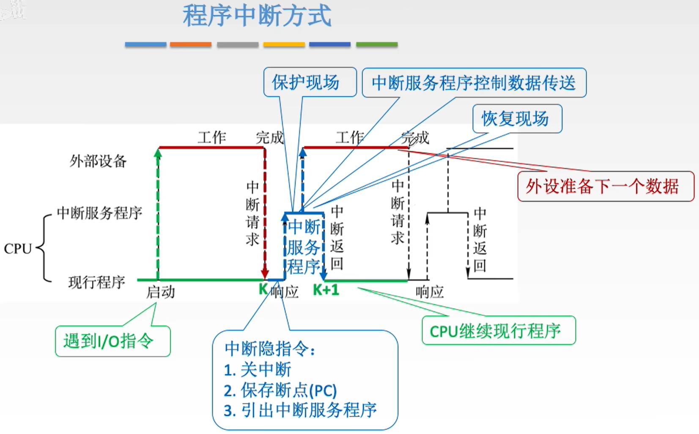

- PC值：中断隐指令自动保存（硬件完成）；
- 通用寄存器、中断屏蔽字：操作系统保存；
- 块表（TLB）和Cache：硬件机构保存。

【2016年408真题】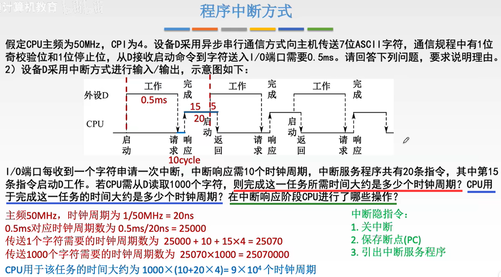

### 3.3==【考点】DMA控制方式==

而对于快速I/O设备，如“磁盘”，每准备好一个字就给CPU发送一次中断请求，会导致CPU需要花大量的时间来处理中断服务程序，CPU利用率严重下降。

所以引出直接存储器存取（DMA控制方式），**硬件实现，不是程序控制方式**。

---

**DMA接口**，即**DMA控制器**，也是一种特殊的I/O接口（I/O控制器）。

**DMA控制方式**：主存与高速I/O设备之间有一条**直接数据通路（DMA总线）**。

==【考点】==

1. 只有具有DMA接口的**外部设备**才可以发出**DMA请求**。在传送期间总线的控制权是**DMA控制器**掌握。
2. **CPU只在开始和结束对DMA进行干预**。同DMA接口发出“读/写”命令，并指明主存地址、磁盘地址、读写数据量等参数。
3. 一段完整的DMA过程，部分DMA控制器控制，部分CPU控制。
4. 外设和主存每传送一个**数据块**，需要占用一个**存取周期**。
   - 【2020年408真题】在整个数据块的传输过程中，CPU可以间歇的访问主存储器。
5. 【2019年408真题】DMA传送结束后，处理由**中断服务程序**完成。

（三总线方式）

DMA控制器自动控制**磁盘与主存**的数据读写（每传送1个字）；每**完成一整块数据读写**（如1KB为一整块），才**向CPU发出一次中断请求**。

#### 3.3.1工作流程

（单总线方式）

DMA详细传送过程：

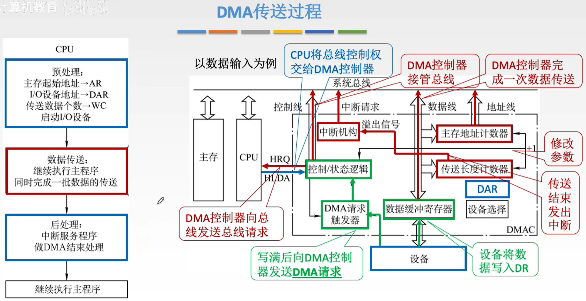

#### 3.3.2传送方式

用于解DMA和CPU的访存冲突

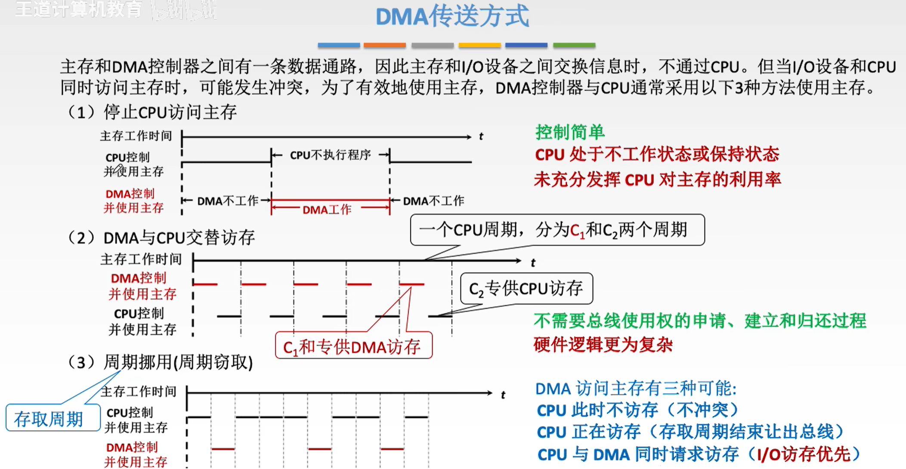

### ==【考点】DMA方式vs中断方式==

|          | 中断                                      | DMA                                                          |
| -------- | ----------------------------------------- | ------------------------------------------------------------ |
| 数据传输 | 程序控制 程序切换→**保护和恢复现场** | 硬件控制 CPU只需要进行**预处理、后处理**                |
| 中断请求 | 传送数据                                  | 后处理（DMA也会中断CPU）                                     |
| 请求目标 | CPU处理时间                               | 总线使用权                                                   |
| 响应     | **指令执行周期结束后，响应中断**          | **每个机器周期结束，总线空闲时，（总线事务完成）都可以响应DMA请求** |
| 场景     | CPU控制，低速设备                         | DMA控制器控制，高速设备                                      |
| 优先级   | **DMA>中断**                              | DMA>中断                                                     |
| 异常处理 | 能处理异常事件                            | 仅传送数据                                                   |
| 与CPU    | 并行                                      | 并行                                                         |
| 与主程序 | 串行                                      | 并行                                                         |

与CPU、主程序工作，**程序查询方式**都是“串行”。

### 3.4通道控制方式

有的商用中型机、大型机可能会接上超多的I/O设备，如果都让CPU来管理，那么CPU就太累了...

**通道**：可以理解为是“弱鸡版的CPU”。通道是一种特殊的处理器，可以识别并执行一系列**通道指令**，通道指令种类、功能通常比较单一。

## 4. I/O设备（外部设备）

> 重点：VRAM的计算

**外部设备**也称**外围设备**，是除了主机以外的、能直接或间接与计算机交换信息的装置。

输入设备：键盘、鼠标等
输出设备：显示器、打印机等

### 4.1输出设备

用于向计算机系统输入命令和文本、数据等信息的部件。键盘和鼠标是最基本的输入设备。

#### 4.1.1键盘

键盘输入信息可分为3个步骤：

①查出按下的是哪个键；

②将该键翻译成能被主机接收的编码，如ASCllI码；

③通过I/O总线将编码传送给主机。

#### 4.1.2鼠标

工作原理：当鼠标在平面上移动时，其底部传感器把运动的方向和距离检测出来，从而控制光标做相应运动。

### 4.2输出设备

用于将计算机系统中的信息输出到计算机外部进行显示、交换等的部件。显示器和打印机是最基本的输出设备。

#### 4.2.1显示器

- **1）分类**

按显示设备所用的显示器件分类：

1. **阴极射线管(CRT)**显示器（大头电视）：CRT显示器主要由电子枪、偏转线圈、荫罩、高压石墨电极和荧光粉涂层及玻璃外壳5部分组成。具有可视角度大、无坏点、色彩还原度高、色度均匀、可调节的多分辨率模式。

2. **液晶显示器(LCD)**：原理:利用液晶的电光效应，由图像信号电压直接控制薄膜晶体管，再间接控制液晶分子的光学特性来实现图像的显示。
   特点:体积小、重量轻、省电、无辐射、绿色环保、画面柔、不伤眼等。

3. **LED显示器**：原理:通过控制半导体发光二极管进行显示，用来显示文字、图形、图像等各种信息。

对比：LCD与LED是两种不同的显示技术，LCD是由液态晶体组成的显示屏，而LED则是由发光二极管组成的显示屏。与LCD相比，LED显示器在亮度、功耗、可视角度和刷新速率等方面都更具优势。

按所显示的信息内容分类：

1. **字符显示器**

显示字符的方法以**点阵（字形码）**为基础。**点阵是指由m×n个点组成的阵列**。点阵的多少取决于显示字符的质量和字符窗口的大小。字符窗口是指每个字符在屏幕上所占的点数，它包括字符显示点阵和字符间隔。

将**点阵存入由ROM构成的字符发生器**中，在CRT进行光栅扫描的过程中，从字符发生器中依次读出某个字符的点阵，按照点阵中0和1代码不同控制扫描电子束的开或关，从而在屏幕上显示出字符。对应于每个字符窗口，所需显示**字符的ASCII代码被存放在视频存储器VRAM中**，以备刷新。

2. **图形显示器**（**矢量图形**）

将所显示图形的一组坐标点和绘图命令组成显示文件存放在缓冲存储器中，缓存中的显示文件传送给矢量（线段）产生器，产生相应的模拟电压，直接控制电子束在屏幕上的移动。为了在屏幕上保留持久稳定的图像，需要按一定的频率对屏幕进行反复刷新。

这种显示器的优点是分辨率高且显示的曲线平滑。目前高质量的图形显示器采用这种随机扫描方式。缺点是当显示复杂图形时，会有闪烁感。

按扫描肖式形式不同可分为：光栅扫描显示器、随机扫描显示器。

3. **图像显示器**

- **2）参数**

**屏幕大小**：以对角线长度表示，常用的有10～29英寸等。因为是根据对角线进行测量，所以不同的长宽比的英寸可能相同。

**分辨率**：所能表示的像素个数，屏幕上的每一个光点就是一个像素，以宽、高的像素的乘积表示，例如800×600、1024×768和1280×1024等。

**灰度级**：指黑白显示器中所显示的像素点的亮暗差别，在彩色显示器中则表现为颜色的不同，灰度级越多，图像层次越清楚逼真，典型的有8位（256级）、16位等。**n位**可以表示2^n^种不同的亮度或颜色。

**刷新率（帧率）**：光点只能保持极短的时间便会消失，为此必须在光点消失之前再重新扫描显示一遍，这个过程称为刷新。
刷新频率:单位时间内扫描整个屏幕内容的次数，按照人的视觉生理，刷新频率大于30Hz时才不会感到闪烁，通常显示器刷新频率在60～120Hz。

**显示存储器(VRAM)**：也称刷新存储器，为了不断提高刷新图像的信号，必须把一帧图像信息存储在刷新存储器中。其存储容量由图像分辨率和灰度级决定，分辨率越高，灰度级越多，刷新存储器容量越大。

**VRAM容量 = 分辨率 × 灰度级位数**（B、KM、MB）一帧的大小即为显存的理论最小值。

**VRAM带宽 = 分辨率 × 灰度级位数 × 帧频**（B/s）

注：

1. 现代计算机中，显存除了作为当前显示帧的缓存，还会用于保存即将渲染的图像数据。
2. 集成显卡计算机中，通常分配一片内有作为显存；而独立显卡会有独立的内存。

#### 4.2.2打印机

打印机是计算机的输出设备之一，用于将计算机处理结果打印在相关介质上。

按印字原理不同可分为：

1. **击打式打印机**

利用机械动作使印字机构与色带和纸相撞而打印字符。

优：设备成本低、印字质量好、**防伪性好**（如发票、银行回执单）

缺：噪声大、速度慢

2. **非击打式打印机**

采用电、磁、光、喷墨等物理、化学方法来印刷字符。

优：速度快噪声小

缺：成本高

按打印机工作方式不同可分为：

1. **串行打印机**：逐字打印、速度慢
2. **行式打印机**：逐行打印、速度快

按工作方式可分为：

1. **针式打印机**

原理:在联机状态下，主机发出打印命令，经接口、检测和控制电路，间歇驱动纵向送纸和打印头横
向移动，同时驱动打印机间歇冲击色带，在纸上打印出所需内容。
特点:针式打印机擅长“多层复写打印”，实现各种票据或蜡纸等的打印。它工作原理简单，造价低
廉，耗材（色带）便宜，但打印分辨率和打印速度不够高。

2. **喷墨式打印机**

原理:带电的喷墨雾点经过电极偏转后，直接在纸上形成所需字形。彩色喷墨打印机基于三基色原理，
即分别喷射3种颜色墨滴，按一定的比例混合出所要求的颜色。
特点:打印噪声小，可实现高质量彩色打印，通常打印速度比针式打印机快;但防水性差，高质量打
印需要专用打印纸。

3. **激光打印机**

原理:计算机输出的二进制信息，经过调制后的激光束扫描，在感光鼓上形成潜像，再经过显影、转
印和定影，便在纸上得到所需的字符或图像。
特点:打印质量高、速度快、噪声小、处理能力强;但耗材多、价格较贵、不能复写打印多份，且对
纸张的要求高。激光打印机是将激光技术和电子显像技术相结合的产物。感光鼓（也称为硒鼓)是激光打印机的核心部件。

### 4.3外存设备

> 见第三章存储系统。

是指除计算机内存及CPU缓存等以外的存储器。硬磁盘、光盘等是最基本的外存设备。

